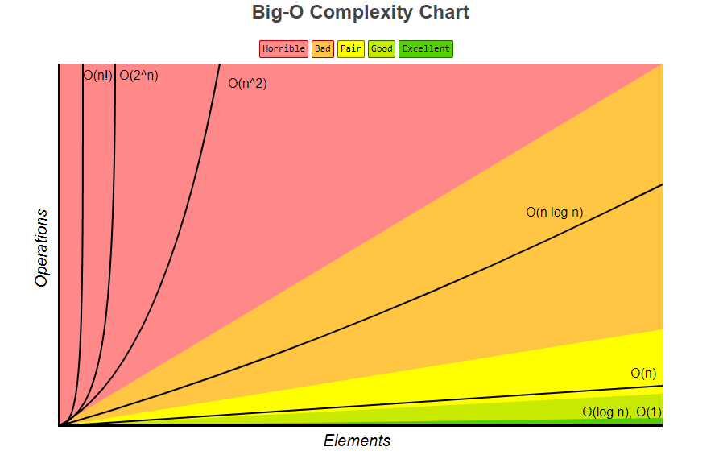
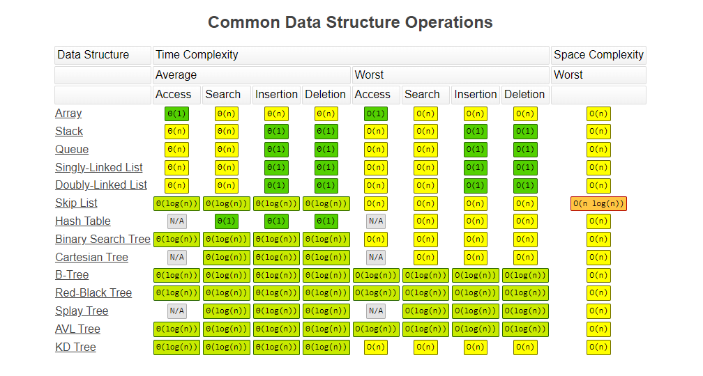
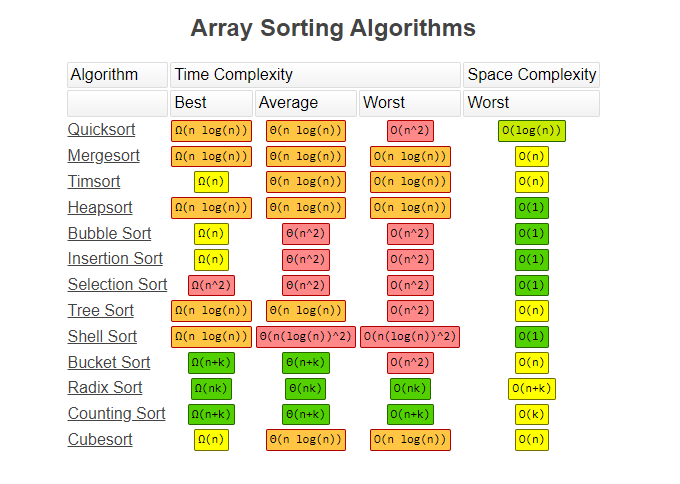

# Algorithms

## Time Complexity 

An Algorithm, in computer programming, is a finite sequence of well-defined instructions, typically executed in a computer, to solve a class of problems or to perform a common task. Based on the definition, there needs to be a sequence of defined instructions that have to be given to the computer to execute an algorithm/ perform a specific task. In this context, variation can occur the way how the instructions are defined. There can be any number of ways, a specific set of instructions can be defined to perform the same task. Also, with options available to choose any one of the available programming languages, the instructions can take any form of syntax along with the performance boundaries of the chosen programming language. We also indicated the algorithm to be performed in a computer, which leads to the next variation, in terms of the operating system, processor, hardware, etc. that are used, which can also influence the way an algorithm can be performed.

By definition, the Space complexity of an algorithm quantifies the amount of space or memory taken by an algorithm to run as a function of the length of the input. While Time complexity of an algorithm quantifies the amount of time taken by an algorithm to run as a function of the length of the input. Now that we know why Time complexity is so significant, it is time to understand what is time complexity and how to evaluate it.

### The Different Types of Time complexity Notation

there exists a relation between the input data size (n) and the number of operations performed (N) with respect to time. This relation is denoted as Order of growth in Time complexity and given notation O[n] where O is the order of growth and n is the length of the input. It is also called as **Big O Notation**

Big O Notation expresses the run time of an algorithm in terms of how quickly it grows relative to the input ‘n’ by defining the N number of operations that are done on it. Thus, the time complexity of an algorithm is denoted by the combination of all O[n] assigned for each line of function.

There are different types of time complexities used, let’s see one by one:

1. Constant time – O (1)

2. Linear time – O (n)

3. Logarithmic time – O (log n)

4. Quadratic time – O (n^2)

5. Cubic time – O (n^3)

and many more complex notations like Exponential time, Quasilinear time, factorial time, etc. are used based on the type of functions defined.

### Constant time – O (1)

An algorithm is said to have constant time with order O (1) when it is not dependent on the input size n. Irrespective of the input size n, the runtime will always be the same.

The above code shows that irrespective of the length of the array (n), the runtime to get the first element in an array of any length is the same. If the run time is considered as 1 unit of time, then it takes only 1 unit of time to run both the arrays, irrespective of length. Thus, the function comes under constant time with order O (1).

### Linear time – O(n)

An algorithm is said to have a logarithmic time complexity when it reduces the size of the input data in each step. This indicates that the number of operations is not the same as the input size. The number of operations gets reduced as the input size increases. Algorithms are found in binary trees or binary search functions. This involves the search of a given value in an array by splitting the array into two and starting searching in one split. This ensures the operation is not done on every element of the data.

### Quadratic time – O (n^2)

An algorithm is said to have a non-linear time complexity where the running time increases non-linearly (n^2) with the length of the input. Generally, nested loops come under this order where one loop takes O(n) and if the function involves a loop within a loop, then it goes for O(n)*O(n) = O(n^2) order.

Similarly, if there are ‘m’ loops defined in the function, then the order is given by O (n ^ m), which are called polynomial time complexity functions.

Thus, the above illustration gives a fair idea of how each function gets the order notation based on the relation between run time against the number of input data sizes and the number of operations performed on them.

## Space Complexity

You might have heard of this term, ‘Space Complexity’, that hovers around when talking about time complexity. What is Space Complexity? Well, it is the working space or storage that is required by any algorithm. It is directly dependent or proportional to the amount of input that the algorithm takes. To calculate space complexity, all you have to do is calculate the space taken up by the variables in an algorithm. The lesser space, the faster the algorithm executes. It is also important to know that time and space complexity are not related to each other.

# Cheat Sheets

# References

https://www.geeksforgeeks.org/understanding-time-complexity-simple-examples/

https://www.mygreatlearning.com/blog/why-is-time-complexity-essential/#:~:text=Time%20complexity%20is%20defined%20as,execution%20time%20of%20an%20algorithm.

https://www.bigocheatsheet.com/