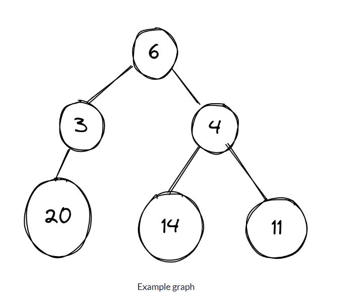

# Techniques

## Brute Force Algorithms

Below given are some features of the brute force algorithm are:

- It is an intuitive, direct, and straightforward technique of problem-solving in which all the possible ways or all the possible solutions to a given problem are enumerated.
- Many problems solved in day-to-day life using the brute force strategy, for example exploring all the paths to a nearby market to find the minimum shortest path.
- Arranging the books in a rack using all the possibilities to optimize the rack spaces, etc.
- In fact, daily life activities use a brute force nature, even though optimal algorithms are also possible.


Pros:

- The brute force approach is a guaranteed way to find the correct solution by listing all the possible candidate solutions for the problem.
- It is a generic method and not limited to any specific domain of problems.
- The brute force method is ideal for solving small and simpler problems.
- It is known for its simplicity and can serve as a comparison benchmark.


Cons:

- The brute force approach is inefficient. For real-time problems, algorithm analysis often goes above the O(N!) order of growth.
- This method relies more on compromising the power of a computer system for solving a problem than on a good algorithm design.
- Brute force algorithms are slow.
- Brute force algorithms are not constructive or creative compared to algorithms that are constructed using some other design paradigms.

Conclusion:

Brute force algorithm is a technique that guarantees solutions for problems of any domain helps in solving the simpler problems and also provides a solution that can serve as a benchmark for evaluating other design techniques, but takes a lot of run time and inefficient.


## Greedy Algorithms

In computer science, a greedy algorithm is an algorithm that finds a solution to problems in the shortest time possible. It picks the path that seems optimal at the moment without regard for the overall optimization of the solution that would be formed.

Edsger Dijkstra, a computer scientist and mathematician who wanted to calculate a minimum spanning tree, introduced the term "Greedy algorithm". Prim and Kruskal came up with optimization techniques for minimizing cost of graphs.


### Greedy vs Not Greedy Algorithms

An algorithm is greedy when the path picked is regarded as the best option based on a specific criterion without considering future consequences. But it typically evaluates feasibility before making a final decision. The correctness of the solution depends on the problem and criteria used.

Example: A graph has various weights and you are to determine the maximum value in the tree. You'd start by searching each node and checking its weight to see if it is the largest value.

There are two approaches to solving this problem: greedy approach or not greedy.




This graph consists of different weights and we need to find the maximum value. We'll apply the two approaches on the graph to get the solution.


#### Greedy Approach
In the images below, a graph has different numbers in its vertices and the algorithm is meant to select the vertex with the largest number.

Starting from vertex 6, then it's faced with two decisions – which is bigger, 3 or 4? The algorithm picks 4, and then is faced with another decision – which is bigger, 14 or 11. It selects 14, and the algorithm ends.

On the other hand there is a vertex labeled 20 but it is attached to vertex 3 which greedy does not consider as the best choice. It is important to select appropriate criteria for making each immediate decision.


#### Not Greedy Approach
The “not greedy” approach checks all options before arriving at a final solution, unlike the "greedy approach" which stops once it gets its results.

Starting from vertex 6, then it's faced with two decisions – which is bigger, 3 or 4? The algorithm picks 4, and then is faced with another decision – which is bigger, 14 or 11. It selects 14 and keeps it aside.

Then it runs the process again, starting from vertex 6. It selects the vertex with 3 and checks it. 20 is attached to the vertex 3 and the process stops. Now it compares the two results – 20 and 14. 20 is bigger, so it selects the vertex (3) that carries the largest number and the process ends.


### Characteristics of a Greedy Algorithm
- The algorithm solves its problem by finding an optimal solution. This solution can be a maximum or minimum value. It makes choices based on the best option available.
- The algorithm is fast and efficient with time complexity of O(n log n) or O(n). Therefore applied in solving large-scale problems.
- The search for optimal solution is done without repetition – the algorithm runs once.
- It is straightforward and easy to implement.


### How to Use Greedy Algorithms
Before applying a greedy algorithm to a problem, you need to ask two questions:

- Do you need the best option at the moment from the problem?

- Do you need an optimal solution (either minimum or maximum value)?

If your answer to these questions is "Yes", then a greedy algorithm is a good choice to solve your problem.


## Divide and Conquer Algorithm


Divide And Conquer 
This technique can be divided into the following three parts:

1. Divide: This involves dividing the problem into smaller sub-problems.
2. Conquer: Solve sub-problems by calling recursively until solved.
3. Combine: Combine the sub-problems to get the final solution of the whole problem.


The following are some standard algorithms that follow Divide and Conquer algorithm.  

1. **Quicksort** is a sorting algorithm. The algorithm picks a pivot element and rearranges the array elements so that all elements smaller than the picked pivot element move to the left side of the pivot, and all greater elements move to the right side. Finally, the algorithm recursively sorts the subarrays on the left and right of the pivot element.
2. **Merge Sort** is also a sorting algorithm. The algorithm divides the array into two halves, recursively sorts them, and finally merges the two sorted halves.
3. **Closest Pair of Points** The problem is to find the closest pair of points in a set of points in the x-y plane. The problem can be solved in O(n^2) time by calculating the distances of every pair of points and comparing the distances to find the minimum. The Divide and Conquer algorithm solves the problem in O(N log N) time.
4. **Strassen’s Algorithm**is an efficient algorithm to multiply two matrices. A simple method to multiply two matrices needs 3 nested loops and is O(n^3). Strassen’s algorithm multiplies two matrices in O(n^2.8974) time.
5. **Cooley–Tukey Fast Fourier Transform (FFT) algorithm** is the most common algorithm for FFT. It is a divide and conquer algorithm which works in O(N log N) time.
6. **Karatsuba algorithm for fast multiplication** does the multiplication of two n-digit numbers
It is, therefore, faster than the classical algorithm, which requires n2 single-digit products. If n = 210 = 1024, in particular, the exact counts are 310 = 59,049 and (210)2 = 1,048,576, respectively.


## Two Pointers Technique

These kind of problems usually involve two pointers:

One slow-runner and the other fast-runner.

There is another variation to that:

One pointer starts from the beginning while the other pointer starts from the end.

They move toward each other until they both meet. Let's take a look at a classic problem: Reverse the characters in a string:

First, let's assume that we already have the swap function defined below:

```
private void swap(char[] str, int i, int j) {
    char temp = str[i];
    str[i] = str[j];
    str[j] = temp;
}
```

The idea is to swap the first character with the end, advance to the next character and swapping repeatedly until it reaches the middle position. We calculate the middle position as n/2
You should verify that the middle position works for both odd and even size of array.

```
public void reverse(char[] str) {
    int n = str.length;
    for (int i = 0; i < n / 2; i++) {
        swap(str, i, n - i - 1);
    }
}
```

Or we can also solve the problem using the two-pointer technique.

```
public void reverse(char[] str) {
    int i = 0, j = str.length - 1;
    while (i < j) {
        swap(str, i, j);
        i++;
        j--;
    }
}
```

Classic problems:

1. Remove Duplicates from Sorted Array
2. Two Sum II - Input array is sorted
3. Reverse Words in a String II
4. Rotate Array
5. Valid Palindrome
6. Container With Most Water
7. Product of Array Except Self


## Fast and Slow Pointers Technique

Fast and Slow pointers is an algorithm that works by setting two pointers that move at different speeds, one faster than the other. If the faster pointer “meets” the slower pointer at any point, a cycle is detected. I came across an interesting problem recently that can be solved using the Fast and Slow pointers technique.

```java
// Java program to detect loop in a linked list
class LinkedList {
	Node head; // head of list

	/* Linked list Node*/
	class Node {
		int data;
		Node next;
		Node(int d)
		{
			data = d;
			next = null;
		}
	}

	/* Inserts a new Node at front of the list. */
	public void push(int new_data)
	{
		/* 1 & 2: Allocate the Node &
				Put in the data*/
		Node new_node = new Node(new_data);

		/* 3. Make next of new Node as head */
		new_node.next = head;

		/* 4. Move the head to point to new Node */
		head = new_node;
	}

	void detectLoop()
	{
		Node slow_p = head, fast_p = head;
		int flag = 0;
		while (slow_p != null && fast_p != null
			&& fast_p.next != null) {
			slow_p = slow_p.next;
			fast_p = fast_p.next.next;
			if (slow_p == fast_p) {
				flag = 1;
				break;
			}
		}
		if (flag == 1)
			System.out.println("Loop found");
		else
			System.out.println("Loop not found");
	}

	/* Driver program to test above functions */
	public static void main(String args[])
	{
		LinkedList llist = new LinkedList();

		llist.push(20);
		llist.push(4);
		llist.push(15);
		llist.push(10);

		/*Create loop for testing */
		llist.head.next.next.next.next = llist.head;

		llist.detectLoop();
	}
}

```


## Merge Intervals Technique

This pattern describes an efficient technique to deal with overlapping intervals. In a lot of problems involving intervals, we either need to find overlapping intervals or merge intervals if they overlap.

Given two intervals (a and b), there will be six different ways the two intervals can relate to each other:

1. a and b do not overlap
2. a and b overlap, b ends after a
3. a completely overlaps b
4. a and b overlap, a ends after b
5. b completely overlaps a
6. a and b do not overlap


To solve this problem optimally we have to first sort the intervals according to the starting time. 
Once we have the sorted intervals, we can combine all intervals in a linear traversal. 
The idea is, in sorted array of intervals, 
if interval[i] doesn’t overlap with interval[i-1], then interval[i+1] cannot overlap with interval[i-1] because starting time of interval[i+1] must be greater than or equal to interval[i].


Time complexity: O(N^2)
Auxiliary Space: O(1)

Follow the steps mentioned below to implement the approach:

- Sort the intervals based on the increasing order of starting time.
- Push the first interval into a stack.
- For each interval do the following:
    - If the current interval does not overlap with the top of the stack then, push the current interval into the stack.
    - If the current interval overlap with the top of the stack then, update the stack top with the ending time of the current interval.
- The end stack contains the merged intervals. 


Our goal is to merge the intervals whenever they overlap. The diagram above clearly shows a merging approach. Our algorithm will look like this:

Sort the intervals on the `startTime` to ensure `a.start <= b.start`
If `a` overlaps `b` (i.e. `b.start <= a.end`), we need to merge them into a new interval `c` such that:

```
c.start = a.start
c.end = max(a.end, b.end)
```


## Sliding Window Technique

In many problems dealing with an array (or a LinkedList), we are asked to find or calculate something among all the contiguous subarrays (or sublists) of a given size. For example, take a look at this problem:

Given an array, find the average of all contiguous subarrays of size K in it.

Lets understand this problem with a real input:

`Array: [1, 3, 2, 6, -1, 4, 1, 8, 2], K=5`

A `brute-force` algorithm will calculate the sum of every 5-element contiguous subarray of the given array and divide the sum by 5 to find the average.

Time complexity: Since for every element of the input array, we are calculating the sum of its next K elements, the time complexity of the above algorithm will be O(N*K) where N is the number of elements in the input array.


**The efficient way** to solve this problem would be to visualize each contiguous subarray as **a sliding window** of 5 elements. This means that we will slide the window by one element when we move on to the next subarray. To reuse the sum from the previous subarray, we will subtract the element going out of the window and add the element now being included in the sliding window. This will save us from going through the whole subarray to find the sum and, as a result, the algorithm complexity will reduce to O(N).


### How to Know, Where we use the Sliding Window?

To know, Where we use the Sliding Window then we remember the following terms which is mentioned below:

```Array, String, Sub Array, Sub String, Largest Sum, Maximum Sum, Minimum Sum```

So, These terms help you to know where you have to use the sliding window.

Example: Given an array of integers of size ‘n’, Our aim is to calculate the maximum sum of ‘k’ consecutive elements in the array.

```
Input  : arr[] = {100, 200, 300, 400}, k = 2
Output : 700

Input  : arr[] = {1, 4, 2, 10, 23, 3, 1, 0, 20}, k = 4 
Output : 39
We get maximum sum by adding subarray {4, 2, 10, 23} of size 4.

Input  : arr[] = {2, 3}, k = 3
Output : Invalid
There is no subarray of size 3 as size of whole array is 2.
```


### Naive Approach

So, let’s analyze the problem with Brute Force Approach. We start with the first index and sum till the kth element. We do it for all possible consecutive blocks or groups of k elements. This method requires a nested for loop, the outer for loop starts with the starting element of the block of k elements, and the inner or the nested loop will add up till the kth element.

Consider the below implementation : 

```java
// Java code O(n*k) solution for finding maximum sum of
// a subarray of size k
class GFG {
	// Returns maximum sum in
	// a subarray of size k.
	static int maxSum(int arr[], int n, int k)
	{
		// Initialize result
		int max_sum = Integer.MIN_VALUE;

		// Consider all blocks starting with i.
		for (int i = 0; i < n - k + 1; i++) {
			int current_sum = 0;
			for (int j = 0; j < k; j++)
				current_sum = current_sum + arr[i + j];

			// Update result if required.
			max_sum = Math.max(current_sum, max_sum);
		}

		return max_sum;
	}

	// Driver code
	public static void main(String[] args)
	{
		int arr[] = { 1, 4, 2, 10, 2, 3, 1, 0, 20 };
		int k = 4;
		int n = arr.length;
		System.out.println(maxSum(arr, n, k));
	}
}

// This code is contributed by Aditya Kumar (adityakumar129)

```


### Sliding Window Approach

The technique can be best understood with the window pane in the bus, considering a window of length n and the pane which is fixed in it of length k. Consider, initially the pane is at extreme left i.e., at 0 units from the left. Now, co-relate the window with array arr[] of size n and pane with current_sum of size k elements. Now, if we apply force on the window, it moves a unit distance ahead. The pane will cover the next k consecutive elements. 

Applying the sliding window technique : 

1. We compute the sum of the first k elements out of n terms using a linear loop and store the sum in variable window_sum.
2. Then we will graze linearly over the array till it reaches the end and simultaneously keep track of the maximum sum.
3. To get the current sum of a block of k elements just subtract the first element from the previous block and add the last element of the current block.


```java
// Java code for
// O(n) solution for finding
// maximum sum of a subarray
// of size k
class GFG {

	// Returns maximum sum in
	// a subarray of size k.
	static int maxSum(int arr[], int n, int k)
	{
		// n must be greater
		if (n < k) {
			System.out.println("Invalid");
			return -1;
		}

		// Compute sum of first window of size k
		int max_sum = 0;
		for (int i = 0; i < k; i++)
			max_sum += arr[i];

		// Compute sums of remaining windows by
		// removing first element of previous
		// window and adding last element of
		// current window.
		int window_sum = max_sum;
		for (int i = k; i < n; i++) {
			window_sum += arr[i] - arr[i - k];
			max_sum = Math.max(max_sum, window_sum);
		}

		return max_sum;
	}

	// Driver code
	public static void main(String[] args)
	{
		int arr[] = { 1, 4, 2, 10, 2, 3, 1, 0, 20 };
		int k = 4;
		int n = arr.length;
		System.out.println(maxSum(arr, n, k));
	}
}

// This code is contributed
// by prerna saini.

```


## Cyclic Sort Technique


Cycle sort is an in-place sorting algorithm. This pattern describes an interesting approach to dealing with problems involving arrays containing numbers in a given range.

- It is optimal in terms of the number of memory writes.
- It is based on the idea that the array to be sorted can be divided into cycles. Cycles can be visualized as a graph.

**The principal idea:** Given an element a, we can find the index at which it will occur in the sorted list by simply counting the number of elements in the entire list that are smaller than a.


```javascript
function cyclicSort(nums) {
  let i = 0;

  while (i < nums.length) {
    const j = nums[i] - 1; //nums[i] = 3, 3-1 = 2
    if (nums[i] !== nums[j]) {
      //3 !== 2
      //swap
      // [nums[i], nums[j]] = [nums[j], nums[i]]
      let temp = nums[i];
      nums[i] = nums[j];
      nums[j] = temp;
    } else {
      i++;
    }
  }
  return nums;
}

cyclicSort([3, 1, 5, 4, 2]);
cyclicSort([2, 6, 4, 3, 1, 5]);
cyclicSort([1, 5, 6, 4, 3, 2]);
```

[3, 1, 5, 4, 2]
[5, 1, 3, 4, 2]
[2, 1, 3, 4, 5]
[1, 2, 3, 4, 5]
[1, 2, 3, 4, 5]
[1, 2, 3, 4, 5]
[1, 2, 3, 4, 5]
[1, 2, 3, 4, 5]


some variations to it exists like the following problems:

- Find the Missing Number (easy)
- Find all Missing Numbers (easy)
- Find the Duplicate Number (easy)
- Find all Duplicate Numbers (easy)
- Find the Corrupt Pair (easy)
- Find the Smallest Missing Positive Number (medium)
- Find the First K Missing Positive Numbers (hard)


# References

https://www.geeksforgeeks.org/brute-force-approach-and-its-pros-and-cons/

https://www.freecodecamp.org/news/greedy-algorithms/

https://www.geeksforgeeks.org/introduction-to-divide-and-conquer-algorithm-data-structure-and-algorithm-tutorials/

https://leetcode.com/articles/two-pointer-technique/

https://github.com/Chanda-Abdul/Several-Coding-Patterns-for-Solving-Data-Structures-and-Algorithms-Problems-during-Interviews/blob/main/%E2%9C%85%20%20Pattern%2004%20:%20Merge%20Intervals.md

https://www.geeksforgeeks.org/merging-intervals/

https://www.geeksforgeeks.org/window-sliding-technique/

https://medium.com/techie-delight/top-problems-on-sliding-window-technique-8e63f1e2b1fa


https://medium.com/@luisfernandosalasg/coding-pattern-cyclic-sort-96511b0f60ac


https://github.com/Chanda-Abdul/Several-Coding-Patterns-for-Solving-Data-Structures-and-Algorithms-Problems-during-Interviews/blob/main/%E2%9C%85%20%20Pattern%2005%3A%20Cyclic%20Sort.md