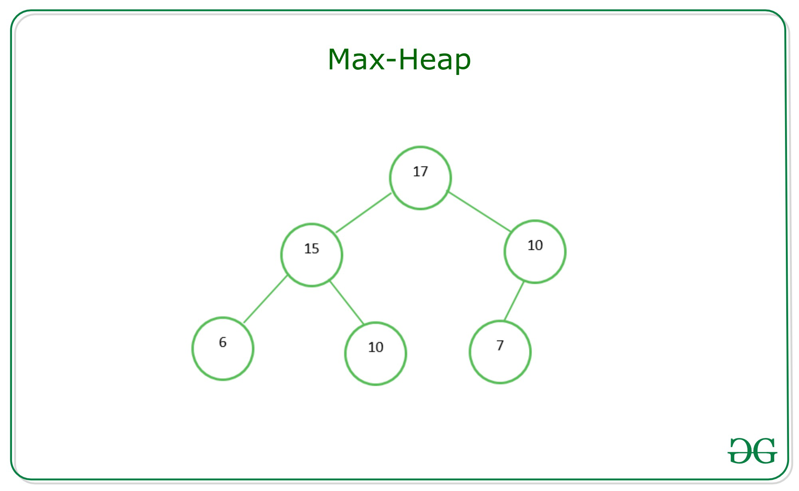

# Techniques

## Brute Force Algorithms

Below given are some features of the brute force algorithm are:

- It is an intuitive, direct, and straightforward technique of problem-solving in which all the possible ways or all the possible solutions to a given problem are enumerated.
- Many problems solved in day-to-day life using the brute force strategy, for example exploring all the paths to a nearby market to find the minimum shortest path.
- Arranging the books in a rack using all the possibilities to optimize the rack spaces, etc.
- In fact, daily life activities use a brute force nature, even though optimal algorithms are also possible.


Pros:

- The brute force approach is a guaranteed way to find the correct solution by listing all the possible candidate solutions for the problem.
- It is a generic method and not limited to any specific domain of problems.
- The brute force method is ideal for solving small and simpler problems.
- It is known for its simplicity and can serve as a comparison benchmark.


Cons:

- The brute force approach is inefficient. For real-time problems, algorithm analysis often goes above the O(N!) order of growth.
- This method relies more on compromising the power of a computer system for solving a problem than on a good algorithm design.
- Brute force algorithms are slow.
- Brute force algorithms are not constructive or creative compared to algorithms that are constructed using some other design paradigms.

Conclusion:

Brute force algorithm is a technique that guarantees solutions for problems of any domain helps in solving the simpler problems and also provides a solution that can serve as a benchmark for evaluating other design techniques, but takes a lot of run time and inefficient.


## Greedy Algorithms

In computer science, a greedy algorithm is an algorithm that finds a solution to problems in the shortest time possible. It picks the path that seems optimal at the moment without regard for the overall optimization of the solution that would be formed.

Edsger Dijkstra, a computer scientist and mathematician who wanted to calculate a minimum spanning tree, introduced the term "Greedy algorithm". Prim and Kruskal came up with optimization techniques for minimizing cost of graphs.


### Greedy vs Not Greedy Algorithms

An algorithm is greedy when the path picked is regarded as the best option based on a specific criterion without considering future consequences. But it typically evaluates feasibility before making a final decision. The correctness of the solution depends on the problem and criteria used.

Example: A graph has various weights and you are to determine the maximum value in the tree. You'd start by searching each node and checking its weight to see if it is the largest value.

There are two approaches to solving this problem: greedy approach or not greedy.


This graph consists of different weights and we need to find the maximum value. We'll apply the two approaches on the graph to get the solution.


#### Greedy Approach
In the images below, a graph has different numbers in its vertices and the algorithm is meant to select the vertex with the largest number.

Starting from vertex 6, then it's faced with two decisions – which is bigger, 3 or 4? The algorithm picks 4, and then is faced with another decision – which is bigger, 14 or 11. It selects 14, and the algorithm ends.

On the other hand there is a vertex labeled 20 but it is attached to vertex 3 which greedy does not consider as the best choice. It is important to select appropriate criteria for making each immediate decision.


#### Not Greedy Approach
The “not greedy” approach checks all options before arriving at a final solution, unlike the "greedy approach" which stops once it gets its results.

Starting from vertex 6, then it's faced with two decisions – which is bigger, 3 or 4? The algorithm picks 4, and then is faced with another decision – which is bigger, 14 or 11. It selects 14 and keeps it aside.

Then it runs the process again, starting from vertex 6. It selects the vertex with 3 and checks it. 20 is attached to the vertex 3 and the process stops. Now it compares the two results – 20 and 14. 20 is bigger, so it selects the vertex (3) that carries the largest number and the process ends.


### Characteristics of a Greedy Algorithm
- The algorithm solves its problem by finding an optimal solution. This solution can be a maximum or minimum value. It makes choices based on the best option available.
- The algorithm is fast and efficient with time complexity of O(n log n) or O(n). Therefore applied in solving large-scale problems.
- The search for optimal solution is done without repetition – the algorithm runs once.
- It is straightforward and easy to implement.


### How to Use Greedy Algorithms
Before applying a greedy algorithm to a problem, you need to ask two questions:

- Do you need the best option at the moment from the problem?

- Do you need an optimal solution (either minimum or maximum value)?

If your answer to these questions is "Yes", then a greedy algorithm is a good choice to solve your problem.


## Divide and Conquer Algorithm


Divide And Conquer 
This technique can be divided into the following three parts:

1. Divide: This involves dividing the problem into smaller sub-problems.
2. Conquer: Solve sub-problems by calling recursively until solved.
3. Combine: Combine the sub-problems to get the final solution of the whole problem.


The following are some standard algorithms that follow Divide and Conquer algorithm.  

1. **Quicksort** is a sorting algorithm. The algorithm picks a pivot element and rearranges the array elements so that all elements smaller than the picked pivot element move to the left side of the pivot, and all greater elements move to the right side. Finally, the algorithm recursively sorts the subarrays on the left and right of the pivot element.
2. **Merge Sort** is also a sorting algorithm. The algorithm divides the array into two halves, recursively sorts them, and finally merges the two sorted halves.
3. **Closest Pair of Points** The problem is to find the closest pair of points in a set of points in the x-y plane. The problem can be solved in O(n^2) time by calculating the distances of every pair of points and comparing the distances to find the minimum. The Divide and Conquer algorithm solves the problem in O(N log N) time.
4. **Strassen’s Algorithm**is an efficient algorithm to multiply two matrices. A simple method to multiply two matrices needs 3 nested loops and is O(n^3). Strassen’s algorithm multiplies two matrices in O(n^2.8974) time.
5. **Cooley–Tukey Fast Fourier Transform (FFT) algorithm** is the most common algorithm for FFT. It is a divide and conquer algorithm which works in O(N log N) time.
6. **Karatsuba algorithm for fast multiplication** does the multiplication of two n-digit numbers
It is, therefore, faster than the classical algorithm, which requires n2 single-digit products. If n = 210 = 1024, in particular, the exact counts are 310 = 59,049 and (210)2 = 1,048,576, respectively.


## Two Pointers Technique

These kind of problems usually involve two pointers:

One slow-runner and the other fast-runner.

There is another variation to that:

One pointer starts from the beginning while the other pointer starts from the end.

They move toward each other until they both meet. Let's take a look at a classic problem: Reverse the characters in a string:

First, let's assume that we already have the swap function defined below:

```
private void swap(char[] str, int i, int j) {
    char temp = str[i];
    str[i] = str[j];
    str[j] = temp;
}
```

The idea is to swap the first character with the end, advance to the next character and swapping repeatedly until it reaches the middle position. We calculate the middle position as n/2
You should verify that the middle position works for both odd and even size of array.

```
public void reverse(char[] str) {
    int n = str.length;
    for (int i = 0; i < n / 2; i++) {
        swap(str, i, n - i - 1);
    }
}
```

Or we can also solve the problem using the two-pointer technique.

```
public void reverse(char[] str) {
    int i = 0, j = str.length - 1;
    while (i < j) {
        swap(str, i, j);
        i++;
        j--;
    }
}
```

Classic problems:

1. Remove Duplicates from Sorted Array
2. Two Sum II - Input array is sorted
3. Reverse Words in a String II
4. Rotate Array
5. Valid Palindrome
6. Container With Most Water
7. Product of Array Except Self


## Fast and Slow Pointers Technique

Fast and Slow pointers is an algorithm that works by setting two pointers that move at different speeds, one faster than the other. If the faster pointer “meets” the slower pointer at any point, a cycle is detected. I came across an interesting problem recently that can be solved using the Fast and Slow pointers technique.

```java
// Java program to detect loop in a linked list
class LinkedList {
	Node head; // head of list

	/* Linked list Node*/
	class Node {
		int data;
		Node next;
		Node(int d)
		{
			data = d;
			next = null;
		}
	}

	/* Inserts a new Node at front of the list. */
	public void push(int new_data)
	{
		/* 1 & 2: Allocate the Node &
				Put in the data*/
		Node new_node = new Node(new_data);

		/* 3. Make next of new Node as head */
		new_node.next = head;

		/* 4. Move the head to point to new Node */
		head = new_node;
	}

	void detectLoop()
	{
		Node slow_p = head, fast_p = head;
		int flag = 0;
		while (slow_p != null && fast_p != null
			&& fast_p.next != null) {
			slow_p = slow_p.next;
			fast_p = fast_p.next.next;
			if (slow_p == fast_p) {
				flag = 1;
				break;
			}
		}
		if (flag == 1)
			System.out.println("Loop found");
		else
			System.out.println("Loop not found");
	}

	/* Driver program to test above functions */
	public static void main(String args[])
	{
		LinkedList llist = new LinkedList();

		llist.push(20);
		llist.push(4);
		llist.push(15);
		llist.push(10);

		/*Create loop for testing */
		llist.head.next.next.next.next = llist.head;

		llist.detectLoop();
	}
}

```


## Merge Intervals Technique

This pattern describes an efficient technique to deal with overlapping intervals. In a lot of problems involving intervals, we either need to find overlapping intervals or merge intervals if they overlap.

Given two intervals (a and b), there will be six different ways the two intervals can relate to each other:

1. a and b do not overlap
2. a and b overlap, b ends after a
3. a completely overlaps b
4. a and b overlap, a ends after b
5. b completely overlaps a
6. a and b do not overlap


To solve this problem optimally we have to first sort the intervals according to the starting time. 
Once we have the sorted intervals, we can combine all intervals in a linear traversal. 
The idea is, in sorted array of intervals, 
if interval[i] doesn’t overlap with interval[i-1], then interval[i+1] cannot overlap with interval[i-1] because starting time of interval[i+1] must be greater than or equal to interval[i].


Time complexity: O(N^2)
Auxiliary Space: O(1)

Follow the steps mentioned below to implement the approach:

- Sort the intervals based on the increasing order of starting time.
- Push the first interval into a stack.
- For each interval do the following:
    - If the current interval does not overlap with the top of the stack then, push the current interval into the stack.
    - If the current interval overlap with the top of the stack then, update the stack top with the ending time of the current interval.
- The end stack contains the merged intervals. 


Our goal is to merge the intervals whenever they overlap. The diagram above clearly shows a merging approach. Our algorithm will look like this:

Sort the intervals on the `startTime` to ensure `a.start <= b.start`
If `a` overlaps `b` (i.e. `b.start <= a.end`), we need to merge them into a new interval `c` such that:

```
c.start = a.start
c.end = max(a.end, b.end)
```


## Sliding Window Technique

In many problems dealing with an array (or a LinkedList), we are asked to find or calculate something among all the contiguous subarrays (or sublists) of a given size. For example, take a look at this problem:

Given an array, find the average of all contiguous subarrays of size K in it.

Lets understand this problem with a real input:

`Array: [1, 3, 2, 6, -1, 4, 1, 8, 2], K=5`

A `brute-force` algorithm will calculate the sum of every 5-element contiguous subarray of the given array and divide the sum by 5 to find the average.

Time complexity: Since for every element of the input array, we are calculating the sum of its next K elements, the time complexity of the above algorithm will be O(N*K) where N is the number of elements in the input array.


**The efficient way** to solve this problem would be to visualize each contiguous subarray as **a sliding window** of 5 elements. This means that we will slide the window by one element when we move on to the next subarray. To reuse the sum from the previous subarray, we will subtract the element going out of the window and add the element now being included in the sliding window. This will save us from going through the whole subarray to find the sum and, as a result, the algorithm complexity will reduce to O(N).


### How to Know, Where we use the Sliding Window?

To know, Where we use the Sliding Window then we remember the following terms which is mentioned below:

```Array, String, Sub Array, Sub String, Largest Sum, Maximum Sum, Minimum Sum```

So, These terms help you to know where you have to use the sliding window.

Example: Given an array of integers of size ‘n’, Our aim is to calculate the maximum sum of ‘k’ consecutive elements in the array.

```
Input  : arr[] = {100, 200, 300, 400}, k = 2
Output : 700

Input  : arr[] = {1, 4, 2, 10, 23, 3, 1, 0, 20}, k = 4 
Output : 39
We get maximum sum by adding subarray {4, 2, 10, 23} of size 4.

Input  : arr[] = {2, 3}, k = 3
Output : Invalid
There is no subarray of size 3 as size of whole array is 2.
```


### Naive Approach

So, let’s analyze the problem with Brute Force Approach. We start with the first index and sum till the kth element. We do it for all possible consecutive blocks or groups of k elements. This method requires a nested for loop, the outer for loop starts with the starting element of the block of k elements, and the inner or the nested loop will add up till the kth element.

Consider the below implementation : 

```java
// Java code O(n*k) solution for finding maximum sum of
// a subarray of size k
class GFG {
	// Returns maximum sum in
	// a subarray of size k.
	static int maxSum(int arr[], int n, int k)
	{
		// Initialize result
		int max_sum = Integer.MIN_VALUE;

		// Consider all blocks starting with i.
		for (int i = 0; i < n - k + 1; i++) {
			int current_sum = 0;
			for (int j = 0; j < k; j++)
				current_sum = current_sum + arr[i + j];

			// Update result if required.
			max_sum = Math.max(current_sum, max_sum);
		}

		return max_sum;
	}

	// Driver code
	public static void main(String[] args)
	{
		int arr[] = { 1, 4, 2, 10, 2, 3, 1, 0, 20 };
		int k = 4;
		int n = arr.length;
		System.out.println(maxSum(arr, n, k));
	}
}

// This code is contributed by Aditya Kumar (adityakumar129)

```


### Sliding Window Approach

The technique can be best understood with the window pane in the bus, considering a window of length n and the pane which is fixed in it of length k. Consider, initially the pane is at extreme left i.e., at 0 units from the left. Now, co-relate the window with array arr[] of size n and pane with current_sum of size k elements. Now, if we apply force on the window, it moves a unit distance ahead. The pane will cover the next k consecutive elements. 

Applying the sliding window technique : 

1. We compute the sum of the first k elements out of n terms using a linear loop and store the sum in variable window_sum.
2. Then we will graze linearly over the array till it reaches the end and simultaneously keep track of the maximum sum.
3. To get the current sum of a block of k elements just subtract the first element from the previous block and add the last element of the current block.


```java
// Java code for
// O(n) solution for finding
// maximum sum of a subarray
// of size k
class GFG {

	// Returns maximum sum in
	// a subarray of size k.
	static int maxSum(int arr[], int n, int k)
	{
		// n must be greater
		if (n < k) {
			System.out.println("Invalid");
			return -1;
		}

		// Compute sum of first window of size k
		int max_sum = 0;
		for (int i = 0; i < k; i++)
			max_sum += arr[i];

		// Compute sums of remaining windows by
		// removing first element of previous
		// window and adding last element of
		// current window.
		int window_sum = max_sum;
		for (int i = k; i < n; i++) {
			window_sum += arr[i] - arr[i - k];
			max_sum = Math.max(max_sum, window_sum);
		}

		return max_sum;
	}

	// Driver code
	public static void main(String[] args)
	{
		int arr[] = { 1, 4, 2, 10, 2, 3, 1, 0, 20 };
		int k = 4;
		int n = arr.length;
		System.out.println(maxSum(arr, n, k));
	}
}

// This code is contributed
// by prerna saini.

```


## Cyclic Sort Technique


Cycle sort is an in-place sorting algorithm. This pattern describes an interesting approach to dealing with problems involving arrays containing numbers in a given range.

- It is optimal in terms of the number of memory writes.
- It is based on the idea that the array to be sorted can be divided into cycles. Cycles can be visualized as a graph.

**The principal idea:** Given an element a, we can find the index at which it will occur in the sorted list by simply counting the number of elements in the entire list that are smaller than a.


```javascript
// in JS
function cyclicSort(nums) {
  let i = 0;

  while (i < nums.length) {
    const j = nums[i] - 1; //nums[i] = 3, 3-1 = 2
    if (nums[i] !== nums[j]) {
      //3 !== 2
      //swap
      // [nums[i], nums[j]] = [nums[j], nums[i]]
      let temp = nums[i];
      nums[i] = nums[j];
      nums[j] = temp;
    } else {
      i++;
    }
  }
  return nums;
}

cyclicSort([3, 1, 5, 4, 2]);
cyclicSort([2, 6, 4, 3, 1, 5]);
cyclicSort([1, 5, 6, 4, 3, 2]);
```

[3, 1, 5, 4, 2]
[5, 1, 3, 4, 2]
[2, 1, 3, 4, 5]
[1, 2, 3, 4, 5]
[1, 2, 3, 4, 5]
[1, 2, 3, 4, 5]
[1, 2, 3, 4, 5]
[1, 2, 3, 4, 5]


some variations to it exists like the following problems:

- Find the Missing Number (easy)
- Find all Missing Numbers (easy)
- Find the Duplicate Number (easy)
- Find all Duplicate Numbers (easy)
- Find the Corrupt Pair (easy)
- Find the Smallest Missing Positive Number (medium)
- Find the First K Missing Positive Numbers (hard)


## Subsets Technique


> Given a set with distinct elements, find all of its distinct subsets.

To generate all subsets of the given set, we can use the Breadth First Search (BFS) approach. We can start with an empty set, iterate through all numbers one-by-one, and add them to existing sets to create new subsets.

Let’s take the example-2 mentioned above to go through each step of our algorithm:

Given set: `[1, 5, 3]`
1. Start with an empty set: `[[]]`
2. Add the first number `1` to all the existing subsets to create new subsets: `[[],`<b>`[1]`</b>`];`
3. Add the second number `5` to all the existing subsets: `[[], [1], `<b>`[5], [1,5]`</b>`]`;
4. Add the third number `3` to all the existing subsets: `[[], [1], [5], [1,5], `<b>`[3], [1,3], [5,3], [1,5,3]`</b>`]`.

Since the input set has distinct elements, the above steps will ensure that we will not have any duplicate subsets.

```javascript
function findSubsets(nums) {
  const subsets = [];
  
  //start by adding the empty subset
  subsets.push([])
  
  for(let i = 0; i < nums.length; i++) {
    const currentNumber = nums[i]
    
    //we will take all existing subsets and insert the current
    //number in them to create new subsets
    const n = subsets.length

    //create a new subset from the existing subset and insert
    //the current element to it
    for(let j = 0; j < n; j++) {
      
      //clone the permutation
      // const set1 = subsets[j].slice(0)
      
      // set1.push(currentNumber)
      subsets.push([...subsets[j], nums[i]])
    }
  }

  return subsets;
};


findSubsets([1, 3])
findSubsets([1, 5, 3])
```

- Since, in each step, the number of subsets doubles as we add each element to all the existing subsets, therefore, we will have a total of `O(2ᴺ)` subsets, where `N` is the total number of elements in the input set. And since we construct a new subset from an existing set, therefore, the time complexity of the above algorithm will be `O(N*2ᴺ)`.
- All the additional space used by our algorithm is for the output list. Since we will have a total of `O(2ᴺ)` subsets, and each subset can take up to `O(N)` space, therefore, the space complexity of our algorithm will be `O(N*2ᴺ)`.


Other variations to these problems:

- Subsets With Duplicates (medium)
- Permutations (medium)
- String Permutations by changing case (medium)
- Balanced Parentheses (hard)
- Unique Generalized Abbreviations (hard)
- Evaluate Expression (hard)
- Structurally Unique Binary Search Trees (hard)
- Count of Structurally Unique Binary Search Trees (hard)


## Topological Sort

Topological Sort is used to find a linear ordering of elements that have dependencies on each other. For example, if event B is dependent on event A, A comes before B in topological ordering.

> Topological Sort of a directed graph (a graph with unidirectional edges) is a linear ordering of its vertices such that for every directed edge (U, V) from vertex U to vertex V, U comes before V in the ordering. Given a directed graph, find the topological ordering of its vertices.


```
Input: Vertices=4, Edges=[3, 2], [3, 0], [2, 0], [2, 1]
Output: Following are the two valid topological sorts for the given graph:
1) 3, 2, 0, 1
2) 3, 2, 1, 0
```


The basic idea behind the topological sort is to provide a partial ordering among the vertices of the graph such that if there is an edge from `U` to `V` then `U≤V` i.e., `U` comes before `V` in the ordering. 

Here are a few fundamental concepts related to <b>topological sort</b>:

- <b>Source:</b> Any node that has no incoming edge and has only outgoing edges is called a <b>source</b>.
- <b>Sink:</b> Any node that has only incoming edges and no outgoing edge is called a <b>sink</b>.
- So, we can say that a topological ordering starts with one of the <b>sources</b> and ends at one of the <b>sinks</b>.
- A topological ordering is possible only when the graph has no directed <i>cycles</i>, i.e. if the graph is a <b>Directed Acyclic Graph (DAG)</b>. If the graph has a cycle, some vertices will have cyclic dependencies which makes it impossible to find a linear ordering among vertices.


To find the topological sort of a graph we can traverse the graph in a Breadth First Search (BFS) way. We will start with all the sources, and in a stepwise fashion, save all sources to a sorted list. We will then remove all sources and their edges from the graph. After the removal of the edges, we will have new sources, so we will repeat the above process until all vertices are visited.


1. Initialization
- We will store the graph in Adjacency Lists, which means each parent vertex will have a list containing all of its children.
- We will do this using a HashMap where the key will be the parent vertex number and the value will be a List containing children vertices.
- To find the sources, we will keep a HashMap to count the in-degrees i.e., count of incoming edges of each vertex. Any vertex with 0 in-degree will be a source.


2. Build the graph and find in-degrees of all vertices
- We will build the graph from the input and populate the in-degrees HashMap.


3. Find all sources
- All vertices with `0` in-degrees will be our sources and we will store them in a Queue.


4. Sort
- For each source, do the following things
	- Add it to the sorted list.
	- Get all of its children from the graph.
	- Decrement the in-degree of each child by `1`.
	- If a child’s in-degree becomes `0`, add it to the sources **Queue**.
- Repeat for each source, until the source **Queue** is empty.


```javascript
function topologicalSort(vertices, edges) {
  const sortedOrder = [];

  if (vertices <= 0) {
    return sortedOrder;
  }

  //1. Initialize the graph
  //count incoming edges
  const inDegree = Array(vertices).fill(0);
  //adjacency list graph
  const graph = Array(vertices)
    .fill(0)
    .map(() => Array());

  //2. Build the graph
  edges.forEach((edge) => {
    let parent = edge[0];
    let child = edge[1];
    //put the child into it's parent's list
    graph[parent].push(child);
    //increment child's inDegree
    inDegree[child]++;
  });
  
  //3. Find all sources/vertices with 0 inDegrees
  const sources = [];
  for (let i = 0; i < inDegree.length; i++) {
    if (inDegree[i] === 0) sources.push(i);
  }

  //4. For each sorce, add it to sortedOrder and decrement it children inDegree
  //if a child become 0, add to source queue
  while (sources.length > 0) {
    const vertex = sources.shift();
    sortedOrder.push(vertex);
    graph[vertex].forEach((child) => {
      //get the nodes children to dcrement thier inDegree
      inDegree[child]--;
      if (inDegree[child] === 0) {
        sources.push(child);
      }
    });
    // console.log(vertex)
  }

  // topological sort is not possible as the graph has a cycle
  if (sortedOrder.length !== vertices) {
    return [];
  }
  // console.log(inDegree, graph, sources)
  return sortedOrder;
}

console.log(`Topological sort: ${topologicalSort(4, [[3, 2], [3, 0], [2, 0], [2, 1]])}`)
//Following are the two valid topological sorts for the given graph:
//1) 3, 2, 0, 1
//2) 3, 2, 1, 0
console.log(`Topological sort: ${topologicalSort(5, [[4, 2], [4, 3], [2, 0], [2, 1], [3, 1]])}`)
//Following are all valid topological sorts for the given graph:
// 1) 4, 2, 3, 0, 1
// 2) 4, 3, 2, 0, 1
// 3) 4, 3, 2, 1, 0
// 4) 4, 2, 3, 1, 0
// 5) 4, 2, 0, 3, 1

console.log(`Topological sort: ${topologicalSort(7, [[6, 4],[6, 2],[5, 3],[5, 4],[3, 0],[3, 1],[3, 2],[4, 1],])}`);
// Following are all valid topological sorts for the given graph:
// 1) 5, 6, 3, 4, 0, 1, 2
// 2) 6, 5, 3, 4, 0, 1, 2
// 3) 5, 6, 4, 3, 0, 2, 1
// 4) 6, 5, 4, 3, 0, 1, 2
// 5) 5, 6, 3, 4, 0, 2, 1
// 6) 5, 6, 3, 4, 1, 2, 0
// There are other valid topological ordering of the graph too.
```

Variation:
Tasks Scheduling (medium)
Tasks Scheduling Order (medium)
All Tasks Scheduling Orders (hard)
Alien Dictionary (hard)
Reconstructing a Sequence (hard)
Minimum Height Trees (hard)


## Top K Elements Technique


Any problem that asks us to find the top/smallest/frequent K elements among a given set falls under this pattern.

The best data structure that comes to mind to keep track of K elements is Heap. This pattern will make use of the Heap to solve multiple problems dealing with K elements at a time from a set of given elements.

`A Heap is a special Tree-based data structure in which the tree is a complete binary tree.`

`A complete binary tree is a special type of binary tree where all the levels of the tree are filled completely except the lowest level nodes which are filled from as left as possible.`


Given an array of N numbers and a positive integer K. The problem is to find K numbers with the most occurrences, i.e., the top K numbers having the maximum frequency. If two numbers have the same frequency then the number with a larger value should be given preference. The numbers should be displayed in decreasing order of their frequencies. It is assumed that the array consists of at least K numbers.

```
Input: arr[] = {3, 1, 4, 4, 5, 2, 6, 1}, K = 2
Output: 4 1
Explanation:
Frequency of 4 = 2, Frequency of 1 = 2
These two have the maximum frequency and 4 is larger than 1.
```

One way to solve this would be to use a Map (which could come to mind first in an interview)

create a Map to store the element-frequency pair. Map is used to perform insertion and updating in constant time. Then sort the element-frequency pair in decreasing order of frequency. This gives the information about each element and the number of times they are present in the array. To get K elements of the array, print the first K elements of the sorted array.

```java
// Java implementation to find
// K elements with max occurrence.

import java.util.*;
public class KFrequentNumbers {
	static void print_N_mostFrequentNumber(int[] arr, int N,
										int K)
	{

		Map<Integer, Integer> mp
			= new HashMap<Integer, Integer>();

		// Put count of all the
		// distinct elements in Map
		// with element as the key &
		// count as the value.
		for (int i = 0; i < N; i++) {

			// Get the count for the
			// element if already present in the
			// Map or get the default value which is 0.
			mp.put(arr[i], mp.getOrDefault(arr[i], 0) + 1);
		}

		// Create a list from elements of HashMap
		List<Map.Entry<Integer, Integer> > list
			= new ArrayList<Map.Entry<Integer, Integer> >(
				mp.entrySet());

		// Sort the list
		Collections.sort(
			list,
			new Comparator<Map.Entry<Integer, Integer> >() {
				public int compare(
					Map.Entry<Integer, Integer> o1,
					Map.Entry<Integer, Integer> o2)
				{
					if (o1.getValue() == o2.getValue())
						return o2.getKey() - o1.getKey();
					else
						return o2.getValue()
							- o1.getValue();
				}
			});

		for (int i = 0; i < K; i++)
			System.out.print(list.get(i).getKey() + " ");
	}

	// Driver's Code
	public static void main(String[] args)
	{
		int arr[] = { 3, 1, 4, 4, 5, 2, 6, 1 };
		int N = arr.length;
		int K = 2;

		// Function call
		System.out.println(
			K + " numbers with most occurrences are:");
		print_N_mostFrequentNumber(arr, N, K);
	}
}

```

Output
```
2 numbers with most occurrences are:
4 1 
```

Time Complexity: O(D log D), where D is the count of distinct elements in the array
Auxiliary Space: O(D), where D is the count of distinct elements in the array


Now Let's try solving this problem with the Max-Head Data Structure


Approach: Create a Map to store element-frequency pair. Map is used to perform insertion and updation in constant time. Then use a priority queue to store the element-frequency pair (Max-Heap). The element which has maximum frequency, comes at the root of the Priority Queue. Remove the top or root of Priority Queue K times and print the element.

```java
// Java implementation to find k
// elements with max occurrence.
import java.util.*;
public class KFrequentNumbers {
	static void print_N_mostFrequentNumber(int[] arr, int N,
										int K)
	{
		Map<Integer, Integer> mp
			= new HashMap<Integer, Integer>();

		// Put count of all the
		// distinct elements in Map
		// with element as the key &
		// count as the value.
		for (int i = 0; i < N; i++) {

			// Get the count for the
			// element if already
			// present in the Map or
			// get the default value
			// which is 0.
			mp.put(arr[i], mp.getOrDefault(arr[i], 0) + 1);
		}

		// Create a Priority Queue
		// to sort based on the
		// count or on the key if the
		// count is same
		PriorityQueue<Map.Entry<Integer, Integer> > queue
			= new PriorityQueue<>(
				(a, b)
					-> a.getValue().equals(b.getValue())
						? Integer.compare(b.getKey(),
											a.getKey())
						: Integer.compare(b.getValue(),
											a.getValue()));

		// Insert the data from the map
		// to the Priority Queue.
		for (Map.Entry<Integer, Integer> entry :
			mp.entrySet())
			queue.offer(entry);

		// Print the top k elements
		for (int i = 0; i < K; i++) {
			System.out.print(queue.poll().getKey() + " ");
		}
	}

	// Driver's Code
	public static void main(String[] args)
	{
		int arr[] = { 3, 1, 4, 4, 5, 2, 6, 1 };
		int N = arr.length;
		int K = 2;

		System.out.println(
			K + " numbers with most occurrences are:");
		// Function call
		print_N_mostFrequentNumber(arr, N, K);
	}
}

// This code is contributed by Shubham Kumar Shah

```


## Min Heaps and Max Heaps Technique


A Heap is a special Tree-based data structure in which the tree is a complete binary tree. Since a heap is a complete binary tree, a heap with N nodes has log N height. It is useful to remove the highest or lowest priority element. It is typically represented as an array. There are two types of Heaps in the data structure.

### Min-Heap
In a Min-Heap the key present at the root node must be less than or equal among the keys present in all of its children. The same property must be recursively true for all sub-trees in that Binary Tree. In a Min-Heap the minimum key element is present at the root. Below is the Binary Tree that satisfies all the property of Min Heap.


### Max Heap
In a Max-Heap the key present at the root node must be greater than or equal among the keys present in all of its children. The same property must be recursively true for all sub-trees in that Binary Tree. In a Max-Heap the maximum key element is present at the root. Below is the Binary Tree that satisfies all the property of Max Heap.




In many problems, where we are given a set of elements such that we can divide them into two parts. To solve the problem, we are interested in knowing the smallest element in one part and the biggest element in the other part. This pattern is an efficient approach to solve such problems.

This pattern uses two Heaps to solve these problems; A Min Heap to find the smallest element and a Max Heap to find the biggest element.


## Find the Median of a Number Stream (medium)
https://leetcode.com/problems/find-median-from-data-stream/
> Design a class to calculate the median of a number stream. The class should have the following two methods:
> 1. `insertNum(int num)`: stores the number in the class
> 2. `findMedian()`: returns the median of all numbers inserted in the class
> If the count of numbers inserted in the class is even, the median will be the average of the middle two numbers.

As we know, the median is the middle value in an ordered integer list. So a brute force solution could be to maintain a sorted list of all numbers inserted in the class so that we can efficiently return the median whenever required. Inserting a number in a sorted list will take `O(N)` time if there are `N` numbers in the list. This insertion will be similar to the <b>Insertion sort</b>. Can we do better than this? Can we utilize the fact that we don’t need the fully sorted list - we are only interested in finding the middle element?

Assume ‘x’ is the median of a list. This means that half of the numbers in the list will be smaller than (or equal to) ‘x’ and half will be greater than (or equal to) ‘x’. This leads us to an approach where we can divide the list into two halves: one half to store all the smaller numbers (let’s call it `smallNumList`) and one half to store the larger numbers (let’s call it `largNumList`). The median of all the numbers will either be the largest number in the `smallNumList` or the smallest number in the `largNumList`. If the total number of elements is even, the median will be the average of these two numbers.

The best data structure that comes to mind to find the smallest or largest number among a list of numbers is a <b>Heap</b>. Let’s see how we can use a heap to find a better algorithm.

1. We can store the first half of numbers (i.e., `smallNumList`) in a <b>Max Heap</b>. We should use a Max Heap as we are interested in knowing the largest number in the first half.
2. We can store the second half of numbers (i.e., `largeNumList`) in a <b>Min Heap</b>, as we are interested in knowing the smallest number in the second half.
3. Inserting a number in a heap will take `O(logN)`, which is better than the brute force approach.
4. At any time, the median of the current list of numbers can be calculated from the top element of the two heaps.

Let’s take the Example-1 mentioned above to go through each step of our algorithm:
1. `insertNum(3)`: We can insert a number in the <b>Max Heap</b> (i.e. first half) if the number is smaller than the top (largest) number of the heap. After every insertion, we will balance the number of elements in both heaps, so that they have an equal number of elements. If the count of numbers is odd, let’s decide to have more numbers in max-heap than the Min Heap.
2. `insertNum(1)`: As ‘1’ is smaller than ‘3’, let’s insert it into the <b>Max Heap</b>.

Now, we have two elements in the <b>Max Heap</b> and no elements in <b>Min Heap</b>. Let’s take the largest element from the Max Heap and insert it into the <b>Min Heap</b>, to balance the number of elements in both heaps.

3. `findMedian()`: As we have an even number of elements, the median will be the average of the top element of both the heaps ➡️ `(1+3)/2 = 2.0(1+3)/2=2.0`
4. `insertNum(5)`: As ‘5’ is greater than the top element of the <b>Max Heap</b>, we can insert it into the <b>Min Heap</b>. After the insertion, the total count of elements will be odd. As we had decided to have more numbers in the <b>Max Heap</b> than the <b>Min Heap</b>, we can take the top (smallest) number from the <b>Min Heap</b> and insert it into the <b>Max Heap</b>.
5. `findMedian()`: Since we have an odd number of elements, the median will be the top element of <b>Max Heap</b> ➡️ `3`. An odd number of elements also means that the <b>Max Heap</b> will have one extra element than the <b>Min Heap</b>.
6. `insertNum(4)`: Insert ‘4’ into <b>Min Heap</b>.
7. `findMedian()`: As we have an even number of elements, the median will be the average of the top element of both the heaps ➡️ `(3+4)/2 = 3.5(3+4)/2=3.5`


Other variations to this problem exist:
Sliding Window Median (hard)
Maximize Capital (hard)
Next Interval (hard)


# References

https://www.geeksforgeeks.org/brute-force-approach-and-its-pros-and-cons/

https://www.freecodecamp.org/news/greedy-algorithms/

https://www.geeksforgeeks.org/introduction-to-divide-and-conquer-algorithm-data-structure-and-algorithm-tutorials/

https://leetcode.com/articles/two-pointer-technique/

https://github.com/Chanda-Abdul/Several-Coding-Patterns-for-Solving-Data-Structures-and-Algorithms-Problems-during-Interviews/blob/main/%E2%9C%85%20%20Pattern%2004%20:%20Merge%20Intervals.md

https://www.geeksforgeeks.org/merging-intervals/

https://www.geeksforgeeks.org/window-sliding-technique/

https://medium.com/techie-delight/top-problems-on-sliding-window-technique-8e63f1e2b1fa


https://medium.com/@luisfernandosalasg/coding-pattern-cyclic-sort-96511b0f60ac


[Cyclic sort](https://github.com/Chanda-Abdul/Several-Coding-Patterns-for-Solving-Data-Structures-and-Algorithms-Problems-during-Interviews/blob/main/%E2%9C%85%20%20Pattern%2005%3A%20Cyclic%20Sort.md)

[Subsets](https://github.com/Chanda-Abdul/Several-Coding-Patterns-for-Solving-Data-Structures-and-Algorithms-Problems-during-Interviews/blob/main/%E2%9C%85%20%20Pattern%2010%3A%20Subsets.md)

[Topological sort](https://github.com/Chanda-Abdul/Several-Coding-Patterns-for-Solving-Data-Structures-and-Algorithms-Problems-during-Interviews/blob/main/%E2%9C%85%20Pattern%2016%3A%20%F0%9F%94%8E%20Topological%20Sort%20(Graph).md)


https://www.geeksforgeeks.org/find-k-numbers-occurrences-given-array/

https://www.geeksforgeeks.org/difference-between-min-heap-and-max-heap/


