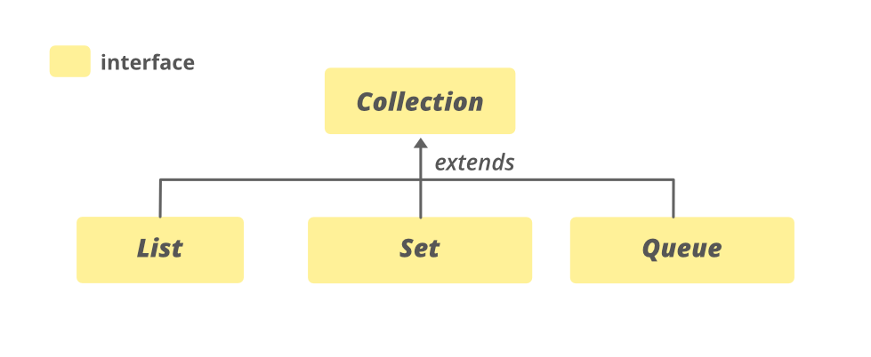
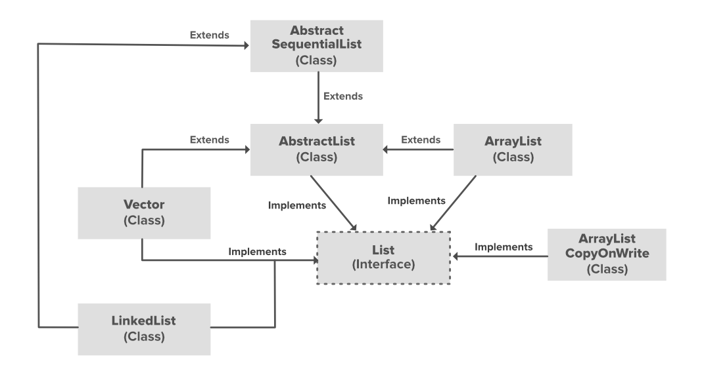

# Array

Array in java is a group of like-typed variables referred to by a common name. Arrays in Java work differently than they do in C/C++. 
Following are some important points about Java arrays. 

- In Java, all arrays are dynamically allocated. (discussed below)
- Arrays are stored in contiguous memory [consecutive memory locations].
- Since arrays are objects in Java, we can find their length using the object property length. This is different from C/C++, where we find length using sizeof.
- A Java array variable can also be declared like other variables with [] after the data type.
- The variables in the array are ordered, and each has an index beginning with 0.
- Java array can also be used as a static field, a local variable, or a method parameter.
- The size of an array must be specified by int or short value and not long.
- The direct superclass of an array type is Object.
- Every array type implements the interfaces Cloneable and java.io.Serializable. 
- This storage of arrays helps us randomly access the elements of an array [Support Random Access].
- The size of the array cannot be altered(once initialized).  However, an array reference can be made to point to another array.

An array can contain primitives (int, char, etc.) and object (or non-primitive) references of a class depending on the definition of the array. In the case of primitive data types, the actual values are stored in contiguous memory locations. In the case of class objects, **the actual objects are stored in a heap segment**. 

## Creating, initializing, and accessing an Array

The general form of a one-dimensional array declaration is 
```
type var-name[];
OR
type[] var-name;
```

An array declaration has two components: the type and the name. type declares the element type of the array. The element type determines the data type of each element that comprises the array. Like an array of integers, we can also create an array of other primitive data types like char, float, double, etc., or user-defined data types (objects of a class). Thus, the element type for the array determines what type of data the array will hold. 


```
// both are valid declarations
int intArray[]; 
or int[] intArray; 

byte byteArray[];
short shortsArray[];
boolean booleanArray[];
long longArray[];
float floatArray[];
double doubleArray[];
char charArray[];

// an array of references to objects of
// the class MyClass (a class created by
// user)
MyClass myClassArray[]; 

Object[]  ao,        // array of Object
Collection[] ca;  // array of Collection
                     // of unknown type
```

Although the first declaration establishes that int Array is an array variable, no actual array exists. It merely tells the compiler that this variable (int Array) will hold an array of the integer type. To link int Array with an actual, physical array of integers, you must allocate one using new and assign it to int Array. 

## Instantiating an Array in Java

When an array is declared, only a reference of an array is created. To create or give memory to the array, you create an array like this: The general form of new as it applies to one-dimensional arrays appears as follows: 
```
var-name = new type [size];
```

Here, type specifies the type of data being allocated, size determines the number of elements in the array, and var-name is the name of the array variable that is linked to the array. To use new to allocate an array, you must specify the type and number of elements to allocate.

Example: 
```java
int intArray[];    //declaring array
intArray = new int[20];  // allocating memory to array

//OR 

int[] intArray = new int[20]; // combining both statements in one
```
**N.B**: The elements in the array allocated by new will automatically be initialized to zero (for numeric types), false (for boolean), or null (for reference types).
Obtaining an array is a two-step process. First, you must declare a variable of the desired array type. Second, you must allocate the memory to hold the array, using new, and assign it to the array variable. Thus, in Java, **all arrays are dynamically allocated**.


### Array Literal

In a situation where the size of the array and variables of the array are already known, array literals can be used. 
```java
 int[] intArray = new int[]{ 1,2,3,4,5,6,7,8,9,10 }; 
 // Declaring array literal
```

The length of this array determines the length of the created array.
There is no need to write the new int[] part in the latest versions of Java.


### Accessing Java Array Elements using for Loop

Each element in the array is accessed via its index. The index begins with 0 and ends at (total array size)-1. All the elements of array can be accessed using Java for Loop.
```java
 // accessing the elements of the specified array
for (int i = 0; i < arr.length; i++)
  System.out.println("Element at index " + i + " : "+ arr[i]);
```

### Arrays of Objects
An array of objects is created like an array of primitive-type data items in the following way. 
```
Student[] arr = new Student[5]; //student is a user-defined class
```
Syntax:

1. data type[] arrName;

2. datatype arrName[];

3. datatype [] arrName;


### What happens if we try to access elements outside the array size?

JVM throws ArrayIndexOutOfBoundsException to indicate that the array has been accessed with an illegal index. The index is either negative or greater than or equal to the size of an array.

Below code shows what happens if we try to access elements outside the array size.

```java
// Code for showing error "ArrayIndexOutOfBoundsException"

public class GFG {
	public static void main(String[] args)
	{
		int[] arr = new int[4];
		arr[0] = 10;
		arr[1] = 20;
		arr[2] = 30;
		arr[3] = 40;

		System.out.println(
			"Trying to access element outside the size of array");
		System.out.println(arr[5]);
	}
}

```
Output
```
Trying to access element outside the size of array
Exception in thread "main" java.lang.ArrayIndexOutOfBoundsException: Index 5 out of bounds for length 4
```


## Multi Dimensional Arrays

In such case, data is stored in row and column based index (also known as matrix form).

Syntax to Declare Multidimensional Array in Java

dataType[][] arrayRefVar; (or)  
dataType [][]arrayRefVar; (or)  
dataType arrayRefVar[][]; (or)  
dataType []arrayRefVar[];  

Example to instantiate Multidimensional Array in Java
```java
int[][] arr=new int[3][3];//3 row and 3 column  
```
Example to initialize Multidimensional Array in Java
```java
arr[0][0]=1;  
arr[0][1]=2;  
arr[0][2]=3;  
arr[1][0]=4;  
arr[1][1]=5;  
arr[1][2]=6;  
arr[2][0]=7;  
arr[2][1]=8;  
arr[2][2]=9;  
```

Example of Multidimensional Java Array
Let's see the simple example to declare, instantiate, initialize and print the 2Dimensional array.
```java
//Java Program to illustrate the use of multidimensional array  
class Testarray3{  
public static void main(String args[]){  
//declaring and initializing 2D array  
int arr[][]={{1,2,3},{2,4,5},{4,4,5}};  
//printing 2D array  
for(int i=0;i<3;i++){  
 for(int j=0;j<3;j++){  
   System.out.print(arr[i][j]+" ");  
 }  
 System.out.println();  
}  
}}  
```
Output
```
1 2 3
2 4 5
4 4 5
```

### Jagged Array in Java

If we are creating different number of columns in a 2D array, it is known as a jagged array. In other words, it is an array of arrays with different number of columns.


```java
//Java Program to illustrate the jagged array  
class TestJaggedArray{  
    public static void main(String[] args){  
        //declaring a 2D array with odd columns  
        int arr[][] = new int[3][];  
        arr[0] = new int[3];  
        arr[1] = new int[4];  
        arr[2] = new int[2];  
        //initializing a jagged array  
        int count = 0;  
        for (int i=0; i<arr.length; i++)  
            for(int j=0; j<arr[i].length; j++)  
                arr[i][j] = count++;  
   
        //printing the data of a jagged array   
        for (int i=0; i<arr.length; i++){  
            for (int j=0; j<arr[i].length; j++){  
                System.out.print(arr[i][j]+" ");  
            }  
            System.out.println();//new line  
        }  
    }  
}  
```

Output
```
0 1 2 
3 4 5 6 
7 8 
```

## Passing Arrays to methods

Like variables, we can also pass arrays to methods. For example, the below program passes the array to method sum to calculate the sum of the array’s values.

```java
// Java program to demonstrate
// passing of array to method

public class Test {
	// Driver method
	public static void main(String args[])
	{
		int arr[] = { 3, 1, 2, 5, 4 };

		// passing array to method m1
		sum(arr);
	}

	public static void sum(int[] arr)
	{
		// getting sum of array values
		int sum = 0;

		for (int i = 0; i < arr.length; i++)
			sum += arr[i];

		System.out.println("sum of array values : " + sum);
	}
}

```


### Returning Arrays from Methods
As usual, a method can also return an array. For example, the below program returns an array from method m1. 

```java
// Java program to demonstrate
// return of array from method

class Test {
	// Driver method
	public static void main(String args[])
	{
		int arr[] = m1();

		for (int i = 0; i < arr.length; i++)
			System.out.print(arr[i] + " ");
	}

	public static int[] m1()
	{
		// returning array
		return new int[] { 1, 2, 3 };
	}
}

```


### Cloning of arrays

When you clone a single-dimensional array, such as Object[], a “deep copy” is performed with the new array containing copies of the original array’s elements as opposed to references.

```java
// Java program to demonstrate
// cloning of one-dimensional arrays

class Test {
	public static void main(String args[])
	{
		int intArray[] = { 1, 2, 3 };

		int cloneArray[] = intArray.clone();

		// will print false as deep copy is created
		// for one-dimensional array
		System.out.println(intArray == cloneArray);

		for (int i = 0; i < cloneArray.length; i++) {
			System.out.print(cloneArray[i] + " ");
		}
	}
}

```
Output
```
false
1 2 3 
```


A clone of a multi-dimensional array (like Object[][]) is a “shallow copy,” however, which is to say that it creates only a single new array with each element array a reference to an original element array, but subarrays are shared. 

```java
// Java program to demonstrate
// cloning of multi-dimensional arrays

class Test {
	public static void main(String args[])
	{
		int intArray[][] = { { 1, 2, 3 }, { 4, 5 } };

		int cloneArray[][] = intArray.clone();

		// will print false
		System.out.println(intArray == cloneArray);

		// will print true as shallow copy is created
		// i.e. sub-arrays are shared
		System.out.println(intArray[0] == cloneArray[0]);
		System.out.println(intArray[1] == cloneArray[1]);
	}
}

```
Output
```
false
true
true
```

# Collection Interface

The Collection interface is a member of the Java Collections Framework. It is a part of `java.util package`. It is one of the root interfaces of the Collection Hierarchy. The Collection interface is not directly implemented by any class. However, it is implemented indirectly via its subtypes or subinterfaces like List, Queue, and Set. 

For Example, the HashSet class implements the Set interface which is a subinterface of the Collection interface. If a collection implementation doesn’t implement a particular operation, it should define the corresponding method to throw `UnsupportedOperationException`.




It implements the `Iterable<E>` interface. The sub-interfaces of Collection are `BeanContext`, `BeanContextServices`, `BlockingDeque<E>`, `BlockingQueue<E>`, `Deque<E>`, `EventSet`, `List<E>`, `NavigableSet<E>`, `Queue<E>`, `Set<E>`, `SortedSet<E>`, `TransferQueue<E>` .


**List**: This is a child interface of the collection interface. This interface is dedicated to the data of the list type in which we can store all the ordered collection of the objects. 
This also allows duplicate data to be present in it. This list interface is implemented by various classes like ArrayList, Vector, Stack, etc. Since all the subclasses implement the list, we can instantiate a list object with any of these classes. For example,

```
List <T> al = new ArrayList<> ();

List <T> ll = new LinkedList<> ();

List <T> v = new Vector<> ();

Where T is the type of the object
```


**Set**: A set is an unordered collection of objects in which duplicate values cannot be stored. This collection is used when we wish to avoid the duplication of the objects and wish to store only the unique objects. This set interface is implemented by various classes like HashSet, TreeSet, LinkedHashSet, etc. Since all the subclasses implement the set, we can instantiate a set object with any of these classes. For example,
```
Set<T> hs = new HashSet<> ();

Set<T> lhs = new LinkedHashSet<> ();

Set<T> ts = new TreeSet<> ();
Where T is the type of the object.
```
**SortedSet**: This interface is very similar to the set interface. The only difference is that this interface has extra methods that maintain the ordering of the elements. The sorted set interface extends the set interface and is used to handle the data which needs to be sorted. The class which implements this interface is TreeSet. Since this class implements the SortedSet, we can instantiate a SortedSet object with this class. For example,
```
SortedSet<T> ts = new TreeSet<> ();

Where T is the type of the object.
```


**Queue**: As the name suggests, a queue interface maintains the FIFO(First In First Out) order similar to a real-world queue line. This interface is dedicated to storing all the elements where the order of the elements matter. For example, whenever we try to book a ticket, the tickets are sold at the first come first serve basis. Therefore, the person whose request arrives first into the queue gets the ticket. There are various classes like PriorityQueue, Deque, ArrayDeque, etc. Since all these subclasses implement the queue, we can instantiate a queue object with any of these classes. For example,
```
Queue <T> pq = new PriorityQueue<> ();

Queue <T> ad = new ArrayDeque<> ();

Where T is the type of the object.
```
**Deque**: This is a very slight variation of the queue data structure. Deque, also known as a double-ended queue, is a data structure where we can add and remove the elements from both the ends of the queue. This interface extends the queue interface. The class which implements this interface is ArrayDeque. Since this class implements the deque, we can instantiate a deque object with this class. For example,
```
Deque<T> ad = new ArrayDeque<> ();

Where T is the type of the object.
```


## Methods of Collection

| Method | Description |
|:---|:---|
| `add​(E e)`| Ensures that this collection contains the specified element (optional operation). |
| `addAll​(Collection<? extends E> c)` | Adds all the elements in the specified collection to this collection (optional operation). |
|`clear()` | Removes all the elements from this collection (optional operation). |
| `contains​(Object o)`| Returns true if this collection contains the specified element. |
| `containsAll​(Collection<?> c)` | Returns true if this collection contains all the elements in the specified collection. |
|`equals​(Object o)` | Compares the specified object with this collection for equality. |
| `hashCode()` | Returns the hash code value for this collection. |
|`isEmpty()`| Returns true if this collection contains no elements. |
| `iterator()`| Returns an iterator over the elements in this collection. |
| `parallelStream()`| Returns a possibly parallel Stream with this collection as its source. |
|`remove​(Object o)` | Removes a single instance of the specified element from this collection, if it is present (optional operation). |
| `removeAll​(Collection<?> c)`| Removes all of this collection’s elements that are also contained in the specified collection (optional operation). |
| `removeIf​(Predicate<? super E> filter)` | Removes all the elements of this collection that satisfy the given predicate. |
|`retainAll​(Collection<?> c)` | Retains only the elements in this collection that are contained in the specified collection (optional operation). |
| `size()` | Returns the number of elements in this collection. |
|`spliterator()`| Creates a Spliterator over the elements in this collection. |
|` stream()` | Returns a sequential Stream with this collection as its source. |
| `toArray()`| Returns an array containing all the elements in this collection. |
| `toArray​(IntFunction<T[]> generator)` | Returns an array containing all the elements in this collection, using the provided generator function to allocate the returned array. |
| `toArray​(T[] a)` | Returns an array containing all the elements in this collection; the runtime type of the returned array is that of the specified array. |


# List


The List interface in Java provides a way to store the ordered collection. It is a child interface of Collection. It is an ordered collection of objects in which duplicate values can be stored. Since List preserves the insertion order, it allows positional access and insertion of elements. 

The List interface is found in java.util package and inherits the Collection interface. It is a factory of ListIterator interface. Through the ListIterator, we can iterate the list in forward and backward directions. The implementation classes of the List interface are `ArrayList`, `LinkedList`, `Stack`, and Vector. ArrayList and LinkedList are widely used in Java programming. **The Vector class is deprecated since Java 5**.


Declaration: The List interface is declared as

```
public interface List<E> extends Collection<E> ; 
```

Let us elaborate on creating objects or instances in a List class. 
Since List is an interface, objects cannot be created of the type list. We always need a class that implements this List in order to create an object. And also, after the introduction of Generics in Java 1.5, it is possible to restrict the type of object that can be stored in the List. Just like several other user-defined ‘interfaces’ implemented by user-defined ‘classes’, `List` is an ‘interface’, implemented by the `ArrayList` class, pre-defined in the java.util package. 


Syntax: This type of safelist can be defined as:
```
List<Obj> list = new ArrayList<Obj> ();
``` 
Note: Obj is the type of the object to be stored in List


## Operations in a List interface
Since List is an interface, it can be used only with a class that implements this interface. Now, let’s see how to perform a few frequently used operations on the List.  

1. Adding elements to List class using add() method
2. Updating elements in List class using set() method
3. Searching for elements using indexOf(), lastIndexOf methods
4. Removing elements using remove() method
5. Accessing Elements in List class using get() method
6. Checking if an element is present in the List class using contains() method

## Iterating over List 


```java
for (int i = 0; i < al.size(); i++) {
 
	// Using get() method to
	// access particular element
	System.out.print(al.get(i) + " ");
}
```

```java
// Using for-each loop for iteration
for (String str : al){

	// Printing all the elements
	// which was inside object
	System.out.print(str + " ");
}
```


## Classes Association with a List Interface





### ArrayList

An ArrayList class which is implemented in the collection framework provides us with dynamic arrays in Java. Though, it may be slower than standard arrays but can be helpful in programs where lots of manipulation in the array is needed. Let’s see how to create a list object using this class. 

```java
// Java program to demonstrate the
// creation of list object using the
// ArrayList class

import java.io.*;
import java.util.*;

class GFG {
	public static void main(String[] args)
	{
		// Size of ArrayList
		int n = 5;

		// Declaring the List with initial size n
		List<Integer> arrli
			= new ArrayList<Integer>(n);

		// Appending the new elements
		// at the end of the list
		for (int i = 1; i <= n; i++)
			arrli.add(i);

		// Printing elements
		System.out.println(arrli);

		// Remove element at index 3
		arrli.remove(3);

		// Displaying the list after deletion
		System.out.println(arrli);

		// Printing elements one by one
		for (int i = 0; i < arrli.size(); i++)
			System.out.print(arrli.get(i) + " ");
	}
}

```

Output
```

[1, 2, 3, 4, 5]
[1, 2, 3, 5]
1 2 3 5 
```

### Stack
Stack is a class that is implemented in the collection framework and extends the vector class models and implements the Stack data structure. The class is based on the basic principle of last-in-first-out. In addition to the basic push and pop operations, the class provides three more functions of empty, search and peek. Let’s see how to create a list object using this class.

```java
// Java program to demonstrate the
// creation of list object using the
// Stack class

import java.io.*;
import java.util.*;

class GFG {
	public static void main(String[] args)
	{
		// Size of the stack
		int n = 5;

		// Declaring the List
		List<Integer> s = new Stack<Integer>();

		// Appending the new elements
		// at the end of the list
		for (int i = 1; i <= n; i++)
			s.add(i);

		// Printing elements
		System.out.println(s);

		// Remove element at index 3
		s.remove(3);

		// Displaying the list after deletion
		System.out.println(s);

		// Printing elements one by one
		for (int i = 0; i < s.size(); i++)
			System.out.print(s.get(i) + " ");
	}
}

```


### LinkedList

LinkedList is a class that is implemented in the collection framework which inherently implements the linked list data structure. It is a linear data structure where the elements are not stored in contiguous locations and every element is a separate object with a data part and address part. The elements are linked using pointers and addresses. Each element is known as a node. Due to the dynamicity and ease of insertions and deletions, they are preferred over the arrays. Let’s see how to create a list object using this class.


```java
// Java program to demonstrate the
// creation of list object using the
// LinkedList class

import java.io.*;
import java.util.*;

class GFG {
	public static void main(String[] args)
	{
		// Size of the LinkedList
		int n = 5;

		// Declaring the List with initial size n
		List<Integer> ll = new LinkedList<Integer>();

		// Appending the new elements
		// at the end of the list
		for (int i = 1; i <= n; i++)
			ll.add(i);

		// Printing elements
		System.out.println(ll);

		// Remove element at index 3
		ll.remove(3);

		// Displaying the list after deletion
		System.out.println(ll);

		// Printing elements one by one
		for (int i = 0; i < ll.size(); i++)
			System.out.print(ll.get(i) + " ");
	}
}

```


# References

https://www.geeksforgeeks.org/arrays-in-java/

https://www.javatpoint.com/array-in-java
