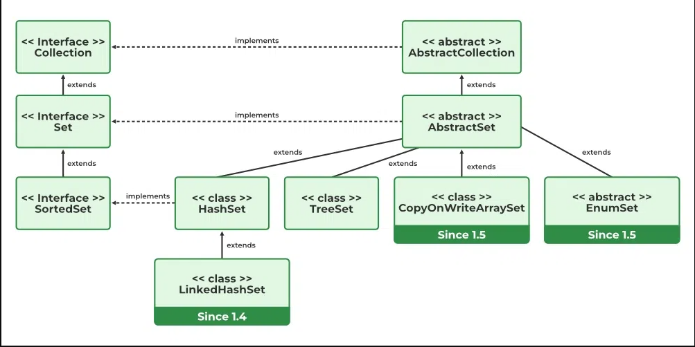

# Set

## HashSet

Java HashSet class implements the Set interface, backed by a hash table which is actually a HashMap instance. No guarantee is made as to the iteration order of the hash sets which means that the class does not guarantee the constant order of elements over time. This class permits the null element. The class also offers constant time performance for the basic operations like add, remove, contains, and size assuming the hash function disperses the elements properly among the buckets

A few important features of HashSet are mentioned below:

- Implements Set Interface.
- The underlying data structure for HashSet is Hashtable.
- As it implements the Set Interface, duplicate values are not allowed.
- Objects that you insert in HashSet are not guaranteed to be inserted in the same order. Objects are inserted based on their hash code.
- NULL elements are allowed in HashSet.
- HashSet also implements Serializable and Cloneable interfaces.


```java
// Java program to illustrate the concept
// of Collection objects storage in a HashSet
import java.io.*;
import java.util.*;

class CollectionObjectStorage {
	
	public static void main(String[] args)
	{
		// Instantiate an object of HashSet
		HashSet<ArrayList> set = new HashSet<>();

		// create ArrayList list1
		ArrayList<Integer> list1 = new ArrayList<>();

		// create ArrayList list2
		ArrayList<Integer> list2 = new ArrayList<>();

		// Add elements using add method
		list1.add(1);
		list1.add(2);
		list2.add(1);
		list2.add(2);
		set.add(list1);
		set.add(list2);

		// print the set size to understand the
		// internal storage of ArrayList in Set
		System.out.println(set.size());
	}
}

```
Output
```
1
```
Before storing an Object, HashSet checks whether there is an existing entry using hashCode() and equals() methods. In the above example, two lists are considered equal if they have the same elements in the same order. When you invoke the hashCode()  method on the two lists, they both would give the same hash since they are equal. 

**Note**: HashSet does not store duplicate items,  if you give two Objects that are equal then it stores only the first one, here it is list1.

### The Hierarchy of HashSet is as follows:



Internal Working of a HashSet
All the classes of the Set interface are internally backed up by Map. HashSet uses HashMap for storing its object internally. You must be wondering that to enter a value in HashMap we need a key-value pair, but in HashSet, we are passing only one value. 

**Storage in HashMap**: Actually the value we insert in HashSet acts as a key to the map Object and for its value, java uses a constant variable. So in the key-value pair, all the values will be the same.


### Implementation of HashSet in Java doc
```java
private transient HashMap map;

// Constructor - 1
// All the constructors are internally creating HashMap Object.
public HashSet()
{
    // Creating internally backing HashMap object
    map = new HashMap();
}

// Constructor - 2
public HashSet(int initialCapacity)
{
    // Creating internally backing HashMap object
    map = new HashMap(initialCapacity);
}

// Dummy value to associate with an Object in Map
private static final Object PRESENT = new Object();
```

If we look at the add() method of the HashSet class: 
```java
public boolean add(E e)
{
   return map.put(e, PRESENT) == null;
}
```
We can notice that add() method of the HashSet class internally calls the put() method of backing the HashMap object by passing the element you have specified as a key and constant “PRESENT” as its value. remove() method also works in the same manner. It internally calls the remove method of the Map interface. 
```java
public boolean remove(Object o)
{
  return map.remove(o) == PRESENT;
}
```
HashSet not only stores unique Objects but also a unique Collection of Objects like ArrayList<E>, LinkedList<E>, Vector<E>,..etc.


### Constructors of HashSet class
To create a HashSet, we need to create an object of the HashSet class. The HashSet class consists of various constructors that allow the possible creation of the HashSet. The following are the constructors available in this class.

1. HashSet()
This constructor is used to build an empty HashSet object in which the default initial capacity is 16 and the default load factor is 0.75. If we wish to create an empty HashSet with the name hs, then, it can be created as:
```java
HashSet<E> hs = new HashSet<E>();
```
2. HashSet(int initialCapacity)
This constructor is used to build an empty HashSet object in which the initialCapacity is specified at the time of object creation. Here, the default loadFactor remains 0.75.
```java
HashSet<E> hs = new HashSet<E>(int initialCapacity);
```
3. HashSet(int initialCapacity, float loadFactor)
This constructor is used to build an empty HashSet object in which the initialCapacity and loadFactor are specified at the time of object creation.
```java
HashSet<E> hs = new HashSet<E>(int initialCapacity, float loadFactor);
```
4. HashSet(Collection)
This constructor is used to build a HashSet object containing all the elements from the given collection. In short, this constructor is used when any conversion is needed from any Collection object to the HashSet object. If we wish to create a HashSet with the name hs, it can be created as:
```java
HashSet<E> hs = new HashSet<E>(Collection C);
```


### Performance of HashSet

HashSet extends `Abstract Set<E>` class and implements `Set<E>`, `Cloneable`, and `Serializable` interfaces where E is the type of elements maintained by this set. The directly known subclass of HashSet is `LinkedHashSet`.

Now for the maintenance of constant time performance, iterating over HashSet requires time proportional to the sum of the HashSet instance’s size (the number of elements) plus the “capacity” of the backing HashMap instance (the number of buckets). Thus, it’s very important not to set the initial capacity too high (or the load factor too low) if iteration performance is important. 

- Initial Capacity: The initial capacity means the number of buckets when the hashtable (HashSet internally uses hashtable data structure) is created. The number of buckets will be automatically increased if the current size gets full. 
 
- Load Factor: The load factor is a measure of how full the HashSet is allowed to get before its capacity is automatically increased. When the number of entries in the hash table exceeds the product of the load factor and the current capacity, the hash table is rehashed (that is, internal data structures are rebuilt) so that the hash table has approximately twice the number of buckets.

```
                Number of stored elements in the table
Load Factor = -----------------------------------------
                        Size of the hash table 
```


## TreeSet


## Difference 

Differences between HashSet and TreeSet in Java.

|Basis|HashSet|TreeSet|
|:---|:---|:---|
| Speed and internal implement the, throw action | For operations like search, insert, and delete. It takes constant time for these operations on average. HashSet is faster than TreeSet. HashSet is Implemented using a hash table. | TreeSet takes O(Log n) for search, insert and delete which is higher than HashSet. But TreeSet keeps sorted data. Also, it supports operations like higher() (Returns least higher element), floor(), ceiling(), etc. These operations are also O(Log n) in TreeSet and not supported in HashSet. TreeSet is implemented using a Self Balancing Binary Search Tree (Red-Black Tree). TreeSet is backed by TreeMap in Java. |
| Ordering | Elements in HashSet are not ordered. | TreeSet maintains objects in Sorted order defined by either the Comparable or Comparator method in Java. TreeSet elements are sorted in ascending order by default. It offers several methods to deal with the ordered set like first(), last(), headSet(), tailSet(), etc. |
| Null Object | HashSet allows the null object. | TreeSet doesn’t allow null Object and throws NullPointerException, Why, is because TreeSet uses compareTo() method to compare keys, and compareTo() will throw java.lang.NullPointerException. |
| Comparison | HashSet uses the equals() method to compare two objects in the Set and for detecting duplicates. | TreeSet uses compareTo() method for the same purpose. If equals() and compareTo() are not consistent, i.e. for two equal objects equals should return true while compareTo() should return zero, then it will break the contract of the Set interface and will allow duplicates in Set implementations like TreeSet |


# References

https://www.geeksforgeeks.org/hashset-in-java/

https://www.geeksforgeeks.org/treeset-in-java-with-examples/