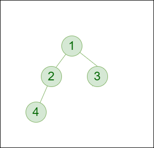
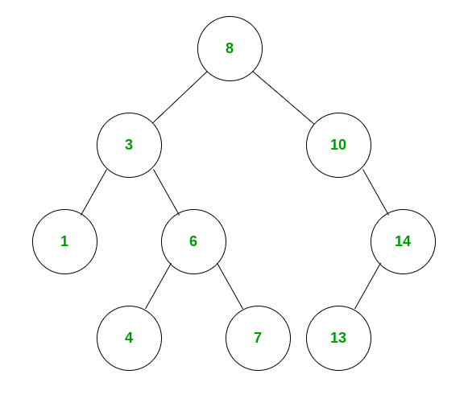
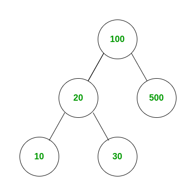
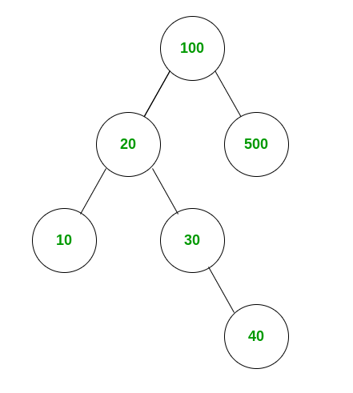

# Tree

A binary tree is a tree data structure in which each node can have at most two children, which are referred to as the left child and the right child. 

The topmost node in a binary tree is called the root, and the bottom-most nodes are called leaves. A binary tree can be visualized as a hierarchical structure with the root at the top and the leaves at the bottom.

Binary trees have many applications in computer science, including data storage and retrieval, expression evaluation, network routing, and game AI. They can also be used to implement various algorithms such as searching, sorting, and graph algorithms.

## Representation of Binary Tree:
Each node in the tree contains the following:
- Data
- Pointer to the left child
- Pointer to the right child


```java
// Class containing left and right child
// of current node and key value
class Node {
	int key;
	Node left, right;

	public Node(int item)
	{
		key = item;
		left = right = null;
	}
}

```

## Basic Operations On Binary Tree:
- Inserting an element.
- Removing an element.
- Searching for an element.
- Deletion for an element.
- Traversing an element. There are four (mainly three) types of traversals in a binary tree which will be discussed ahead.


## Auxiliary Operations On Binary Tree:
- Finding the height of the tree
- Find the level of the tree
- Finding the size of the entire tree.


## Binary Tree Traversals:
Tree Traversal algorithms can be classified broadly into two categories:

- Depth-First Search (DFS) Algorithms
- Breadth-First Search (BFS) Algorithms


### Tree Traversal using Depth-First Search (DFS) algorithm can be further classified into three categories:

- Preorder Traversal (current-left-right): Visit the current node before visiting any nodes inside the left or right subtrees. Here, the traversal is root – left child – right child. It means that the root node is traversed first then its left child and finally the right child.
- Inorder Traversal (left-current-right): Visit the current node after visiting all nodes inside the left subtree but before visiting any node within the right subtree. Here, the traversal is left child – root – right child.  It means that the left child is traversed first then its root node and finally the right child.
- Postorder Traversal (left-right-current): Visit the current node after visiting all the nodes of the left and right subtrees.  Here, the traversal is left child – right child – root.  It means that the left child has traversed first then the right child and finally its root node.


### Tree Traversal using Breadth-First Search (BFS) algorithm can be further classified into one category:

- Level Order Traversal:  Visit nodes level-by-level and left-to-right fashion at the same level. Here, the traversal is level-wise. It means that the most left child has traversed first and then the other children of the same level from left to right have traversed. 


Let us traverse the following tree with all four traversal methods:


```
Pre-order Traversal of the above tree: 1-2-4-5-3-6-7
```
```
In-order Traversal of the above tree: 4-2-5-1-6-3-7
```
```
Post-order Traversal of the above tree: 4-5-2-6-7-3-1
```
```
Level-order Traversal of the above tree: 1-2-3-4-5-6-7
```


## Implementation of Binary Tree:
Let us create a simple tree with 4 nodes. The created tree would be as follows. 



```java
// Class containing left and right child
// of current node and key value
class Node {

	int key;

	Node left, right;
	public Node(int item)
	{
		key = item;
		left = right = null;
	}
}

// A Java program to introduce Binary Tree
class BinaryTree {
	
	// Root of Binary Tree
	Node root;
	
	// Constructors
	BinaryTree(int key) { root = new Node(key); }
	BinaryTree() { root = null; }
	public static void main(String[] args)
	{
		BinaryTree tree = new BinaryTree();
		
		// Create root
		tree.root = new Node(1);
		/* Following is the tree after above statement
		1
		/ \
		null null
		*/

		tree.root.left = new Node(2);
		tree.root.right = new Node(3);
		/* 2 and 3 become left and right children of 1
			1
			/ \
			2 3
		/ \ / \
	null null null null */
		tree.root.left.left = new Node(4);
		/* 4 becomes left child of 2
			1
			/ \
			2 3
			/ \ / \
		4 null null null
		/ \
		null null
		*/
	}
}

```


# Binary Search Tree

What is Binary Search Tree?

A Binary Search Tree is a special type of binary tree data structure which has the following properties:  

The left subtree of a node contains only nodes with keys lesser than the node’s key.
The right subtree of a node contains only nodes with keys greater than the node’s key.
The left and right subtree each must also be a binary search tree.
There must be no duplicate nodes.

The above properties of the Binary Search Tree provide an ordering among keys so that the operations like search, minimum and maximum can be done fast. If there is no order, then we may have to compare every key to search for a given key.

## How to search for a key in a given Binary Tree?

For searching a value, if we had a sorted array we could have performed a **binary search**.


Search operations in binary search trees will be very similar to that. Let’s say we want to search for the number X. 

- We start at the root, and then we compare the value to be searched with the value of the root, 
	- If it’s equal we are done with the search if it’s smaller we know that we need to go to the left subtree because in a binary search tree all the elements in the left subtree are smaller and all the elements in the right subtree are larger. 
	- Searching an element in the binary search tree is basically this traversal, at each step we go either left or right and at each step we discard one of the sub-trees. 


If the tree is balanced, (we call a tree balanced if for all nodes the difference between the heights of left and right subtrees is not greater than one) we start with a search space of ‘n’ nodes and as we discard one of the sub-trees, we discard ‘n/2’ nodes so our search space gets reduced to ‘n/2’.

In the next step, we reduce the search space to ‘n/4’ and we repeat until we find the element or our search space is reduced to only one node. The search here is also a binary search hence the name; Binary Search Tree.


### BST Example

Consider the graph shown below and the key = 6.




- Initially compare the key with the root i.e., 8. As 6 is less than 8, search in the left subtree of 8.
- Now compare the key with 3. As key is greater than 3, search next in the right subtree of 3.
- Now compare the key with 6. The value of the key is 6. So we have found the key. 


```java
// A utility function to search a given key in BST
public Node search(Node root, int key)
{
	// Base Cases: root is null or key is present at root
	if (root == null || root.key == key)
		return root;

	// Key is greater than root's key
	if (root.key < key)
		return search(root.right, key);

	// Key is smaller than root's key
	return search(root.left, key);
}

```

```
Time complexity: O(h), where h is the height of the BST.

Space complexity: O(h), where h is the height of the BST. This is because the maximum amount of space needed to store the recursion stack would be h.
```


## How to insert a value in BST?
The insertion logic into BST is similar to its searching operation. A new value is always inserted at the leaf node of the BST.

Compare the value with the root of the BST.

If the value to be inserted is less than the root, move to the left subtree. 

Otherwise, if the value is greater than the root, move to the right subtree.

Continue this process, until we hit a leaf node.

If the value is less than the leaf, create a left child of the leaf and insert the value.

Otherwise, if the value is greater than the leaf, create a right child of the leaf and insert the value in the right child.


Consider the following BST and the value = 40 to be added.



- Initially, 40 is less than 100. So move to the left subtree.
- Now, 40 is greater than 20. So move to the right subtree.
- Now we reach the leaf node 30. As 40 is greater than 30, create right child of 30 and insert the value 40.





```java
// Java program to demonstrate insert operation
// in binary search tree

import java.io.*;

public class BinarySearchTree {

	// Class containing left and right child of
	// current node and key value
	class Node {
		int key;
		Node left, right;

		public Node(int item)
		{
			key = item;
			left = right = null;
		}
	}

	// Root of BST
	Node root;

	// Constructor
	BinarySearchTree() { root = null; }

	BinarySearchTree(int value) { root = new Node(value); }

	// This method mainly calls insertRec()
	void insert(int key) { root = insertRec(root, key); }

	// A recursive function to
	// insert a new key in BST
	Node insertRec(Node root, int key)
	{
		// If the tree is empty return a new node
		if (root == null) {
			root = new Node(key);
			return root;
		}

		// Otherwise, recur down the tree
		if (key < root.key)
			root.left = insertRec(root.left, key);
		else if (key > root.key)
			root.right = insertRec(root.right, key);

		// return the (unchanged) node pointer
		return root;
	}

	// This method mainly calls InorderRec()
	void inorder() { inorderRec(root); }

	// A utility function to do inorder traversal of BST
	void inorderRec(Node root)
	{
		if (root != null) {
			inorderRec(root.left);
			System.out.print(root.key + " ");
			inorderRec(root.right);
		}
	}

	// Driver Code
	public static void main(String[] args)
	{
		BinarySearchTree tree = new BinarySearchTree();
		tree.insert(50);
		tree.insert(30);
		tree.insert(20);
		tree.insert(40);
		tree.insert(70);
		tree.insert(60);
		tree.insert(80);

		// Print inorder traversal of the BST
		tree.inorder();
	}
}
// This code is contributed by Ankur Narain Verma

```

Output
```
20 30 40 50 60 70 80 
```
Time Complexity: 

O(h) where h is the height of the Binary Search Tree. In the worst case, we may have to travel from the root to the deepest leaf node.

The height of a skewed tree may become n and the time complexity of the search and insert operation may become O(n). 

Auxiliary Space: O(1)


# Reference

https://www.geeksforgeeks.org/introduction-to-binary-tree-data-structure-and-algorithm-tutorials/