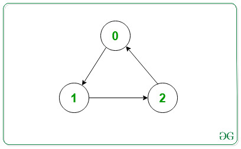
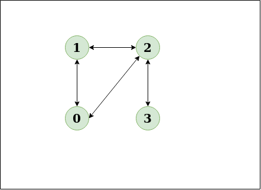
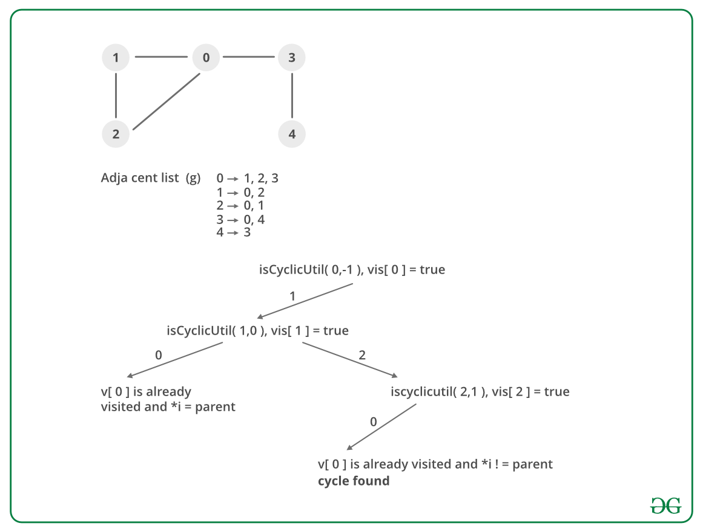

# Graph

A Graph is a non-linear data structure consisting of vertices and edges. The vertices are sometimes also referred to as nodes and the edges are lines or arcs that connect any two nodes in the graph. More formally a Graph is composed of a set of vertices( V ) and a set of edges( E ). The graph is denoted by G(E, V).


## Components of a Graph

- Vertices: Vertices are the fundamental units of the graph. Sometimes, vertices are also known as vertex or nodes. Every node/vertex can be labeled or unlabelled.
- Edges: Edges are drawn or used to connect two nodes of the graph. It can be ordered pair of nodes in a directed graph. Edges can connect any two nodes in any possible way. There are no rules. Sometimes, edges are also known as arcs. Every edge can be labeled/unlabelled.


Graphs are used to solve many real-life problems. Graphs are used to represent networks. The networks may include paths in a city or telephone network or circuit network. Graphs are also used in social networks like linkedIn, Facebook. For example, in Facebook, each person is represented with a vertex(or node). Each node is a structure and contains information like person id, name, gender, locale etc.


## Directed Graph

Characteristics of Directed Graph
Directed graphs have several characteristics that make them different from undirected graphs. Here are some key characteristics of directed graphs:

- Directed edges: In a directed graph, edges have a direction associated with them, indicating a one-way relationship between vertices.
- Indegree and Outdegree: Each vertex in a directed graph has two different degree measures: indegree and outdegree. Indegree is the number of incoming edges to a vertex, while outdegree is the number of outgoing edges from a vertex.
- Cycles: A directed graph can contain cycles, which are paths that start and end at the same vertex and contain at least one edge. Cycles can be important for understanding feedback loops or other patterns in the graph.
- Paths and reachability: Paths in a directed graph follow the direction of the edges, and can be used to analyze reachability between vertices.


### Applications of Directed Graph

Directed graphs have many applications across a wide range of fields. Here are some examples:

- Social networks: Social networks are often modeled as directed graphs, where each person is a vertex and relationships such as friendships or following are represented as edges.
- Transportation networks: Transportation systems such as roads, airports, or subway systems can be modeled as directed graphs, with vertices representing locations and edges representing connections between them.
- Computer networks: Computer networks such as the internet can be represented as directed graphs, with vertices representing devices such as computers or routers and edges representing connections between them.
- Project management: Project management can be modeled as a directed graph, with vertices representing tasks and edges representing dependencies between them.


### Advantages of Directed Graph
- Can model complex relationships: Directed graphs are useful for modeling complex relationships where directionality is important, such as social networks or transportation systems.
- Can be used for analysis: Directed graphs allow for analysis of the flow of relationships or information in a system, which can be useful for optimization or understanding of the system’s behavior.
- Can represent dependencies: Directed graphs are useful for representing dependencies between entities, such as in project management or recommender systems.

### Disadvantages of Directed Graph
- May be more complex: Directed graphs can be more complex than undirected graphs, since each edge has a direction associated with it.
- May require more processing power: Analyzing directed graphs may require more processing power than analyzing undirected graphs, since the directionality of the edges must be taken into account.
- Maybe less intuitive: Since directed graphs are less common than undirected graphs, they may be less intuitive for people to work with or understand.


### Print Adjacency List for a Directed Graph

An Adjacency List is used for representing graphs. Here, for every vertex in the graph, we have a list of all the other vertices which the particular vertex has an edge to.

Problem: Given the adjacency list and number of vertices and edges of a graph, the task is to represent the adjacency list for a directed graph.

Examples:

Input: V = 3, edges[][]= {{0, 1}, {1, 2} {2, 0}}



Approach (using STL): The main idea is to represent the graph as an array of vectors such that every vector represents the adjacency list of a single vertex. Using STL, the code becomes simpler and easier to understand. 

Below is the implementation of the above approach:

```java
// Java program for the above approach
import java.util.*;

class GFG
{

// Function to add edges
static void addEdge(Vector<Integer> adj[], int u, int v)
{
	adj[u].add(v);
}

// Function to print adjacency list
static void adjacencylist(Vector<Integer> adj[], int V)
{
	for (int i = 0; i < V; i++) {
	System.out.print(i+ "->");
	for (int x : adj[i]) {
		System.out.print(x+ " ");
	}
	System.out.println();
	}
}

// Function to initialize the adjacency list
// of the given graph
static void initGraph(int V, int edges[][], int noOfEdges)
{

	// To represent graph as adjacency list
	@SuppressWarnings("unchecked")
	Vector<Integer> adj[] = new Vector[3];
	for(int i =0;i<adj.length;i++) {
	adj[i] = new Vector<>();
	}
	// Traverse edges array and make edges
	for (int i = 0; i < noOfEdges; i++) {

	// Function call to make an edge
	addEdge(adj, edges[i][0], edges[i][1]);
	}

	// Function Call to print adjacency list
	adjacencylist(adj, V);
}

// Driver Code
public static void main(String[] args)
{
	// Given vertices
	int V = 3;

	// Given edges
	int edges[][] = { { 0, 1 }, { 1, 2 }, { 2, 0 } };

	int noOfEdges = 3;

	// Function Call
	initGraph(V, edges, noOfEdges);

}
}

// This code is contributed by gauravrajput1

```

Time Complexity:  O(V+E), where V = no. of vertices and E = no. of edges.
Auxiliary Space: For avg case, it’s O(V+E). But in the worst case, it’s O(V^2) when each vertex is connected to all the other vertices.

## Undirected graph

### Characteristics of an Undirected Graph:

- Edges in an undirected graph are bidirectional in nature.
- In an undirected graph, there is no concept of a “parent” or “child” vertex as there is no direction to the edges.
- An undirected graph may contain loops, which are edges that connect a vertex to itself.
- Degree of each vertex is the same as the total no of edges connected to it.


### Advantages of Undirected Graph:
- It provides simplicity as they are basic and easy to grasp, making them valuable for representing a wide range of real-world systems.
- It provides flexibility as they are versatile and may be used to describe a broad range of systems.

### Disadvantages of Undirected Graph:

- It may be undesirable for some applications that need directionality due to their lack of directionality.
- It provides limited information, In some cases, it may not give enough information about certain systems since they merely capture the existence or absence of edges.


### Clone an Undirected Graph

Cloning of a LinkedList and a Binary Tree with random pointers has already been discussed. The idea behind cloning a graph is pretty much similar. 

The idea is to do a BFS traversal of the graph and while visiting a node make a clone node of it (a copy of original node). If a node is encountered which is already visited then it already has a clone node.

How to keep track of the visited/cloned nodes? A HashMap/Map is required in order to maintain all the nodes which have already been created. Key stores: Reference/Address of original Node Value stores: Reference/Address of cloned Node A copy of all the graph nodes has been made, 

how to connect clone nodes? While visiting the neighboring vertices of a node u get the corresponding cloned node for u , let’s call that cloneNodeU , now visit all the neighboring nodes for u and for each neighbor find the corresponding clone node(if not found create one) and then push into the neighboring vector of cloneNodeU node. 


#### How to verify if the cloned graph is a correct? 

Do a BFS traversal before and after the cloning of graph. In BFS traversal display the value of a node along with its address/reference. Compare the order in which nodes are displayed, if the values are same but the address/reference is different for both the traversals then the cloned graph is correct. 


```java
// Java program to Clone an Undirected Graph
import java.util.*;

// GraphNode class represents each
// Node of the Graph
class GraphNode
{
	int val;

	// A neighbour Vector which contains references to
	// all the neighbours of a GraphNode
	Vector<GraphNode> neighbours;
	public GraphNode(int val)
	{
		this.val = val;
		neighbours = new Vector<GraphNode>();
	}
}

class Graph
{
	// A method which clones the graph and
	// returns the reference of new cloned source node
	public GraphNode cloneGraph(GraphNode source)
	{
		Queue<GraphNode> q = new LinkedList<GraphNode>();
		q.add(source);

		// An HashMap to keep track of all the
		// nodes which have already been created
		HashMap<GraphNode,GraphNode> hm =
						new HashMap<GraphNode,GraphNode>();

		//Put the node into the HashMap
		hm.put(source,new GraphNode(source.val));

		while (!q.isEmpty())
		{
			// Get the front node from the queue
			// and then visit all its neighbours
			GraphNode u = q.poll();

			// Get corresponding Cloned Graph Node
			GraphNode cloneNodeU = hm.get(u);
			if (u.neighbours != null)
			{
				Vector<GraphNode> v = u.neighbours;
				for (GraphNode graphNode : v)
				{
					// Get the corresponding cloned node
					// If the node is not cloned then we will
					// simply get a null
					GraphNode cloneNodeG = hm.get(graphNode);

					// Check if this node has already been created
					if (cloneNodeG == null)
					{
						q.add(graphNode);

						// If not then create a new Node and
						// put into the HashMap
						cloneNodeG = new GraphNode(graphNode.val);
						hm.put(graphNode,cloneNodeG);
					}

					// add the 'cloneNodeG' to neighbour
					// vector of the cloneNodeG
					cloneNodeU.neighbours.add(cloneNodeG);
				}
			}
		}

		// Return the reference of cloned source Node
		return hm.get(source);
	}

	// Build the desired graph
	public GraphNode buildGraph()
	{
		/*
			Note : All the edges are Undirected
			Given Graph:
			1--2
			| |
			4--3
		*/
		GraphNode node1 = new GraphNode(1);
		GraphNode node2 = new GraphNode(2);
		GraphNode node3 = new GraphNode(3);
		GraphNode node4 = new GraphNode(4);
		Vector<GraphNode> v = new Vector<GraphNode>();
		v.add(node2);
		v.add(node4);
		node1.neighbours = v;
		v = new Vector<GraphNode>();
		v.add(node1);
		v.add(node3);
		node2.neighbours = v;
		v = new Vector<GraphNode>();
		v.add(node2);
		v.add(node4);
		node3.neighbours = v;
		v = new Vector<GraphNode>();
		v.add(node3);
		v.add(node1);
		node4.neighbours = v;
		return node1;
	}

	// BFS traversal of a graph to
	// check if the cloned graph is correct
	public void bfs(GraphNode source)
	{
		Queue<GraphNode> q = new LinkedList<GraphNode>();
		q.add(source);
		HashMap<GraphNode,Boolean> visit =
						new HashMap<GraphNode,Boolean>();
		visit.put(source,true);
		while (!q.isEmpty())
		{
			GraphNode u = q.poll();
			System.out.println("Value of Node " + u.val);
			System.out.println("Address of Node " + u);
			if (u.neighbours != null)
			{
				Vector<GraphNode> v = u.neighbours;
				for (GraphNode g : v)
				{
					if (visit.get(g) == null)
					{
						q.add(g);
						visit.put(g,true);
					}
				}
			}
		}
		System.out.println();
	}
}

// Driver code
class Main
{
	public static void main(String args[])
	{
		Graph graph = new Graph();
		GraphNode source = graph.buildGraph();
		System.out.println("BFS traversal of a graph before cloning");
		graph.bfs(source);
		GraphNode newSource = graph.cloneGraph(source);
		System.out.println("BFS traversal of a graph after cloning");
		graph.bfs(newSource);
	}
}

```


Time Complexity: O(V+E) where V is the number of vertices and E is the number of edges in the graph.
Auxiliary Space: O(V), since a map is used to store the graph nodes which can grow upto V.


#### Detect cycle in an undirected graph

Given an undirected graph, The task is to check if there is a cycle in the given graph.
```
Input: N = 4, E = 4 
```



Output: Yes 
Explanation: The diagram clearly shows a cycle 0 to 2 to 1 to 0


**Find cycle in undirected Graph using DFS:**

Use DFS from every unvisited node. Depth First Traversal can be used to detect a cycle in a Graph. There is a cycle in a graph only if there is a back edge present in the graph. A back edge is an edge that is indirectly joining a node to itself (self-loop) or one of its ancestors in the tree produced by DFS. 

To find the back edge to any of its ancestors keep a visited array and if there is a back edge to any visited node then there is a loop and return true.


Follow the below steps to implement the above approach:

- Iterate over all the nodes of the graph and Keep a visited array visited[] to track the visited nodes.
- Run a Depth First Traversal on the given subgraph connected to the current node and pass the parent of the current node. In each recursive 
	- Set visited[root] as 1.
	- Iterate over all adjacent nodes of the current node in the adjacency list 
	- If it is not visited then run DFS on that node and return true if it returns true.
	- Else if the adjacent node is visited and not the parent of the current node then return true.
- Return false.





```java
// A Java Program to detect cycle in an undirected graph
import java.io.*;
import java.util.*;
@SuppressWarnings("unchecked")
// This class represents a
// directed graph using adjacency list
// representation
class Graph {

	// No. of vertices
	private int V;

	// Adjacency List Representation
	private LinkedList<Integer> adj[];

	// Constructor
	Graph(int v)
	{
		V = v;
		adj = new LinkedList[v];
		for (int i = 0; i < v; ++i)
			adj[i] = new LinkedList();
	}

	// Function to add an edge
	// into the graph
	void addEdge(int v, int w)
	{
		adj[v].add(w);
		adj[w].add(v);
	}

	// A recursive function that
	// uses visited[] and parent to detect
	// cycle in subgraph reachable
	// from vertex v.
	Boolean isCyclicUtil(int v, Boolean visited[],
						int parent)
	{
		// Mark the current node as visited
		visited[v] = true;
		Integer i;

		// Recur for all the vertices
		// adjacent to this vertex
		Iterator<Integer> it = adj[v].iterator();
		while (it.hasNext()) {
			i = it.next();

			// If an adjacent is not
			// visited, then recur for that
			// adjacent
			if (!visited[i]) {
				if (isCyclicUtil(i, visited, v))
					return true;
			}

			// If an adjacent is visited
			// and not parent of current
			// vertex, then there is a cycle.
			else if (i != parent)
				return true;
		}
		return false;
	}

	// Returns true if the graph
	// contains a cycle, else false.
	Boolean isCyclic()
	{

		// Mark all the vertices as
		// not visited and not part of
		// recursion stack
		Boolean visited[] = new Boolean[V];
		for (int i = 0; i < V; i++)
			visited[i] = false;

		// Call the recursive helper
		// function to detect cycle in
		// different DFS trees
		for (int u = 0; u < V; u++) {

			// Don't recur for u if already visited
			if (!visited[u])
				if (isCyclicUtil(u, visited, -1))
					return true;
		}

		return false;
	}

	// Driver method to test above methods
	public static void main(String args[])
	{

		// Create a graph given
		// in the above diagram
		Graph g1 = new Graph(5);
		g1.addEdge(1, 0);
		g1.addEdge(0, 2);
		g1.addEdge(2, 1);
		g1.addEdge(0, 3);
		g1.addEdge(3, 4);
		if (g1.isCyclic())
			System.out.println("Graph contains cycle");
		else
			System.out.println("Graph doesn't contain cycle");

		Graph g2 = new Graph(3);
		g2.addEdge(0, 1);
		g2.addEdge(1, 2);
		if (g2.isCyclic())
			System.out.println("Graph contains cycle");
		else
			System.out.println("Graph doesn't contain cycle");
	}
}
// This code is contributed by Aakash Hasija

```


Output
```
Graph contains cycle
Graph doesn't contain cycle
```
Time Complexity: O(V+E), The program does a simple DFS Traversal of the graph which is represented using an adjacency list. So the time complexity is O(V+E).
Auxiliary Space: O(V), To store the visited array O(V) space is required.


### using BFS to detect cycle in an undirected graph in O(V+E) time? What about directed graphs?

Example Algorithm
```
Create a boolean array visited[] to keep track of visited vertices and initialize all values as false.
For each unvisited vertex v in the graph, perform the following steps:

a. Mark the vertex v as visited.

b. For each adjacent vertex u of vertex v, perform the following steps:

i. If the vertex u is not visited, then recursively call the function with v as the current vertex and u as the adjacent vertex.


ii. If the vertex u is visited and it is not the parent of vertex v, then a cycle is detected in the graph.

Return false if no cycle is detected.

Here, we assume that the graph is represented using an adjacency list. The parent of a vertex is the vertex that was used to visit it during the DFS traversal. If a visited vertex u is found that is not the parent of vertex v, then there must be a back edge from u to v, which indicates a cycle in the graph.
```


#### Time and Space complexity:

Time and space complexity are important measures of the performance of an algorithm, and they are used to evaluate how well an algorithm scales with increasing input size.

The time complexity of an algorithm is a measure of the amount of time it takes to complete, as a function of the input size. It is usually denoted by the big O notation, and represents the upper bound of the running time of the algorithm. For example, an algorithm with a time complexity of O(n) means that its running time grows linearly with the input size n. An algorithm with a better time complexity (i.e. lower order of growth) will run faster for larger input sizes.

The space complexity of an algorithm is a measure of the amount of memory it uses, as a function of the input size. It is also usually denoted by the big O notation, and represents the upper bound of the memory usage of the algorithm. For example, an algorithm with a space complexity of O(n) means that it uses a linear amount of memory with respect to the input size n. An algorithm with a better space complexity (i.e. lower order of growth) will use less memory for larger input sizes.

In the case of the BFS and DFS algorithms, the time and space complexity depends on the representation of the graph. If the graph is represented using an adjacency list, the time complexity of both algorithms is O(V + E), where V is the number of vertices and E is the number of edges in the graph. This is because the algorithms visit each vertex and edge at most once. The space complexity of BFS is O(V), as it stores a queue of vertices, while the space complexity of DFS is O(V) if implemented recursively, as it stores a recursive call stack, or O(E + V) if implemented using an iterative approach, as it stores a stack of vertices.

In the case of detecting a cycle in an undirected graph using DFS, the time complexity is also O(V + E), as the algorithm visits each vertex and edge at most once. The space complexity is O(V), as it stores a recursive call stack. However, in the worst case scenario where the graph is a complete graph, the space complexity can be as high as O(V^2), which is the maximum number of recursive calls that can be made.

Overall, it is important to consider both the time and space complexity of an algorithm when evaluating its performance, as they both have an impact on the efficiency and scalability of the algorithm.


## Acyclic graph


###  DAG (Directed Acyclic graph)


# Reference

https://www.geeksforgeeks.org/graph-data-structure-and-algorithms/

https://www.geeksforgeeks.org/what-is-directed-graph-directed-graph-meaning/

https://www.geeksforgeeks.org/print-adjacency-list-for-a-directed-graph/

https://www.geeksforgeeks.org/clone-an-undirected-graph/

https://www.geeksforgeeks.org/detect-cycle-undirected-graph/

https://www.geeksforgeeks.org/directed-acyclic-graph-in-compiler-design-with-examples/