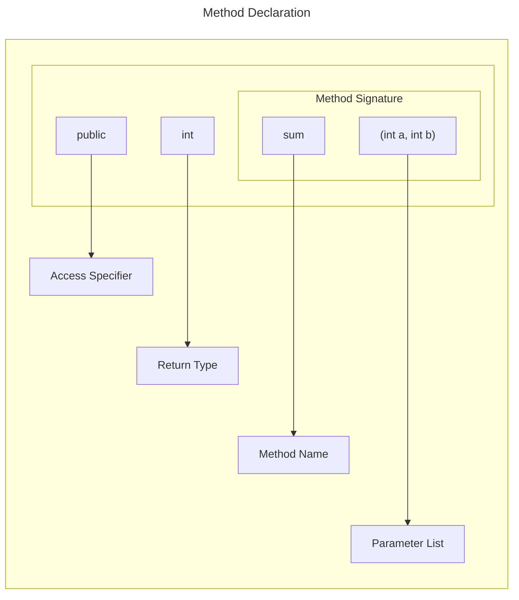

# Methods in Java

In general, a method is a way to perform some task. Similarly, the method in Java is a collection of instructions that performs a specific task. 
It provides the reusability of code. We can also easily modify code using methods. 
In this section, we will learn what is a method in Java, types of methods, method declaration, and how to call a method in Java.


## Method Declaration

The method declaration provides information about method attributes, such as visibility, return-type, name, and arguments. 

It has six components that are known as method header, as we have shown in the following figure.




**Method Signature**: Every method has a method signature. It is a part of the method declaration. It includes the method name and parameter list.

**Access Specifier**: Access specifier or modifier is the access type of the method. It specifies the visibility of the method. Java provides four types of access specifier:

- **Public**: The method is accessible by all classes when we use public specifier in our application.
- **Private**: When we use a private access specifier, the method is accessible only in the classes in which it is defined.
- **Protected**: When we use protected access specifier, the method is accessible within the same package or subclasses in a different package.
- **Default**: When we do not use any access specifier in the method declaration, Java uses default access specifier by default. It is visible only from the same package only.

**Return Type**: Return type is a data type that the method returns. It may have a primitive data type, object, collection, void, etc. If the method does not return anything, we use void keyword.

**Method Name**: It is a unique name that is used to define the name of a method. It must be corresponding to the functionality of the method. Suppose, if we are creating a method for subtraction of two numbers, the method name must be `subtraction()`. A method is invoked by its name.

**Parameter List**: It is the list of parameters separated by a comma and enclosed in the pair of parentheses. It contains the data type and variable name. If the method has no parameter, left the parentheses blank.

**Method Body**: It is a part of the method declaration. It contains all the actions to be performed. It is enclosed within the pair of curly braces.


## Naming a Method

While defining a method, remember that the method name must be a verb and start with a lowercase letter. If the method name has more than two words, the first name must be a verb followed by adjective or noun. In the multi-word method name, the first letter of each word must be in uppercase except the first word. For example:

**Single-word method name**: `sum()`, `area()`

**Multi-word method name**: `areaOfCircle()`, `stringComparision()`

It is also possible that a method has the same name as another method name in the same class, it is known as **method overloading**.


## Static Method

A method that has static keyword is known as static method. In other words, a method that belongs to a class rather than an instance of a class is known as a static method. We can also create a static method by using the keyword static before the method name.

The main advantage of a static method is that **we can call it without creating an object**. 

It can access static data members and also change the value of it. It is used to create an instance method. 

It is invoked by using the class name. 

The best example of a static method is the main() method.


```java
public class Display  
{  
    public static void main(String[] args)   
    {  
        show();  
    }  
    static void show()   
    {  
        System.out.println("It is an example of static method.");  
    }  
}  
```

## Instance Method

The method of the class is known as an instance method. It is a non-static method defined in the class. 

Before calling or invoking the instance method, it is necessary to create an object of its class. 

Let's see an example of an instance method.

InstanceMethodExample.java

```java
public class InstanceMethodExample  
{  
    public static void main(String [] args)  
    {  
        //Creating an object of the class  
        InstanceMethodExample obj = new InstanceMethodExample();  
        //invoking instance method   
        System.out.println("The sum is: "+obj.add(12, 13));  
    }  

    int s;

    //user-defined method because we have not used static keyword  
    public int add(int a, int b)  
    {  
        s = a+b;  
        //returning the sum  
        return s;  
    }  
}  
```
Output
```
The sum is: 25
```

### Type of instance method

There are two types of instance method:

- Accessor Method
- Mutator Method

**Accessor Method**: The method(s) that reads the instance variable(s) is known as the accessor method. We can easily identify it because the method is prefixed with the word get. It is also known as getters. 

It returns the value of the private field. It is used to get the value of the private field.

```java
public int getId()    
{    
    return Id;    
} 
```   

**Mutator Method**: The method(s) read the instance variable(s) and also modify the values. We can easily identify it because the method is prefixed with the word set. It is also known as setters or modifiers. 

It does not return anything. It accepts a parameter of the same data type that depends on the field. It is used to set the value of the private field.

```java
public void setRoll(int roll)   
{  
    this.roll = roll;  
}  
```

Example of accessor and mutator method

```java
public class Student   
{  
    private int roll;  
    private String name; 

    public int getRoll()    //accessor method  
    {  
        return roll;  
    }  

    public void setRoll(int roll) //mutator method  
    {  
        this.roll = roll;  
    }  

    public String getName()   
    {  
        return name;  
    }  

    public void setName(String name)   
    {  
        this.name = name;  
    }  

    public void display()  
    {  
        System.out.println("Roll no.: "+roll);  
        System.out.println("Student name: "+name);  
    }  
}  
```

## Abstract Method

The method that does not have a method body is known as abstract method. In other words, without an implementation, it is known as abstract method. 

It is always declared in the abstract class. It means the class itself must be abstract if it has an abstract method. To create an abstract method, we use the keyword abstract.

```java
abstract void method_name();  
```

Example of abstract method
Demo.java

```java
abstract class Demo //abstract class  
{  
    //abstract method declaration  
    abstract void display();  
}  

public class MyClass extends Demo  
{  

    //method impelmentation  
    void display()  
    {  
        System.out.println("Abstract method?");  
    }  

    public static void main(String args[])  
    {  
        //creating object of abstract class  
        Demo obj = new MyClass();  
        //invoking abstract method  
        obj.display();  
    }  
}  
```

## Factory method

It is a method that returns an object to the class to which it belongs. All static methods are factory methods. For example, `NumberFormat obj = NumberFormat.getNumberInstance();`


# Pass by Value or Pass by Reference


# Java main() method
https://www.javatpoint.com/java-main-method


# References

https://www.javatpoint.com/method-in-java

https://www.geeksforgeeks.org/methods-in-java/

https://www.geeksforgeeks.org/parameter-passing-techniques-in-java-with-examples/

https://www.digitalocean.com/community/tutorials/java-is-pass-by-value-and-not-pass-by-reference

