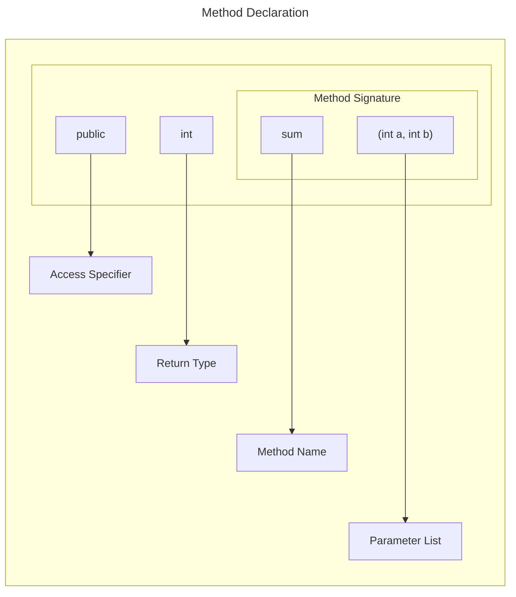
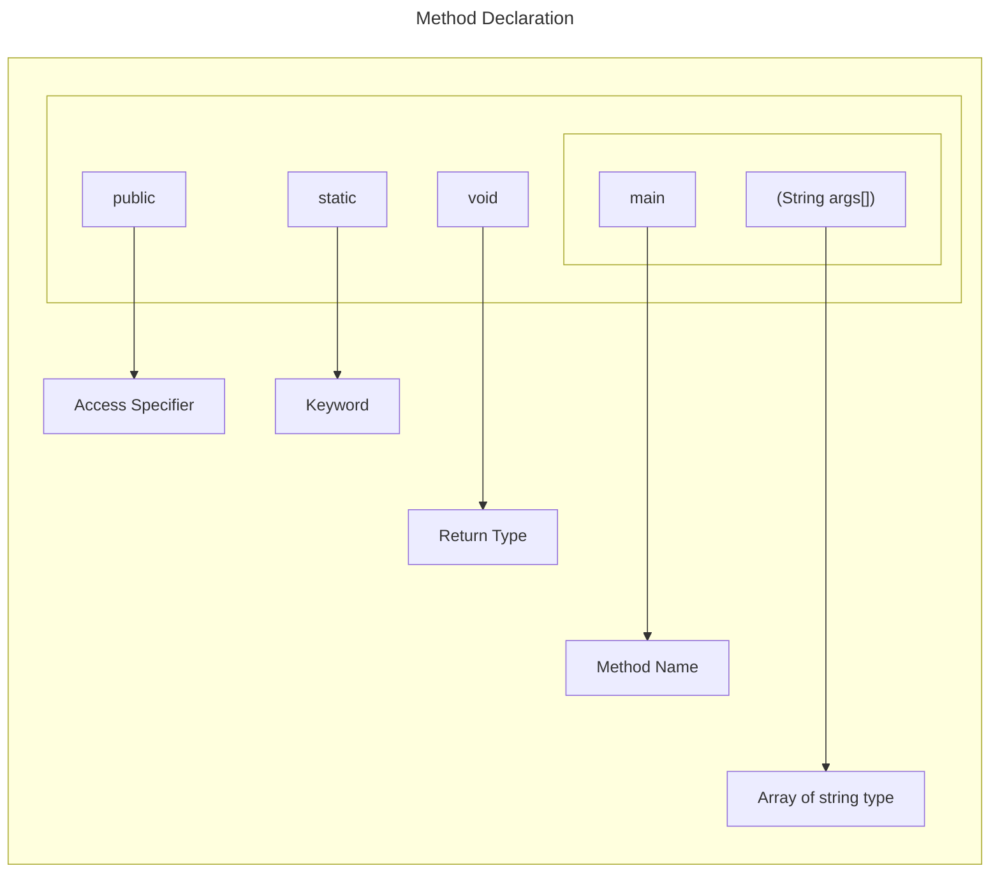

# Methods in Java

In general, a method is a way to perform some task. Similarly, the method in Java is a collection of instructions that performs a specific task. 
It provides the reusability of code. We can also easily modify code using methods. 
In this section, we will learn what is a method in Java, types of methods, method declaration, and how to call a method in Java.


## Method Declaration

The method declaration provides information about method attributes, such as visibility, return-type, name, and arguments. 

It has six components that are known as method header, as we have shown in the following figure.




**Method Signature**: Every method has a method signature. It is a part of the method declaration. It includes the method name and parameter list.

**Access Specifier**: Access specifier or modifier is the access type of the method. It specifies the visibility of the method. Java provides four types of access specifier:

- **Public**: The method is accessible by all classes when we use public specifier in our application.
- **Private**: When we use a private access specifier, the method is accessible only in the classes in which it is defined.
- **Protected**: When we use protected access specifier, the method is accessible within the same package or subclasses in a different package.
- **Default**: When we do not use any access specifier in the method declaration, Java uses default access specifier by default. It is visible only from the same package only.

**Return Type**: Return type is a data type that the method returns. It may have a primitive data type, object, collection, void, etc. If the method does not return anything, we use void keyword.

**Method Name**: It is a unique name that is used to define the name of a method. It must be corresponding to the functionality of the method. Suppose, if we are creating a method for subtraction of two numbers, the method name must be `subtraction()`. A method is invoked by its name.

**Parameter List**: It is the list of parameters separated by a comma and enclosed in the pair of parentheses. It contains the data type and variable name. If the method has no parameter, left the parentheses blank.

**Method Body**: It is a part of the method declaration. It contains all the actions to be performed. It is enclosed within the pair of curly braces.


## Naming a Method

While defining a method, remember that the method name must be a verb and start with a lowercase letter. If the method name has more than two words, the first name must be a verb followed by adjective or noun. In the multi-word method name, the first letter of each word must be in uppercase except the first word. For example:

**Single-word method name**: `sum()`, `area()`

**Multi-word method name**: `areaOfCircle()`, `stringComparision()`

It is also possible that a method has the same name as another method name in the same class, it is known as **method overloading**.


## Static Method

A method that has static keyword is known as static method. In other words, a method that belongs to a class rather than an instance of a class is known as a static method. We can also create a static method by using the keyword static before the method name.

The main advantage of a static method is that **we can call it without creating an object**. 

It can access static data members and also change the value of it. It is used to create an instance method. 

It is invoked by using the class name. 

The best example of a static method is the main() method.


```java
public class Display  
{  
    public static void main(String[] args)   
    {  
        show();  
    }  
    static void show()   
    {  
        System.out.println("It is an example of static method.");  
    }  
}  
```

## Instance Method

The method of the class is known as an instance method. It is a non-static method defined in the class. 

Before calling or invoking the instance method, it is necessary to create an object of its class. 

Let's see an example of an instance method.

InstanceMethodExample.java

```java
public class InstanceMethodExample  
{  
    public static void main(String [] args)  
    {  
        //Creating an object of the class  
        InstanceMethodExample obj = new InstanceMethodExample();  
        //invoking instance method   
        System.out.println("The sum is: "+obj.add(12, 13));  
    }  

    int s;

    //user-defined method because we have not used static keyword  
    public int add(int a, int b)  
    {  
        s = a+b;  
        //returning the sum  
        return s;  
    }  
}  
```
Output
```
The sum is: 25
```

### Type of instance method

There are two types of instance method:

- Accessor Method
- Mutator Method

**Accessor Method**: The method(s) that reads the instance variable(s) is known as the accessor method. We can easily identify it because the method is prefixed with the word get. It is also known as getters. 

It returns the value of the private field. It is used to get the value of the private field.

```java
public int getId()    
{    
    return Id;    
} 
```   

**Mutator Method**: The method(s) read the instance variable(s) and also modify the values. We can easily identify it because the method is prefixed with the word set. It is also known as setters or modifiers. 

It does not return anything. It accepts a parameter of the same data type that depends on the field. It is used to set the value of the private field.

```java
public void setRoll(int roll)   
{  
    this.roll = roll;  
}  
```

Example of accessor and mutator method

```java
public class Student   
{  
    private int roll;  
    private String name; 

    public int getRoll()    //accessor method  
    {  
        return roll;  
    }  

    public void setRoll(int roll) //mutator method  
    {  
        this.roll = roll;  
    }  

    public String getName()   
    {  
        return name;  
    }  

    public void setName(String name)   
    {  
        this.name = name;  
    }  

    public void display()  
    {  
        System.out.println("Roll no.: "+roll);  
        System.out.println("Student name: "+name);  
    }  
}  
```

## Abstract Method

The method that does not have a method body is known as abstract method. In other words, without an implementation, it is known as abstract method. 

It is always declared in the abstract class. It means the class itself must be abstract if it has an abstract method. To create an abstract method, we use the keyword abstract.

```java
abstract void method_name();  
```

Example of abstract method
Demo.java

```java
abstract class Demo //abstract class  
{  
    //abstract method declaration  
    abstract void display();  
}  

public class MyClass extends Demo  
{  

    //method impelmentation  
    void display()  
    {  
        System.out.println("Abstract method?");  
    }  

    public static void main(String args[])  
    {  
        //creating object of abstract class  
        Demo obj = new MyClass();  
        //invoking abstract method  
        obj.display();  
    }  
}  
```

## Factory method

It is a method that returns an object to the class to which it belongs. All static methods are factory methods. For example, `NumberFormat obj = NumberFormat.getNumberInstance();`


# Pass by Value or Pass by Reference


There are different ways in which parameter data can be passed into and out of methods and functions. Let us assume that a function `B()` is called from another function `A()`. In this case A is called the “caller function” and B is called the “called function or callee function”. Also, the arguments which A sends to B are called actual arguments and the parameters of B are called formal arguments.

## Types of parameters
**Formal Parameter**: A variable and its type as they appear in the prototype of the function or method. 

Syntax: 
```java
function_name(datatype variable_name)
```

**Actual Parameter**: The variable or expression corresponding to a formal parameter that appears in the function or method call in the calling environment. 

Syntax:  
```java
func_name(variable_name); 
```

## Pass By Value 

Changes made to formal parameter do not get transmitted back to the caller. Any modifications to the formal parameter variable inside the called function or method affect only the separate storage location and will not be reflected in the actual parameter in the calling environment. This method is also called as call by value.
Java in fact is strictly call by value.

Example:

```java
// Java program to illustrate
// Call by Value

// Callee
class CallByValue {

	// Function to change the value
	// of the parameters
	public static void example(int x, int y)
	{
		x++;
		y++;
	}
}

// Caller
public class Main {
	public static void main(String[] args)
	{

		int a = 10;
		int b = 20;

		// Instance of class is created
		CallByValue object = new CallByValue();

		System.out.println("Value of a: " + a
						+ " & b: " + b);

		// Passing variables in the class function
		object.example(a, b);

		// Displaying values after
		// calling the function
		System.out.println("Value of a: "
						+ a + " & b: " + b);
	}
}

```


Output
```
Value of a: 10 & b: 20
Value of a: 10 & b: 20
```

Time Complexity: O(1)

Auxiliary Space: O(1)

Shortcomings: 
- Inefficiency in storage allocation
- For objects and arrays, the copy semantics are costly


## Call by reference(aliasing)

Changes made to formal parameter do get transmitted back to the caller through parameter passing. Any changes to the formal parameter are reflected in the actual parameter in the calling environment as formal parameter receives a reference (or pointer) to the actual data. This method is also called as call by reference. This method is efficient in both time and space.

Example:

```java
// Java program to illustrate
// Call by Reference

// Callee
class CallByReference {

	int a, b;

	// Function to assign the value
	// to the class variables
	CallByReference(int x, int y)
	{
		a = x;
		b = y;
	}

	// Changing the values of class variables
	void ChangeValue(CallByReference obj)
	{
		obj.a += 10;
		obj.b += 20;
	}
}

// Caller
public class Main {

	public static void main(String[] args)
	{

		// Instance of class is created
		// and value is assigned using constructor
		CallByReference object
			= new CallByReference(10, 20);

		System.out.println("Value of a: " + object.a
						+ " & b: " + object.b);

		// Changing values in class function
		object.ChangeValue(object);

		// Displaying values
		// after calling the function
		System.out.println("Value of a: " + object.a
						+ " & b: " + object.b);
	}
}

```

Output
```
Value of a: 10 & b: 20
Value of a: 20 & b: 40
```

Time Complexity: O(1)

Auxiliary Space: O(1)

Please note that when we pass a reference, a new reference variable to the same object is created. So we can only change members of the object whose reference is passed. We cannot change the reference to refer to some other object as the received reference is a copy of the original reference. 

## Java is Strictly Pass by Value!  

>[Digital Ocean Tutorial, java is pass by value](https://www.digitalocean.com/community/tutorials/java-is-pass-by-value-and-not-pass-by-reference)


First, what does pass by value and pass by reference mean?

- Pass by value: The method parameter values are copied to another variable and then the copied object is passed to the method. The method uses the copy.
- Pass by reference: An alias or reference to the actual parameter is passed to the method. The method accesses the actual parameter.

Often, the confusion around these terms is a result of the concept of the object reference in Java. Technically, Java is always pass by value, because even though a variable might hold a reference to an object, that object reference is a value that represents the object’s location in memory. Object references are therefore passed by value.

Both reference data types and primitive data types are passed by value.


### Demonstrating pass by value
The following example demonstrates how values are passed in Java.

The example program uses the following class:

```java
public class Balloon {

	private String color;

	public Balloon() {}
	
	public Balloon(String c) {
		this.color = c;
	}
	
	public String getColor() {
		return color;
	}

	public void setColor(String color) {
		this.color = color;
	}
}
```


The following example program uses a generic method, `swap()`, that swaps two variables. Another method, `changeValue()`, attempts to change the variable values.


```java
public class Test {

	public static void main(String[] args) {

		Balloon red = new Balloon("Red"); // memory reference = 50
		Balloon blue = new Balloon("Blue"); // memory reference = 100
		
		swap(red, blue);
		System.out.println("After the swap method executes:");
		System.out.println("`red` color value = " + red.getColor());
		System.out.println("`blue` color value = " + blue.getColor());
		
		changeValue(blue);
		System.out.println("After the changeValue method executes:");
		System.out.println("`blue` color value = " + blue.getColor());
		
	}

	// Generic swap method
	public static void swap(Object o1, Object o2){
		Object temp = o1;
		o1 = o2;
		o2 = temp;
	}

	private static void changeValue(Balloon balloon) { // balloon = 100
		balloon.setColor("Red"); // balloon = 100
		balloon = new Balloon("Green"); // balloon = 200
		balloon.setColor("Blue"); // balloon = 200
	}

}
```


When you execute the example program, you get the following output:

Output
```
After the swap method executes:
'red' color value = Red
'blue' color value = Blue
After the changeValue method executes:
'blue' color value = Red
```

The output shows that the `swap()` method didn’t swap the color values of the original objects. This helps to show that Java is pass by value, since the `swap()` method only acts upon copies of the original object reference values.

This `swap()` method test can be used with any programming language to check whether it’s pass by value or pass by reference.


#### The Example `swap()` Method Explained
When you use the new operator to create an instance of a class, the object is created and the variable contains the location in memory where the object is saved.

```java
Balloon red = new Balloon("Red");
Balloon blue = new Balloon("Blue");
```


Here’s a step-by-step breakdown of what happens when the swap() method executes:

- Assume that red is pointing to memory location 50 and blue is pointing to memory location 100, and that these are the memory locations of both Balloon objects.

- When the class calls the `swap()` method with the red and blue variables as arguments, two new object variables, `o1` and `o2`, are created. `o1` and `o2` also point to memory locations 50 and 100 respectively.

The following code snippet explains what happens within the swap() method:

```java
public static void swap(Object o1, Object o2) { // o1 = 50, o2 = 100
	Object temp = o1; // assign the object reference value of o1 to temp: temp = 50, o1 = 50, o2 = 100
	o1 = o2; // assign the object reference value of o2 to o1: temp = 50, o1 = 100, o2 = 100
	o2 = temp; // assign the object reference value of temp to o2: temp = 50, o1 = 100, o2 = 50
} // method terminated
```

- The values of o1 and o2 are swapped, **but because the values are copies of the red and blue memory locations**, `there is no change to the values` of the red and blue color values.

Since the variables contain the reference to the objects, it’s a common mistake to assume that you’re passing the reference and Java is pass by reference. 

However, you’re passing a value which is a copy of the reference and therefore it’s pass by value.


#### The Example changeValue() Method Explained

The next method in the example program changes the color value of the object referenced by the blue variable:


Here’s a step-by-step breakdown of what happens within the `changeValue()` method:

- The class calls the `changeValue()` method on the `blue` variable that references memory location 100. The first line creates a reference that also points to memory location 100. The color value of the object at memory location 100 is changed to `"Red"`.

- The second line creates a new object (with color value `"Green"`). The new object is at memory location 200. Any further methods executed on the `balloon` variable act upon the object at memory location 200, and don’t affect the object at memory location 100. The new `balloon` variable overwrites the reference created in line 1 and the balloon reference from line 1 is no longer accessible within this method.

- The third line changes the color value of the new `Balloon` object at memory location 200 to `"Blue"`, but does not affect the original object referenced by `blue` at memory location 100. This explains why the final line of the example program output prints `blue color value = Red`, which reflects the change from line 1.


# Java main() method

The main() is the starting point for JVM to start execution of a Java program. Without the main() method, JVM will not execute the program. The syntax of the main() method is:




Values passed to the `main()` method is called arguments. These arguments are stored into `args[]` array, so the name `args[]` is generally used for it.

**What happens if the main() method is written without String args[]?**

The program will compile, but not run, because JVM will not recognize the main() method. Remember JVM always looks for the main() method with a string type array as a parameter.

## Execution Process

First, JVM executes the static block, then it executes static methods, and then it creates the object needed by the program. Finally, it executes the instance methods. JVM executes a static block on the highest priority basis. It means JVM first goes to static block even before it looks for the main() method in the program.

Example
```java
class  Demo  
{  
	static                  //static block  
	{  
		System.out.println("Static block");  
	}  

	public static void main(String args[])  //static method  
	{  
		System.out.println("Static method");  
	}  
}  
```

Output:
```
Static block
Static method
```

We observe that JVM first executes the static block, if it is present in the program. After that it searches for the main() method. If the main() method is not found, it gives error.

Example

A program that does not have the main() method gives an error at run time.
```java
class DemoStaticBlock  
{  
	static                                  //static block  
	{  
		System.out.println("Static block");  
	}  
}    
``` 
Output:
```
Error: Main method not found in the class Demo, please define the main method as:
public static void main(String[] args)
or a JavaFX application class must extend javafx.application.Application
```


So the `main()` method should always be written as:
```
public static void main(String args[])  
```
We can interchange public and static and write it as follows:
```
static public void main(String args[])  
```
We can also use the different name for the String type array and write it as:
```
static public void main(String[] x)  
```
Different ways of writing main() method are:
```
static public void main(String []x)  
static public void main(String...args)  
```
String...args: It allows the method to accept zero or multiple arguments. There should be exactly three dots between String and array; otherwise, it gives an error.


>[Main method java point tutorial](https://www.javatpoint.com/java-main-method)


# References

https://www.javatpoint.com/method-in-java

https://www.geeksforgeeks.org/methods-in-java/

https://www.geeksforgeeks.org/parameter-passing-techniques-in-java-with-examples/

https://www.digitalocean.com/community/tutorials/java-is-pass-by-value-and-not-pass-by-reference

