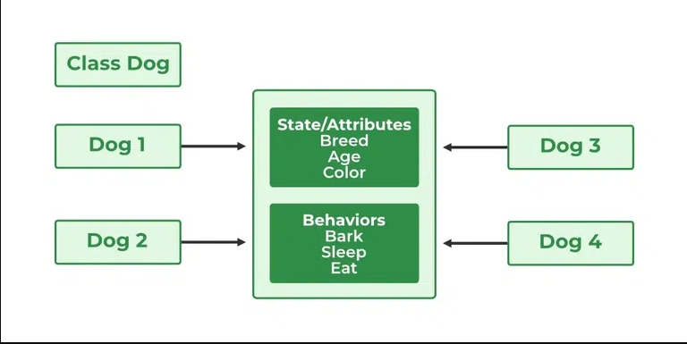

# Object-Oriented Programming

## Class and Objects

A Java class is a set of object which shares common characteristics/ behavior and common properties/ attributes. There are certain points about Java Classes as mentioned below:

Class is not a real-world entity. It is just a template or blueprint or prototype from which objects are created.
Class does not occupy memory.
Class is a group of variables of different data types and a group of methods.

A Class in Java can contain:

- Data member
- Method
- Constructor
- Nested Class
- Interface


### Declare Class in Java
```
access_modifier class<class_name>
{  
    data member;  
    method;  
    constructor;
    nested class;
    interface;
}
```

```java
// Java Program for class example

class Student {
	// data member (also instance variable)
	int id;
	// data member (also instance variable)
	String name;

	public static void main(String args[])
	{
		// creating an object of
		// Student
		Student s1 = new Student();
		System.out.println(s1.id);
		System.out.println(s1.name);
	}
}

```

A class is a user-defined blueprint or prototype from which objects are created. It represents the set of properties or methods that are common to all objects of one type.


### Components of Java Classes

In general, class declarations can include these components, in order: 
- Modifiers: A class can be public or has default access (Refer this for details).
- Class keyword: class keyword is used to create a class.
- Class name: The name should begin with an initial letter (capitalized by convention).
- Superclass(if any): The name of the class’s parent (superclass), if any, preceded by the keyword extends. A class can only extend (subclass) one parent.
- Interfaces(if any): A comma-separated list of interfaces implemented by the class, if any, preceded by the keyword implements. A class can implement more than one interface.
- Body: The class body is surrounded by braces, { }.


Constructors are used for initializing new objects. Fields are variables that provide the state of the class and its objects, and methods are used to implement the behavior of the class and its objects.
There are various types of classes that are used in real-time applications such as nested classes, anonymous classes, and lambda expressions.


## Objects in Java


It is a basic unit of Object-Oriented Programming and represents real-life entities. A typical Java program creates many objects, which as you know, interact by invoking methods. An object consists of : 

- State: It is represented by attributes of an object. It also reflects the properties of an object.
- Behavior: It is represented by the methods of an object. It also reflects the response of an object with other objects.
- Identity: It gives a unique name to an object and enables one object to interact with other objects.


### Declaring Objects (Also called instantiating a class)

When an object of a class is created, the class is said to be instantiated. All the instances share the attributes and the behavior of the class. 

But the values of those attributes, i.e. the state are unique for each object. A single class may have any number of instances.





As we declare variables like (type name;). This notifies the compiler that we will use the name to refer to data whose type is type. With a primitive variable, this declaration also reserves the proper amount of memory for the variable. So for reference variables , the type must be strictly a concrete class name. In general, we can’t create objects of an abstract class or an interface.  

```java
Dog tuffy;
```

If we declare a reference variable(tuffy) like this, its value will be undetermined(null) until an object is actually created and assigned to it. Simply declaring a reference variable does not create an object.


### Initializing a Java object

The new operator instantiates a class by allocating memory for a new object and returning a reference to that memory. The new operator also invokes the class constructor. 

```java
// Class Declaration

public class Dog {
	// Instance Variables
	String name;
	String breed;
	int age;
	String color;

	// Constructor Declaration of Class
	public Dog(String name, String breed, int age,String color)
	{
		this.name = name;
		this.breed = breed;
		this.age = age;
		this.color = color;
	}

	// method 1
	public String getName() { return name; }

	// method 2
	public String getBreed() { return breed; }

	// method 3
	public int getAge() { return age; }

	// method 4
	public String getColor() { return color; }

	@Override public String toString()
	{
		return ("Hi my name is " + this.getName()
				+ ".\nMy breed,age and color are "
				+ this.getBreed() + "," + this.getAge()
				+ "," + this.getColor());
	}

	public static void main(String[] args)
	{
		Dog tuffy
			= new Dog("tuffy", "papillon", 5, "white");
		System.out.println(tuffy.toString());
	}
}

```

Output
```
Hi my name is tuffy.
My breed,age and color are papillon,5,white
```


This class contains a single constructor. We can recognize a constructor because its declaration uses the same name as the class and it has no return type. 

The Java compiler differentiates the constructors based on the number and the type of the arguments. The constructor in the Dog class takes four arguments. The following statement provides “tuffy”, “papillon”,5, and “white” as values for those arguments:

```
Dog tuffy = new Dog("tuffy","papillon",5, "white");
```


**Note**: All classes have at least one constructor. If a class does not explicitly declare any, the Java compiler automatically provides a no-argument constructor, also called the default constructor. 

This default constructor calls the class parent’s no-argument constructor (as it contains only one statement i.e `super();`), or the Object class constructor if the class has no other parent (as the Object class is the parent of all classes either directly or indirectly). 


### Ways to Create an Object of a Class

There are four ways to create objects in Java. Strictly speaking, there is only one way(by using a new keyword), and the rest internally use a new keyword. 

#### Using new keyword
It is the most common and general way to create an object in Java. 

Example:
```
// creating object of class Test
Test t = new Test();
```

#### Using Class.forName(String className) method

There is a pre-defined class in java.lang package with name Class. The forName(String className) method returns the Class object associated with the class with the given string name. We have to give a fully qualified name for a class. On calling the new Instance() method on this Class object returns a new instance of the class with the given string name.
```
// creating object of public class Test
// consider class Test present in com.p1 package
Test obj = (Test)Class.forName("com.p1.Test").newInstance();
```


#### Using clone() method
clone() method is present in the Object class. It creates and returns a copy of the object.
```   
// creating object of class Test
Test t1 = new Test();

// creating clone of above object
Test t2 = (Test)t1.clone();
```

#### Deserialization
De-serialization is a technique of reading an object from the saved state in a file. Refer to Serialization/De-Serialization in Java

```        
FileInputStream file = new FileInputStream(filename);
ObjectInputStream in = new ObjectInputStream(file);
Object obj = in.readObject();
```

### Creating multiple objects by one type only (A good practice) 

In real-time, we need different objects of a class in different methods. Creating a number of references for storing them is not a good practice and therefore we declare a static reference variable and use it whenever required. In this case, the wastage of memory is less. The objects that are not referenced anymore will be destroyed by the Garbage Collector of Java. 

Example:

``` java      
Test test = new Test();
test = new Test();
```
In the inheritance system, we use a parent class reference variable to store a sub-class object. In this case, we can switch into different subclass objects using the same referenced variable. 


Example:
```java
class Animal {}

class Dog extends Animal {}
class Cat extends Animal {}

public class Test
{
    // using Dog object
    Animal obj = new Dog();

    // using Cat object
    obj = new Cat();
}       

```


#### Anonymous Objects in Java
Anonymous objects are objects that are instantiated but are not stored in a reference variable.  

- They are used for immediate method calls.
- They will be destroyed after method calling.
- They are widely used in different libraries. For example, in AWT libraries, they are used to perform some action on capturing an event(eg a key press).
- In the example below, when a key button(referred to by the btn) is pressed, we are simply creating an anonymous object of EventHandler class for just calling the handle method.

```java
btn.setOnAction(new EventHandler()
{
    public void handle(ActionEvent event)
    {
        System.out.println("Hello World!");
    }
});
```


## Instantiation and the life cycle of an object

Already discussed previously [Instance variables and Memory Lifecycle](./Variables.md)


## Declaring Classes
You've seen classes defined in the following way:
```
class MyClass {
    // field, constructor, and 
    // method declarations
}
```


This is a class declaration. The class body (the area between the braces) contains all the code that provides for the life cycle of the objects created from the class: constructors for initializing new objects, declarations for the fields that provide the state of the class and its objects, and methods to implement the behavior of the class and its objects.

The preceding class declaration is a minimal one. It contains only those components of a class declaration that are required. You can provide more information about the class, such as the name of its superclass, whether it implements any interfaces, and so on, at the start of the class declaration. For example,
```
class MyClass extends MySuperClass implements YourInterface {
    // field, constructor, and
    // method declarations
}
```

means that MyClass is a subclass of MySuperClass and that it implements the YourInterface interface.

You can also add modifiers like public or private at the very beginning—so you can see that the opening line of a class declaration can become quite complicated. The modifiers public and private, which determine what other classes can access MyClass, are discussed later in this lesson. The lesson on interfaces and inheritance will explain how and why you would use the extends and implements keywords in a class declaration. For the moment you do not need to worry about these extra complications.

In general, class declarations can include these components, in order:

- Modifiers such as public, private, and a number of others that you will encounter later. (However, note that the private modifier can only be applied to Nested Classes.)
- The class name, with the initial letter capitalized by convention.
- The name of the class's parent (superclass), if any, preceded by the keyword extends. A class can only extend (subclass) one parent.
- A comma-separated list of interfaces implemented by the class, if any, preceded by the keyword implements. A class can implement more than one interface.
- The class body, surrounded by braces, `{}`.


Now implementing a class comes down to filling the body with functionality while adhering tot he signature of the methods provided by the interface or the methods signature them selfs when no interface is provided , more on interfaces later.


# Access Modifiers

Access modifiers are object-oriented programming that is used to set the accessibility of classes, constructors, methods, and other members of Java.
Using the access modifiers we can set the scope or accessibility of these classes, methods, constructors, and other members. 


### Four Types of Access Modifiers

- **Private** : We can access the private modifier only within the same class and not from outside the class.
- **Default** : We can access the default modifier only within the same package and not from outside the package. And also, **if we do not specify any access modifier it will automatically consider it as default**.
- **Protected** : We can access the protected modifier within the same package and also from outside the package with the help of the child class. If we do not make the child class, we cannot access it from outside the package. **So inheritance is a must for accessing it from outside the package.**
- **Public** : We can access the public modifier from anywhere. We can access public modifiers from within the class as well as from outside the class and also within the package and outside the package.


### Which all members of Java can be assigned with the access modifiers


|Members of JAVA|	Private|	Default|	Protected|	Public
|:---|:---|:---|:---|:---|
Class	|No	|Yes	|No	|Yes
Variable|	Yes	|Yes|	Yes|	Yes
Method	|Yes	|Yes	|Yes	|Yes
Constructor	|Yes	|Yes	|Yes	|Yes
interface	|No	|Yes	|No	|Yes
Initializer Block|	NOT ALLOWED|||


### Scope of each Access Modifier


|  | Accessibility	|Private	|Default	|Protected	|Public
|:---|:---|:---|:---|:---|:---|
Same Package|	Same Class|	Yes|	Yes|	Yes|	Yes
Without Inheritance|	No|	Yes|	Yes	|Yes
With Inheritance|	No|	Yes|	Yes|	Yes
Different Package|	Without Inheritance|	No|	No	|No|	Yes
With Inheritance|	No|	No	|Yes	|Yes


## Data Members


Member variables are known as instance variables in java.

- Instance variables are declared in a class, but outside a method, constructor or any block.

- When space is allocated for an object in the heap, a slot for each instance variable value is created.

- Instance variables are created when an object is created with the use of the keyword 'new' and destroyed when the object is destroyed.

- Instance variables hold values that must be referenced by more than one method, constructor or block, or essential parts of an object's state that must be present throughout the class.

- Instance variables can be declared in a class level before or after use.

- Access modifiers can be given for instance variables.

- The instance variables are visible for all methods, constructors, and block in the class. Normally, it is recommended to make these variables private (access level). However, visibility for subclasses can be given for these variables with the use of access modifiers.

- Instance variables have default values. For numbers, the default value is 0, for Booleans it is false, and for object references it is null. Values can be assigned during the declaration or within the constructor.

- Instance variables can be accessed directly by calling the variable name inside the class. However, within static methods (when instance variables are given accessibility), they should be called using the fully qualified name. ObjectReference.VariableName.


## Constructors 

Java constructors or constructors in Java is a terminology used to construct something in our programs. A constructor in Java is a special method that is used to initialize objects. The constructor is called when an object of a class is created. It can be used to set initial values for object attributes.

### What are Constructors in Java?

In Java, Constructor is a block of codes similar to the method. It is called when an instance of the class is created. At the time of calling the constructor, memory for the object is allocated in the memory. It is a special type of method that is used to initialize the object. Every time an object is created using the new() keyword, at least one constructor is called.

**Note**: It is not necessary to write a constructor for a class. It is because the java compiler creates a default constructor (constructor with no arguments) if your class doesn’t have any.


Each time an object is created using a new() keyword, at least one constructor (it could be the default constructor) is invoked to assign initial values to the data members of the same class. Rules for writing constructors are as follows:

- The constructor(s) of a class must have the same name as the class name in which it resides.
- A constructor in Java can not be abstract, final, static, or Synchronized.
- Access modifiers can be used in constructor declaration to control its access i.e which other class can call the constructor.

### Types of constructors in java

Now is the correct time to discuss the types of the constructor, so primarily there are three types of constructors in Java are mentioned below:

- Default Constructor
- Parameterized Constructor
- Copy Constructor


### Default Constructor in Java

A constructor that has no parameters is known as default the constructor. A default constructor is invisible. And if we write a constructor with no arguments, the compiler does not create a default constructor. It is taken out. It is being overloaded and called a parameterized constructor. The default constructor changed into the parameterized constructor. But Parameterized constructor can’t change the default constructor.

### Parameterized Constructor in Java

A constructor that has parameters is known as parameterized constructor. If we want to initialize fields of the class with our own values, then use a parameterized constructor.

```java
// Java Program for Parameterized Constructor
import java.io.*;
class Geek {
	// data members of the class.
	String name;
	int id;
	Geek(String name, int id)
	{
		this.name = name;
		this.id = id;
	}
}
class GFG {
	public static void main(String[] args)
	{
		// This would invoke the parameterized constructor.
		Geek geek1 = new Geek("avinash", 68);
		System.out.println("GeekName :" + geek1.name
						+ " and GeekId :" + geek1.id);
	}
}

```

Now the most important topic that comes into play is the strong incorporation of OOPS with constructors known as constructor overloading. Just like methods, we can overload constructors for creating objects in different ways. 

The compiler differentiates constructors on the basis of the number of parameters, types of parameters, and order of the parameters. 


```java
// Java Program to illustrate constructor overloading
// using same task (addition operation ) for different
// types of arguments.

import java.io.*;

class Geek {
	// constructor with one argument
	Geek(String name)
	{
		System.out.println("Constructor with one "
						+ "argument - String : " + name);
	}

	// constructor with two arguments
	Geek(String name, int age)
	{

		System.out.println(
			"Constructor with two arguments : "
			+ " String and Integer : " + name + " " + age);
	}

	// Constructor with one argument but with different
	// type than previous..
	Geek(long id)
	{
		System.out.println(
			"Constructor with one argument : "
			+ "Long : " + id);
	}
}

class GFG {
	public static void main(String[] args)
	{
		// Creating the objects of the class named 'Geek'
		// by passing different arguments

		// Invoke the constructor with one argument of
		// type 'String'.
		Geek geek2 = new Geek("Shikhar");

		// Invoke the constructor with two arguments
		Geek geek3 = new Geek("Dharmesh", 26);

		// Invoke the constructor with one argument of
		// type 'Long'.
		Geek geek4 = new Geek(325614567);
	}
}

```


### Copy Constructor in Java

Unlike other constructors copy constructor is passed with another object which copies the data available from the passed object to the newly created object.

```java
// Java Program for Copy Constructor
import java.io.*;

class Geek {
	// data members of the class.
	String name;
	int id;

	// Parameterized Constructor
	Geek(String name, int id)
	{
		this.name = name;
		this.id = id;
	}

	// Copy Constructor
	Geek(Geek obj2)
	{
		this.name = obj2.name;
		this.id = obj2.id;
	}
}
class GFG {
	public static void main(String[] args)
	{
		// This would invoke the parameterized constructor.
		System.out.println("First Object");
		Geek geek1 = new Geek("avinash", 68);
		System.out.println("GeekName :" + geek1.name
						+ " and GeekId :" + geek1.id);

		System.out.println();

		// This would invoke the copy constructor.
		Geek geek2 = new Geek(geek1);
		System.out.println(
			"Copy Constructor used Second Object");
		System.out.println("GeekName :" + geek2.name
						+ " and GeekId :" + geek2.id);
	}
}
```

## Nested Class


In Java, it is possible to define a class within another class, such classes are known as nested classes. They enable you to logically group classes that are only used in one place, thus this increases the use of encapsulation, and creates more readable and maintainable code.

- The scope of a nested class is bounded by the scope of its enclosing class. Thus in below example, class NestedClass does not exist independently of class OuterClass.
- A nested class has access to the members, including private members, of the class in which it is nested. But the enclosing class does not have access to the member of the nested class.
- A nested class is also a member of its enclosing class.
- As a member of its enclosing class, a nested class can be declared private, public, protected, or package private(default).
- Nested classes are divided into two categories:
	- static nested class : Nested classes that are declared static are called static nested classes.
	- inner class : An inner class is a non-static nested class.


```
class OuterClass
{
...
    class NestedClass
    {
        ...
    }
}
```


### Static Nested Class

In the case of normal or regular inner classes, without an outer class object existing, there cannot be an inner class object. 

i.e., an object of the inner class is always strongly associated with an outer class object. But in the case of static nested class, Without an outer class object existing, there may be a static nested class object. i.e., an object of a static nested class is not strongly associated with the outer class object.

As with class methods and variables, a static nested class is associated with its outer class. And like static class methods, a static nested class cannot refer directly to instance variables or methods defined in its enclosing class: it can use them only through an object reference.They are accessed using the enclosing class name.

```
OuterClass.StaticNestedClass
```

For example, to create an object for the static nested class, use this syntax:
```java
OuterClass.StaticNestedClass nestedObject =
     new OuterClass.StaticNestedClass();
```


```java
// Java program to demonstrate accessing
// a static nested class

// outer class
class OuterClass {
	// static member
	static int outer_x = 10;

	// instance(non-static) member
	int outer_y = 20;

	// private member
	private static int outer_private = 30;

	// static nested class
	static class StaticNestedClass {
		void display()
		{
			// can access static member of outer class
			System.out.println("outer_x = " + outer_x);

			// can access private static member of
			// outer class
			System.out.println("outer_private = "
							+ outer_private);

			// The following statement will give compilation
			// error as static nested class cannot directly
			// access non-static members
			// System.out.println("outer_y = " + outer_y);
		
			// Therefore create object of the outer class
			// to access the non-static member
			OuterClass out = new OuterClass();
			System.out.println("outer_y = " + out.outer_y);
		
		
		}
	}
}

// Driver class
public class StaticNestedClassDemo {
	public static void main(String[] args)
	{
		// accessing a static nested class
		OuterClass.StaticNestedClass nestedObject
			= new OuterClass.StaticNestedClass();

		nestedObject.display();
	}
}

```

Output:
```
outer_x = 10
outer_private = 30
outer_y = 20
```

### Inner classes

To instantiate an inner class, you must first instantiate the outer class. Then, create the inner object within the outer object with this syntax:

```
OuterClass.InnerClass innerObject = outerObject.new InnerClass();
```

There are two special kinds of inner classes :

1. Local inner classes
2. Anonymous inner classes


#### Local inner classes

Local Inner Classes are the inner classes that are defined inside a block. Generally, this block is a method body. Sometimes this block can be a for loop or an if clause. Local Inner classes are not a member of any enclosing classes. They belong to the block they are defined within, due to which local inner classes cannot have any access modifiers associated with them. However, they can be marked as final or abstract. This class has access to the fields of the class enclosing it. Local inner class must be instantiated in the block they are defined in. 

Rules of Local Inner Class:

- The scope of the local inner class is restricted to the block they are defined in.
- A local inner class cannot be instantiated from outside the block where it is created in.
- Till JDK 7, the Local inner class can access only the final local variable of the enclosing block. However, From JDK 8, it is possible to access the non-final local variable of enclosing block in the local inner class.
- A local class has access to the members of its enclosing class.
Local inner classes can extend an abstract class or implement an interface. 


**Declaring a Local Inner class**: A local inner class can be declared within a block. This block can be either a method body, initialization block, for loop, or even an if statement. 

**Accessing Members**: A local inner class has access to fields of the class enclosing it as well as the fields of the block that it is defined within. These classes, however, can access the variables or parameters of the block that encloses it only if they are declared as final or are effectively final. A variable whose value is not changed once initialized is called an effectively final variable. A local inner class defined inside a method body has access to its parameters. 


#### What happens at compile time?

When a program containing a local inner class is compiled, the compiler generates two .class files, one for the outer class and the other for the inner class that has the reference to the outer class. The two files are named by the compiler as: 

- Outer.class
- Outer$1Inner.class

#### Declaration within a method body


```java
// Java program to illustrate
// working of local inner classes

public class Outer
{
	private void getValue()
	{
		// Note that local variable(sum) must be final till JDK 7
		// hence this code will work only in JDK 8
		int sum = 20;
		
		// Local inner Class inside method
		class Inner
		{
			public int divisor;
			public int remainder;
			
			public Inner()
			{
				divisor = 4;
				remainder = sum%divisor;
			}
			private int getDivisor()
			{
				return divisor;
			}
			private int getRemainder()
			{
				return sum%divisor;
			}
			private int getQuotient()
			{
				System.out.println("Inside inner class");
				return sum / divisor;
			}
		}
		
		Inner inner = new Inner();
		System.out.println("Divisor = "+ inner.getDivisor());
		System.out.println("Remainder = " + inner.getRemainder());
		System.out.println("Quotient = " + inner.getQuotient());
	}
	
	public static void main(String[] args)
	{
		Outer outer = new Outer();
		outer.getValue();
	}
}

```


Output
```
Divisor = 4
Remainder = 0
Inside inner class
Quotient = 5
```
Note: A local class can access local variables and parameters of the enclosing block that are effectively final. 


For example, if you add the highlighted assignment statement in the Inner class constructor or any method of Inner class in the above example: 
```
public Inner()
{
   sum = 50; // <==
   divisor = 4;
   remainder = sum%divisor;
}
```
Because of this assignment statement, the variable sum is not effectively final anymore. As a result, the Java compiler generates an error message similar to “local variables referenced from an inner class must be final or effectively final.”


#### Declaration inside an if statement

```java
// Java program to illustrate Declaration of
// local inner classes inside an if statement

public class Outer
{
	public int data = 10;
	public int getData()
	{
		return data;
	}
	public static void main(String[] args)
	{
		Outer outer = new Outer();
		
		if(outer.getData() < 20)
		{
			// Local inner class inside if clause
			class Inner
			{
				public int getValue()
				{
					System.out.println("Inside Inner class");
					return outer.data;
				}
			}

			Inner inner = new Inner();
			System.out.println(inner.getValue());
		}
		else
		{
			System.out.println("Inside Outer class");
		}
	}
}

```

### Anonymous Inner Class in Java

Nested Classes in Java is prerequisite required before adhering forward to grasp about anonymous Inner class. It is an inner class without a name and for which only a single object is created. 

An anonymous inner class can be useful when making an instance of an object with certain “extras” such as overriding methods of a class or interface, without having to actually subclass a class.

The syntax of an anonymous class expression is like the invocation of a constructor, except that there is a class definition contained in a block of code. 

```
// Test can be interface,abstract/concrete class
Test t = new Test() 
{
   // data members and methods
   public void test_method() 
   {
      ........
      ........
    }   
};
```

Now let us do discuss the difference between regular class(normal classes) and Anonymous Inner class

- A normal class can implement any number of interfaces but the anonymous inner class can implement only one interface at a time.
- A regular class can extend a class and implement any number of interfaces simultaneously. But anonymous Inner class can extend a class or can implement an interface but not both at a time.
- For regular/normal class, we can write any number of constructors but we can’t write any constructor for anonymous Inner class because the anonymous class does not have any name and while defining constructor class name and constructor name must be same.


#### Accessing Local Variables of the Enclosing Scope, and Declaring and Accessing Members of the Anonymous Class 

Like local classes, anonymous classes can capture variables; they have the same access to local variables of the enclosing scope:  

- An anonymous class has access to the members of its enclosing class.
- An anonymous class cannot access local variables in its enclosing scope that are not declared as final or effectively final.
- Like a nested class, a declaration of a type (such as a variable) in anonymous class shadows any other declarations in the enclosing scope that have the same name.

Anonymous classes also have the same restrictions as local classes with respect to their members: 

- We cannot declare static initializers or member interfaces in an anonymous class.
- An anonymous class can have static members provided that they are constant variables.

**Note**: We can declare the following in anonymous classes as follows:

- Fields
- Extra methods (even if they do not implement any methods of the supertype)
- Instance initializers
- Local classes

```java
// Java Program to Demonstrate Anonymous inner class

// Interface
interface Age {
	int x = 21;
	void getAge();
}

// Main class
class AnonymousDemo {

	// Main driver method
	public static void main(String[] args)
	{

		// Myclass is hidden inner class of Age interface
		// whose name is not written but an object to it
		// is created.
		Age oj1 = new Age() {
		
			@Override public void getAge()
			{
				// printing age
				System.out.print("Age is " + x);
			}
		};
	
		oj1.getAge();
	}
}

```


### Comparison between normal or regular class and static nested class
|Normal/Regular inner class|Static nested class|
|:--|:--|
|Without an outer class object existing, there cannot be an inner class object. That is, the inner class object is always associated with the outer class object. |Without an outer class object existing, there may be a static nested class object. That is, static nested class object is not associated with the outer class object. |
| Inside normal/regular inner class, static members can’t be declared.|Inside static nested class, static members can be declared. |
| As main() method can’t be declared, regular inner class can’t be invoked directly from the command prompt.|As main() method can be declared, the static nested class can be invoked directly from the command prompt. |
| Both static and non static members of outer class can be accessed directly.|Only a static member of outer class can be accessed directly. |


# References

https://www.geeksforgeeks.org/classes-objects-java/

https://docs.oracle.com/javase/tutorial/java/javaOO/classdecl.html

https://docs.oracle.com/javase/tutorial/java/IandI/usinginterface.html

https://www.mygreatlearning.com/blog/the-access-modifiers-in-java/

https://www.geeksforgeeks.org/access-modifiers-java/

https://www.geeksforgeeks.org/constructors-in-java/

https://www.geeksforgeeks.org/nested-classes-java/

https://www.geeksforgeeks.org/anonymous-inner-class-java/