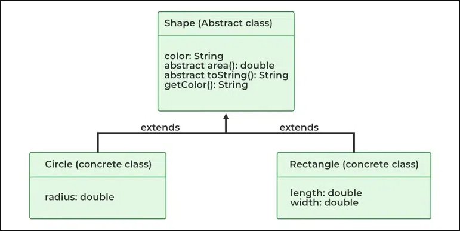

# Abstraction

In Java, abstraction is achieved by interfaces and abstract classes. We can achieve 100% abstraction using interfaces.

Data Abstraction may also be defined as the process of identifying only the required characteristics of an object ignoring the irrelevant details. The properties and behaviors of an object differentiate it from other objects of similar type and also help in classifying/grouping the objects.

## When to use abstract classes and abstract methods

There are situations in which we will want to define a superclass that declares the structure of a given abstraction without providing a complete implementation of every method. Sometimes we will want to create a superclass that only defines a generalization form that will be shared by all of its subclasses, leaving it to each subclass to fill in the details.

Consider a classic “shape” example, perhaps used in a computer-aided design system or game simulation. The base type is “shape” and each shape has a color, size, and so on. From this, specific types of shapes are derived(inherited)-circle, square, triangle, and so on — each of which may have additional characteristics and behaviors. For example, certain shapes can be flipped. Some behaviors may be different, such as when you want to calculate the area of a shape. The type hierarchy embodies both the similarities and differences between the shapes.




```java
// Java program to illustrate the
// concept of Abstraction
abstract class Shape {
	String color;

	// these are abstract methods
	abstract double area();
	public abstract String toString();

	// abstract class can have the constructor
	public Shape(String color)
	{
		System.out.println("Shape constructor called");
		this.color = color;
	}

	// this is a concrete method
	public String getColor() { return color; }
}
class Circle extends Shape {
	double radius;

	public Circle(String color, double radius)
	{

		// calling Shape constructor
		super(color);
		System.out.println("Circle constructor called");
		this.radius = radius;
	}

	@Override double area()
	{
		return Math.PI * Math.pow(radius, 2);
	}

	@Override public String toString()
	{
		return "Circle color is " + super.getColor()
			+ "and area is : " + area();
	}
}
class Rectangle extends Shape {

	double length;
	double width;

	public Rectangle(String color, double length,
					double width)
	{
		// calling Shape constructor
		super(color);
		System.out.println("Rectangle constructor called");
		this.length = length;
		this.width = width;
	}

	@Override double area() { return length * width; }

	@Override public String toString()
	{
		return "Rectangle color is " + super.getColor()
			+ "and area is : " + area();
	}
}
public class Test {
	public static void main(String[] args)
	{
		Shape s1 = new Circle("Red", 2.2);
		Shape s2 = new Rectangle("Yellow", 2, 4);

		System.out.println(s1.toString());
		System.out.println(s2.toString());
	}
}

```


Output
```
Shape constructor called
Circle constructor called
Shape constructor called
Rectangle constructor called
Circle color is Redand area is : 15.205308443374602
Rectangle color is Yellowand area is : 8.0
```


# Abstract Class in Java

An abstract class in Java is one that is declared with the abstract keyword. It may have both abstract and non-abstract methods(methods with bodies). An abstract is a java modifier applicable for classes and methods in java but not for Variables.


Java abstract class is a class that can not be initiated by itself, it needs to be subclassed by another class to use its properties. An abstract class is declared using the “abstract” keyword in its class definition.


```
abstract class Shape 
{
    int color;
    // An abstract function
    abstract void draw();
}
```


In Java, the following are some important observations about abstract classes are as follows:

- An instance of an abstract class can not be created.
- Constructors are allowed.
- We can have an abstract class without any abstract method.
- There can be a final method in abstract class but any abstract method in class(abstract class) can not be declared as final  or in simpler terms final method can not be abstract itself as it will yield an error: “Illegal combination of modifiers: abstract and final”
- We can define static methods in an abstract class
- We can use the abstract keyword for declaring top-level classes (Outer class) as well as inner classes as abstract
- If a class contains **at least one abstract method then compulsory should declare a class as abstract** 
- If the Child class is unable to provide implementation to all abstract methods of the Parent class then we should declare that Child class as abstract so that the next level Child class should provide implementation to the remaining abstract method


## Properties of Abstract class

### Observation 1

In Java, just like in C++ an instance of an abstract class cannot be created, we can have references to abstract class type though. It is as shown below via the clean java program.


```java
// Java Program to Illustrate
// that an instance of Abstract
// Class can not be created

// Class 1
// Abstract class
abstract class Base {
	abstract void fun();
}

// Class 2
class Derived extends Base {
	void fun()
	{
		System.out.println("Derived fun() called");
	}
}

// Class 3
// Main class
class Main {

	// Main driver method
	public static void main(String args[])
	{

		// Uncommenting the following line will cause
		// compiler error as the line tries to create an
		// instance of abstract class. Base b = new Base();

		// We can have references of Base type.
		Base b = new Derived();
		b.fun();
	}
}

```


### Observation 2

Like C++, an abstract class can contain constructors in Java. And a constructor of an abstract class is called when an instance of an inherited class is created. It is as shown in the program below as follows: 

```java
// Java Program to Illustrate Abstract Class
// Can contain Constructors

// Class 1
// Abstract class
abstract class Base {

	// Constructor of class 1
	Base()
	{
		// Print statement
		System.out.println("Base Constructor Called");
	}

	// Abstract method inside class1
	abstract void fun();
}

// Class 2
class Derived extends Base {

	// Constructor of class2
	Derived()
	{
		System.out.println("Derived Constructor Called");
	}

	// Method of class2
	void fun()
	{
		System.out.println("Derived fun() called");
	}
}

// Class 3
// Main class
class GFG {

	// Main driver method
	public static void main(String args[])
	{
		// Creating object of class 2
		// inside main() method
		Derived d = new Derived();
		d.fun();
	}
}

```


### Observation 3
In Java, we can have an abstract class without any abstract method. This allows us to create classes that cannot be instantiated but can only be inherited. It is as shown below as follows with help of a clean java program.

```java
// Java Program to illustrate Abstract class
// Without any abstract method

// Class 1
// An abstract class without any abstract method
abstract class Base {

	// Demo method. This is not an abstract method.
	void fun()
	{
		// Print message if class 1 function is called
		System.out.println("Function of Base class is called");
	}
}

// Class 2
class Derived extends Base {
//This class only inherits the Base class methods and properties

}

// Class 3
class Main {

	// Main driver method
	public static void main(String args[])
	{
		// Creating object of class 2
		Derived d = new Derived();

		// Calling function defined in class 1 inside main()
		// with object of class 2 inside main() method
		d.fun();
	}
}

```

### Observation 4
Abstract classes can also have final methods (methods that cannot be overridden)

### Observation 5
For any abstract java class we are not allowed to create an object i.e., for an abstract class instantiation is not possible. 


### Observation 6
Similar to the interface we can define static methods in an abstract class that can be called independently without an object. 


### Observation 7
We can use the abstract keyword for declaring top-level classes (Outer class) as well as inner classes as abstract

```java
import java.io.*;

abstract class B {
	// declaring inner class as abstract with abstract
	// method
	abstract class C {
		abstract void myAbstractMethod();
	}
}
class D extends B {
	class E extends C {
		// implementing the abstract method
		void myAbstractMethod()
		{
			System.out.println(
				"Inside abstract method implementation");
		}
	}
}

public class Main {

	public static void main(String args[])
	{
		// Instantiating the outer class
		D outer = new D();

		// Instantiating the inner class
		D.E inner = outer.new E();
		inner.myAbstractMethod();
	}
}

```

### Observation 8
If a class contains at least one abstract method then compulsory that we should declare the class as abstract otherwise we will get a compile-time error ,If a class contains at least one abstract method then, implementation is not complete for that class, and hence it is not recommended to create an object so in order to restrict object creation for such partial classes we use abstract keyword.

### Observation 9
If the Child class is unable to provide implementation to all abstract methods of the Parent class then we should declare that Child class as abstract so that the next level Child class should provide implementation to the remaining abstract method.

In C++, if a class has at least one pure virtual function, then the class becomes abstract. Unlike C++, in Java, a separate keyword abstract is used to make a class abstract. 


# References

https://www.geeksforgeeks.org/abstraction-in-java-2/

https://www.geeksforgeeks.org/abstract-classes-in-java/