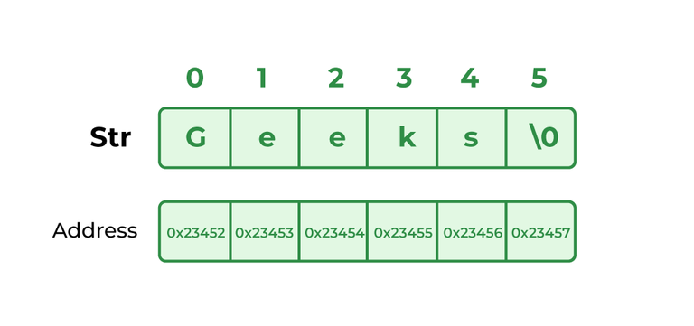

# Precedence and Associativity of Operators


Precedence and associative rules are used when dealing with hybrid equations involving more than one type of operator. In such cases, these rules determine which part of the equation to consider first, as there can be many different valuations for the same equation. The below table depicts the precedence of operators in decreasing order as magnitude, with the top representing the highest precedence and the bottom showing the lowest precedence.


| Operators | Associativity | Type |
|:--- | :---: | :---: |
| `++` `--` | Right to left | Unary postfix |
| `++` `--` `+` `-` `!` (type) |  Right to left | Unary prefix |
| `/` `*` `%` | Left to right | Multiplicative |
| `+` `-` | Left to right | Additive |
| `<` `<=` `>` `>=` | Left to right | Relational |
| `==` `!==` | Left to right | Equality |
| `&` | Left to right | Boolean Logical AND |
| `^` | Left to right | Boolean Logical Exclusive OR |
| `\|` | Left to right | Boolean Logical Inclusive OR |
| `&&` | Left to right | Conditional AND |
| `\|\|` | Left to right | Conditional OR |
| `?:` | Right to left | Conditional |
| `=` `+=` `-=` `*=` `/=` `%=` | Right to left | Assignment |


# Strings in Java

Strings are the type of objects that can store the character of values. A string acts the same as an array of characters in Java.

Example:  
```java
String str = "Geeks";
```




```java
// Java Program to demonstrate
// String
public class StringExample {

	// Main Function
	public static void main(String args[])
	{
		String s1 = new String("example");
		// creating java string by new keyword
		// this statement create two object i.e
		// first object is created in heap
		// memory area and second object is
		// create in String constant pool.

		System.out.println(s1);
	}
}
```


## Ways of Creating a String
There are two ways to create a string in Java: 

- String Literal
- Using new Keyword

Syntax:  
```
<String_Type> <string_variable> = "<sequence_of_string>"; 
```
### String literal
To make Java more memory efficient (because no new objects are created if it exists already in the string constant pool). 

Example:
```java
String s = "GeeksforGeeks";
```
### Using new keyword

```java
String s = new String("Welcome");
```
In such a case, JVM will create a new string object in normal (non-pool) heap memory and the literal “Welcome” will be placed in the string constant pool. The variable s will refer to the object in the heap (non-pool)

## Interfaces and Classes in Strings in Java

- CharBuffer: This class implements the CharSequence interface. This class is used to allow character buffers to be used in place of CharSequences. An example of such usage is the regular-expression package java.util.regex.

- String: It is a sequence of characters. In Java, objects of String are immutable which means a constant and cannot be changed once created.

### CharSequence Interface

CharSequence Interface is used for representing the sequence of Characters in Java. Classes that are implemented using the CharSequence interface are mentioned below:

1. String
2. StringBuffer
3. StringBuilder


#### StringBuffer

StringBuffer is a peer class of String that provides much of the functionality of strings. The string represents fixed-length, immutable character sequences while StringBuffer represents growable and writable character sequences.

Syntax:
```java
StringBuffer s = new StringBuffer("GeeksforGeeks");
```

#### StringBuilder

StringBuilder in Java represents a mutable sequence of characters. Since the String Class in Java creates an immutable sequence of characters, the StringBuilder class provides an alternative to String Class, as it creates a mutable sequence of characters.

Syntax:
```java
StringBuilder str = new StringBuilder();
str.append("GFG");
```

#### StringTokenizer

StringTokenizer class in Java is used to break a string into tokens.


A StringTokenizer object internally maintains a current position within the string to be tokenized. Some operations advance this current position past the characters processed. A token is returned by taking a substring of the string that was used to create the StringTokenizer object.


## Immutable String in Java

In Java, string objects are immutable. Immutable simply means unmodifiable or unchangeable. Once a string object is created its data or state can’t be changed but a new string object is created.

```java
// Java Program to demonstrate Immutable String in Java
import java.io.*;

class GFG {
	public static void main(String[] args)
	{
		String s = "Sachin";
		
		// concat() method appends
		// the string at the end
		s.concat(" Tendulkar");
		
		// This will print Sachin
		// because strings are
		// immutable objects
		System.out.println(s);
	}
}
```
Output
```
Sachin
```

Here Sachin is not changed but a new object is created with “Sachin Tendulkar”. That is why a string is known as immutable.

As you can see in the given figure that two objects are created but s reference variable still refers to “Sachin” and not to “Sachin Tendulkar”. But if we explicitly assign it to the reference variable, it will refer to the “Sachin Tendulkar” object.

```java
// Java Program to demonstrate Explicitly assigned strings
import java.io.*;

class GFG {
	public static void main(String[] args)
	{
		String s = "Sachin";
		s = s.concat(" Tendulkar");
		System.out.println(s);
	}
}

```
Output
```
Sachin Tendulkar
```


# References

https://www.geeksforgeeks.org/operators-in-java/

https://www.javatpoint.com/operators-in-java