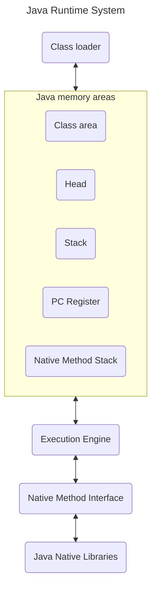

# JRE vs JDK vs JVM

## Java Virtual Machine (JVM)

JVM (Java Virtual Machine) is an abstract machine. It is called a virtual machine because it doesn't physically exist. It is a specification that provides a runtime environment in which Java bytecode can be executed. It can also run those programs which are written in other languages and compiled to Java bytecode.

JVMs are available for many hardware and software platforms. JVM, JRE, and JDK are platform dependent because the configuration of each OS is different from each other. However, Java is platform independent. There are three notions of the JVM: specification, implementation, and instance.

The JVM performs the following main tasks:

- Loads code
- Verifies code
- Executes code
- Provides runtime environment

## Java Runtime Environment (JRE)

JRE is an acronym for Java Runtime Environment. It is also written as Java RTE. The Java Runtime Environment is a set of software tools which are used for developing Java applications. 
It is used to provide the runtime environment. 
It is the implementation of JVM. It physically exists. 
It contains a set of libraries + other files that JVM uses at runtime.

The implementation of JVM is also actively released by other companies besides Oracle.

## Java Development Kit (JDK)

JDK is an acronym for Java Development Kit. The Java Development Kit (JDK) is a software development environment which is used to develop Java applications and applets. It physically exists. It contains JRE + development tools.

JDK is an implementation of any one of the below given Java Platforms released by Oracle Corporation:

- Standard Edition Java Platform
    - It is a Java programming platform. It includes Java programming APIs such as java.lang, java.io, java.net, java.util, java.sql, java.math etc. It includes core topics like OOPs, String, Regex, Exception, Inner classes, Multithreading, I/O Stream, Networking, AWT, Swing, Reflection, Collection, etc.
- Enterprise Edition Java Platform
    - It is an enterprise platform that is mainly used to develop web and enterprise applications. It is built on top of the Java SE platform. It includes topics like Servlet, JSP, Web Services, EJB, JPA, etc.
- Micro Edition Java Platform
    - It is a micro platform that is dedicated to mobile applications.

>[Java tutorial jvm1](https://www.javatpoint.com/difference-between-jdk-jre-and-jvm)

# JVM (Java Virtual Machine) Architecture

As mentioned above, JVM (Java Virtual Machine) is an abstract machine. It is a specification that provides runtime environment in which java bytecode can be executed.

JVMs are available for many hardware and software platforms (i.e. JVM is platform dependent).

## What is JVM

Lets start from the beginning, JVM is :

1. A specification where working of Java Virtual Machine is specified. But implementation provider is independent to choose the algorithm. Its implementation has been provided by Oracle and other companies.
2. An implementation Its implementation is known as JRE (Java Runtime Environment).
3. Runtime Instance Whenever you write java command on the command prompt to run the java class, an instance of JVM is created.

## What it does 

As mentioned previously, it does the following:
- Loads code
- Verifies code
- Executes code
- Provides runtime environment

And also provides the following definitions:

- Memory area
- Class file format
- Register set
- Garbage-collected heap
- Fatal error reporting etc.

## JVM Architecture

Let's understand the internal architecture of JVM. It contains classloader, memory area, execution engine etc.

### Class Loader

Classloader is a subsystem of JVM which is used to load class files. Whenever we run the java program, it is loaded first by the classloader.
It is mainly responsible for three activities:
- Loading
- Linking
- Initialization

There are three built-in classloaders in Java.

1. Bootstrap ClassLoader: This is the first classloader which is the super class of Extension classloader. It loads the rt.jar file which contains all class files of Java Standard Edition like java.lang package classes, java.net package classes, java.util package classes, java.io package classes, java.sql package classes etc.

2. Extension ClassLoader: This is the child classloader of Bootstrap and parent classloader of System classloader. It loades the jar files located inside $JAVA_HOME/jre/lib/ext directory.

3. System/Application ClassLoader: This is the child classloader of Extension classloader. It loads the classfiles from classpath. By default, classpath is set to current directory. You can change the classpath using "-cp" or "-classpath" switch. It is also known as Application classloader.

**N.B**: These are the internal classloaders provided by Java. If you want to create your own classloader, you need to extend the ClassLoader class.

**Loading**: The Class loader reads the “.class” file, generate the corresponding binary data and save it in the method area. For each “.class” file, JVM stores the following information in the method area. 
 

- The fully qualified name of the loaded class and its immediate parent class.
- Whether the “.class” file is related to Class or Interface or Enum.
- Modifier, Variables and Method information etc.

After loading the “.class” file, JVM creates an object of type Class to represent this file in the heap memory. Please note that this object is of type Class predefined in java.lang package. These Class object can be used by the programmer for getting class level information like the name of the class, parent name, methods and variable information etc. To get this object reference we can use getClass() method of Object class.

**Linking**: Performs verification, preparation, and (optionally) resolution. 
 

- Verification: It ensures the correctness of the .class file i.e. it checks whether this file is properly formatted and generated by a valid compiler or not. If verification fails, we get run-time exception java.lang.VerifyError. This activity is done by the component ByteCodeVerifier. Once this activity is completed then the class file is ready for compilation.
- Preparation: JVM allocates memory for class static variables and initializing the memory to default values. 
- Resolution: It is the process of replacing symbolic references from the type with direct references. It is done by searching into the method area to locate the referenced entity.

**Initialization**: In this phase, all static variables are assigned with their values defined in the code and static block(if any). This is executed from top to bottom in a class and from parent to child in the class hierarchy. 
In general, there are three class loaders : 
 
- Bootstrap class loader: Every JVM implementation must have a bootstrap class loader, capable of loading trusted classes. It loads core java API classes present in the “JAVA_HOME/jre/lib” directory. This path is popularly known as the bootstrap path. It is implemented in native languages like C, C++.
- Extension class loader: It is a child of the bootstrap class loader. It loads the classes present in the extensions directories “JAVA_HOME/jre/lib/ext”(Extension path) or any other directory specified by the java.ext.dirs system property. It is implemented in java by the sun.misc.Launcher$ExtClassLoader class.
- System/Application class loader: It is a child of the extension class loader. It is responsible to load classes from the application classpath. It internally uses Environment Variable which mapped to java.class.path. It is also implemented in Java by the sun.misc.Launcher$AppClassLoader class.

### Class(Method) Area

Class(Method) Area stores per-class structures such as the runtime constant pool, field and method data, the code for methods.

### Heap
It is the runtime data area in which objects are allocated.

### Stack

Java Stack stores frames. It holds local variables and partial results, and plays a part in method invocation and return.

Each thread has a private JVM stack, created at the same time as thread.

A new frame is created each time a method is invoked. A frame is destroyed when its method invocation completes.

### Program Counter Register

PC (program counter) register contains the address of the Java virtual machine instruction currently being executed.

### Native Method Stack

It contains all the native methods used in the application.

### Execution Engine

It contains:

1. A virtual processor
2. Interpreter: Read bytecode stream then execute the instructions.
3. Just-In-Time(JIT) compiler: It is used to improve the performance. JIT compiles parts of the byte code that have similar functionality at the same time, and hence reduces the amount of time needed for compilation. Here, the term "compiler" refers to a translator from the instruction set of a Java virtual machine (JVM) to the instruction set of a specific CPU.

### Java Native Interface

Java Native Interface (JNI) is a framework which provides an interface to communicate with another application written in another language like C, C++, Assembly etc. Java uses JNI framework to send output to the Console or interact with OS libraries.

>[Java tutorial jvm2](https://www.javatpoint.com/jvm-java-virtual-machine)

## References

https://www.javatpoint.com/jvm-java-virtual-machine

https://www.geeksforgeeks.org/jvm-works-jvm-architecture/?ref=lbp