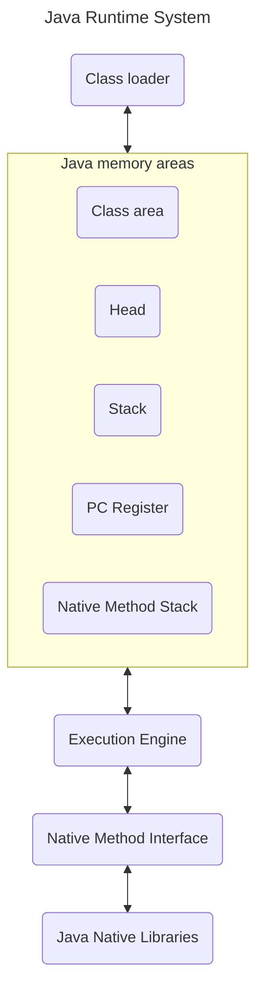

# JRE vs JDK vs JVM

## Java Virtual Machine (JVM)

JVM (Java Virtual Machine) is an abstract machine. It is called a virtual machine because it doesn't physically exist. It is a specification that provides a runtime environment in which Java bytecode can be executed. It can also run those programs which are written in other languages and compiled to Java bytecode.

JVMs are available for many hardware and software platforms. JVM, JRE, and JDK are platform dependent because the configuration of each OS is different from each other. However, Java is platform independent. There are three notions of the JVM: specification, implementation, and instance.

The JVM performs the following main tasks:

- Loads code
- Verifies code
- Executes code
- Provides runtime environment

## Java Runtime Environment (JRE)

JRE is an acronym for Java Runtime Environment. It is also written as Java RTE. The Java Runtime Environment is a set of software tools which are used for developing Java applications. 
It is used to provide the runtime environment. 
It is the implementation of JVM. It physically exists. 
It contains a set of libraries + other files that JVM uses at runtime.

The implementation of JVM is also actively released by other companies besides Oracle.

## Java Development Kit (JDK)

JDK is an acronym for Java Development Kit. The Java Development Kit (JDK) is a software development environment which is used to develop Java applications and applets. It physically exists. It contains JRE + development tools.

JDK is an implementation of any one of the below given Java Platforms released by Oracle Corporation:

- Standard Edition Java Platform
    - It is a Java programming platform. It includes Java programming APIs such as java.lang, java.io, java.net, java.util, java.sql, java.math etc. It includes core topics like OOPs, String, Regex, Exception, Inner classes, Multithreading, I/O Stream, Networking, AWT, Swing, Reflection, Collection, etc.
- Enterprise Edition Java Platform
    - It is an enterprise platform that is mainly used to develop web and enterprise applications. It is built on top of the Java SE platform. It includes topics like Servlet, JSP, Web Services, EJB, JPA, etc.
- Micro Edition Java Platform
    - It is a micro platform that is dedicated to mobile applications.

>[Java tutorial jvm1](https://www.javatpoint.com/difference-between-jdk-jre-and-jvm)

# JVM (Java Virtual Machine) Architecture

As mentioned above, JVM (Java Virtual Machine) is an abstract machine. It is a specification that provides runtime environment in which java bytecode can be executed.

JVMs are available for many hardware and software platforms (i.e. JVM is platform dependent).

## What is JVM

Lets start from the beginning, JVM is :

1. A specification where working of Java Virtual Machine is specified. But implementation provider is independent to choose the algorithm. Its implementation has been provided by Oracle and other companies.
2. An implementation Its implementation is known as JRE (Java Runtime Environment).
3. Runtime Instance Whenever you write java command on the command prompt to run the java class, an instance of JVM is created.

## What it does 

As mentioned previously, it does the following:
- Loads code
- Verifies code
- Executes code
- Provides runtime environment

And also provides the following definitions:

- Memory area
- Class file format
- Register set
- Garbage-collected heap
- Fatal error reporting etc.

## JVM Architecture

Let's understand the internal architecture of JVM. It contains classloader, memory area, execution engine etc.

>[Java tutorial jvm1](https://www.javatpoint.com/jvm-java-virtual-machine)