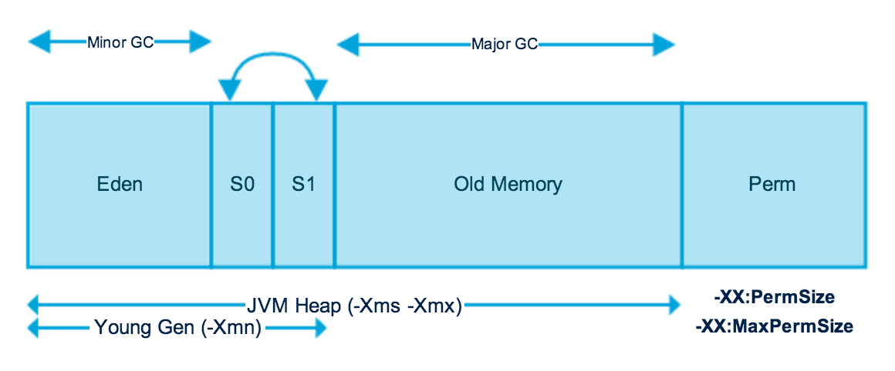

# Java Variables

Java Variables are the data containers that save the data values during Java program execution. Every variable is assigned a data type that designates the type and quantity of value it can hold. A variable is a memory location name for the data.

A variable is a name given to a memory location. It is the basic unit of storage in a program.

- The value stored in a variable can be changed during program execution.
- A variable is only a name given to a memory location. All the operations done on - the variable affect that memory location.
- In Java, all variables must be declared before use.


## How to declare Java variables

To declare a variable is Java we need 2 parts
1. Data Type: Type of the data the variable is going to store
2. Variable Name: Name given to the variable representing a memory location


## How to Initialize Variables in Java

To initialize a variable in Java we need 3 parts
1. Data Type
2. Variable Name
3. Value: the initial values stored in the variable

```java
Int temperature = 20 ;
```
As you can see the `Int` is the data type Integer, `temperature` is the variable name and `20` is the initial value. 

```java
// Declaring float variable
float simpleInterest; 

// Declaring and initializing integer variable
int time = 10, speed = 20; 

// Declaring and initializing character variable
char var = 'h'; 
```

## Types of variables in Java

1. Local Variables
2. Instance Variables
3. Static Variables


### Local Variables


A variable defined within a block or method or constructor is called a local variable. 

- These variables are created when the block is entered, or the function is called and destroyed after exiting from the block or when the call returns from the function.
- The scope of these variables exists only within the block in which the variables are declared, i.e., we can access these variables only within that block.
- Initialization of the local variable is mandatory before using it in the defined scope.


```java
// Java Program to implement
// Local Variables
import java.io.*;

class GFG {
	public static void main(String[] args)
	{
		// Declared a Local Variable
		int var = 10;

		// This variable is local to this main method only
		System.out.println("Local Variable: " + var);
	}
}

```

The above will print the following in the console

```cmd
Local Variable: 10
```

Here is another example showing the scope of a variable inside a method

```java
package a;
public class LocalVariable {
	
	public static void main(String[] args) {
		int x = 10; // x is a local variable
		String message = "Hello, world!"; // message is also a local variable
		
		System.out.println("x = " + x);
		System.out.println("message = " + message);
		
		if (x > 5) {
			String result = "x is greater than 5"; // result is a local variable
			System.out.println(result);
		}
		
		// Uncommenting the line below will result in a compile-time error
		// System.out.println(result);
		
		for (int i = 0; i < 3; i++) {
			String loopMessage = "Iteration " + i; // loopMessage is a local variable
			System.out.println(loopMessage);
		}
		
		// Uncommenting the line below will result in a compile-time error
		// System.out.println(loopMessage);
	}
}

```

The above will output to the console the following
```cmd
x = 10
message = Hello, world!
x is greater than 5
Iteration 0
Iteration 1Iteration 2
```


### Instance Variables

Instance variables are non-static variables and are declared in a class outside of any method, constructor, or block. 

- As instance variables are declared in a class, these variables are created when an object of the class is created and destroyed when the object is destroyed.
Unlike local variables, we may use access specifiers for instance variables. 
If we do not specify any access specifier, then the default access specifier will be used.
- Initialization of an instance variable is not mandatory. Its default value is **dependent on the data type of variable**. For String it is null, for float it is 0.0f, for int it is 0, for Wrapper classes like Integer it is null, etc.
Instance variables can be accessed only by creating objects.
- We initialize instance variables using constructors while creating an object. We can also use instance blocks to initialize the instance variables.


```java
// Java Program to demonstrate
// Instance Variables
import java.io.*;

class GFG {

	// Declared Instance Variable
	public String geek;
	public int i;
	public Integer I;
	public GFG()
	{
		// Default Constructor
		// initializing Instance Variable
		this.geek = "Patrick Balian";
	}

	// Main Method
	public static void main(String[] args)
	{
		// Object Creation
		GFG name = new GFG();

		// Displaying O/P
		System.out.println("Geek name is: " + name.geek);
		System.out.println("Default value for int is "+ name.i);
	
		// toString() called internally
		System.out.println("Default value for Integer is "+ name.I);
	}
}

```

The above code will output the following:

```cmd
Geek name is: Patrick Balian
Default value for int is 0
Default value for Integer is null
```


### Static Variables

Static variables are also known as class variables. 

- These variables are declared similarly to instance variables. The difference is that static variables are declared using the `static` keyword within a class outside of any method, constructor, or block.
- Unlike instance variables, we can only have one copy of a static variable per class, irrespective of how many objects we create.
- Static variables are created at the start of program execution and destroyed automatically when execution ends.
- Initialization of a static variable is not mandatory. Its default value is dependent on the data type of variable. For String it is null, for float it is 0.0f, for int it is 0, for Wrapper classes like Integer it is null, etc.
- If we access a static variable like an instance variable (through an object), the compiler will show a warning message, which won’t halt the program. **The compiler will replace the object name with the class name automatically.**
- If we access a static variable without the class name, the compiler will automatically append the class name. But for accessing the static variable of a different class, we must mention the class name as 2 different classes might have a static variable with the same name.
- Static variables cannot be declared locally inside an instance method.
- Static blocks can be used to initialize static variables.

```java
// Java Program to demonstrate
// Static variables
import java.io.*;

class GFG {
	// Declared static variable
	public static String geek = "Patrick Balian";

	public static void main(String[] args)
	{

		// geek variable can be accessed without object
		// creation Displaying O/P GFG.geek --> using the
		// static variable
		System.out.println("Geek Name is : " + GFG.geek);

		// static int c=0;
		// above line,when uncommented,
		// will throw an error as static variables cannot be
		// declared locally.
	}
}

```

The above code will output the following:
```cmd
Geek Name is : Patrick Balian
```

### Instance Variables vs Static Variables


Now let us discuss the differences between the Instance variables and the Static variables:

- Each object will have its own copy of an instance variable, whereas we can only have one copy of a static variable per class, irrespective of how many objects we create. Thus, static variables are good for memory management.
- Changes made in an instance variable using one object will not be reflected in other objects as each object has its own copy of the instance variable. In the case of a static variable, changes will be reflected in other objects as static variables are common to all objects of a class.
- We can access instance variables through object references, and static variables can be accessed directly using the class name.
- Instance variables are created when an object is created with the use of the keyword ‘new’ and destroyed when the object is destroyed. Static variables are created when the program starts and destroyed when the program stops.

</br>


# Memory Location and Lifecycle


## Java memory model




[DigitalOcean tutorial](https://www.digitalocean.com/community/tutorials/java-jvm-memory-model-memory-management-in-java)


The JVM Heap memory is divided into 2 physical parts young generation and old generation 


### Memory Management in Java - Young Generation


The young generation is the place where all the new objects are created. When the young generation is filled, garbage collection is performed. This garbage collection is called Minor GC. Young Generation is divided into three parts - Eden Memory and two Survivor Memory spaces. Important Points about Young Generation Spaces:

- Most of the newly created objects are located in the Eden memory space.
- When Eden space is filled with objects, Minor GC is performed and all the survivor objects are moved to one of the survivor spaces.
- Minor GC also checks the survivor objects and move them to the other survivor space. So at a time, one of the survivor space is always empty.
- Objects that are survived after many cycles of GC, are moved to the Old generation memory space. Usually, it’s done by setting a threshold for the age of the young generation objects before they become eligible to promote to Old generation.


### Memory Management in Java - Old Generation

Old Generation memory contains the objects that are long-lived and survived after many rounds of Minor GC. Usually, garbage collection is performed in Old Generation memory when it’s full. Old Generation Garbage Collection is called Major GC and usually takes a longer time.

#### Stop the world event

All the Garbage Collections are “Stop the World” events because all application threads are stopped until the operation completes. Since Young generation keeps short-lived objects, Minor GC is very fast and the application doesn’t get affected by this. However, Major GC takes a long time because it checks all the live objects. 

Major GC should be minimized because it will make your application unresponsive for the garbage collection duration. So if you have a responsive application and there are a lot of Major Garbage Collection happening, you will notice timeout errors. 

The duration taken by garbage collector depends on the strategy used for garbage collection. That’s why it’s necessary to monitor and tune the garbage collector to avoid timeouts in the highly responsive applications.


#### Java Memory Model - Permanent Generation

Permanent Generation or “Perm Gen” contains the application metadata required by the JVM to describe the classes and methods used in the application. Note that Perm Gen is not part of Java Heap memory. Perm Gen is populated by JVM at runtime based on the classes used by the application. Perm Gen also contains Java SE library classes and methods. Perm Gen objects are garbage collected in a full garbage collection.


#### Java Memory Model - Method Area

Method Area is part of space in the Perm Gen and used to store class structure (runtime constants and static variables) and code for methods and constructors.

#### Java Memory Model - Memory Pool

Memory Pools are created by JVM memory managers to create a pool of immutable objects if the implementation supports it. String Pool is a good example of this kind of memory pool. Memory Pool can belong to Heap or Perm Gen, depending on the JVM memory manager implementation.


#### Java Memory Model - Runtime Constant Pool

Runtime constant pool is per-class runtime representation of constant pool in a class. It contains class runtime constants and static methods. Runtime constant pool is part of the method area.


#### Java Memory Model - Java Stack Memory

Java Stack memory is used for execution of a thread. They contain method specific values that are short-lived and references to other objects in the heap that is getting referred from the method. 

## Difference between Stack and Heap Memory

### Java Heap Space

Java Heap space is used by java runtime to allocate memory to Objects and JRE classes. Whenever we create an object, it’s always created in the Heap space. Garbage Collection runs on the heap memory to free the memory used by objects that don’t have any reference. Any object created in the heap space has global access and can be referenced from anywhere of the application.

### Java Stack Memory

Java Stack memory is used for the execution of a thread. They contain method-specific values that are short-lived and references to other objects in the heap that is getting referred from the method. Stack memory is always referenced in LIFO (Last-In-First-Out) order. Whenever a method is invoked, a new block is created in the stack memory for the method to hold local primitive values and reference to other objects in the method. As soon as the method ends, the block becomes unused and becomes available for the next method. Stack memory size is very less compared to Heap memory.


### Heap and Stack Memory in Java Program
Let’s understand the Heap and Stack memory usage with a simple program.

```java
public class Memory {

	public static void main(String[] args) { // Line 1
		int i=1; // Line 2
		Object obj = new Object(); // Line 3
		Memory mem = new Memory(); // Line 4
		mem.foo(obj); // Line 5
	} // Line 9

	private void foo(Object param) { // Line 6
		String str = param.toString(); //// Line 7
		System.out.println(str);
	} // Line 8
}
```

The below image shows the Stack and Heap memory with reference to the above program and how they are being used to store primitive, Objects and reference variables.


Let’s go through the steps of the execution of the program.

- As soon as we run the program, it loads all the Runtime classes into the Heap space. When the main() method is found at line 1, Java Runtime creates stack memory to be used by main() method thread.
- We are creating primitive local variable at line 2, so it’s created and stored in the stack memory of main() method.
- Since we are creating an Object in the 3rd line, it’s created in heap memory and stack memory contains the reference for it. A similar process occurs when we create Memory object in the 4th line.
- Now when we call the foo() method in the 5th line, a block in the top of the stack is created to be used by the foo() method. Since Java is pass-by-value, a new reference to Object is created in the foo() stack block in the 6th line.
- A string is created in the 7th line, it goes in the String Pool in the heap space and a reference is created in the foo() stack space for it.
- foo() method is terminated in the 8th line, at this time memory block allocated for foo() in stack becomes free.
- In line 9, main() method terminates and the stack memory created for main() method is destroyed. Also, the program ends at this line, hence Java Runtime frees all the memory and ends the execution of the program.


### Difference between Java Heap Space and Stack Memory

Based on the above explanations, we can easily conclude the following differences between Heap and Stack memory.

- Heap memory is used by all the parts of the application whereas stack memory is used only by one thread of execution.
- Whenever an object is created, it’s always stored in the Heap space and stack memory contains the reference to it. Stack memory only contains local primitive variables and reference variables to objects in heap space.
- Objects stored in the heap are globally accessible whereas stack memory can’t be accessed by other threads.
- Memory management in stack is done in LIFO manner whereas it’s more complex in Heap memory because it’s used globally. Heap memory is divided into Young-Generation, Old-Generation etc, more details at Java Garbage Collection.
- Stack memory is short-lived whereas heap memory lives from the start till the end of application execution.
- We can use -Xms and -Xmx JVM option to define the startup size and maximum size of heap memory. We can use -Xss to define the stack memory size.
- When stack memory is full, Java runtime throws `java.lang.StackOverFlowError` whereas if heap memory is full, it throws `java.lang.OutOfMemoryError: Java Heap Space` error.
- Stack memory size is very less when compared to Heap memory. Because of simplicity in memory allocation (LIFO), stack memory is very fast when compared to heap memory.


## References

https://www.geeksforgeeks.org/variables-in-java/

https://www.javatpoint.com/java-variables

https://www.digitalocean.com/community/tutorials/java-jvm-memory-model-memory-management-in-java

https://www.digitalocean.com/community/tutorials/java-heap-space-vs-stack-memory

https://medium.com/swlh/understanding-object-life-cycle-573d055b51c6

https://codeahoy.com/2017/08/06/basics-of-java-garbage-collection/